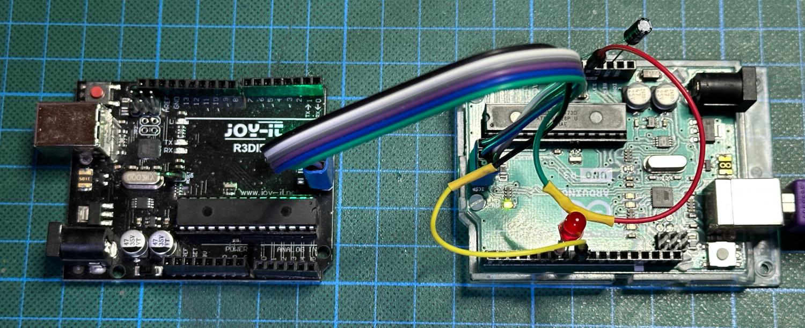
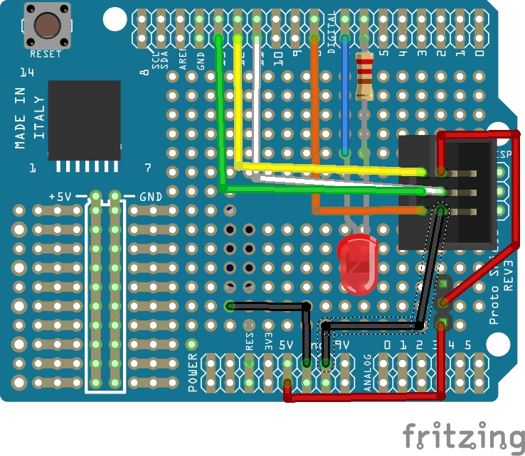

# Better hardware for the hardware debugger

The hardware part of our hardware debugger is very limited so far. You can, of course, use 6 jumper wires to connect dw-link to your target as described in the [hardware setup section](setup.md#debugging-an-attiny85). However, if you want to use this tool more than once, then there should be at least something like an ISP cable connection. Otherwise, you might scratch your head which cable goes where every time you start a debugging session.

## The basic solution

For most of the wires, we use the same pins on the debugger and the target. Moreover, most of the pins are connected to the ISP connector on board. So, it makes sense to think about something similar to an ISP cable people use when employing an Arduino UNO as an ISP programmer. Such cables can be easily constructed with some Dupont wires and a bit of heat shrink tube as, for example, demonstrated in [this instructable](https://www.instructables.com/Arduino-ICSP-Programming-Cable/). In contrast to such a programmer cable, it makes sense to also break out the Vcc wire. And you do not want to integrate a capacitor between RESET and GND in such a cable in contrast to what is described in the instructable!

As argued in [my blog post on being cheap](https://hinterm-ziel.de/index.php/2022/01/13/a-debugwire-hardware-debugger-for-less-than-10-e/), with such an ISP cable, we have sort of constructed a hardware debugger for less than 10 €, which can be considered semi-durable. Just add the optional system LED with an attached resistor and a capacitor between RESET and GND.

The relevant pins are defined in the following table. 

| Arduino pin | ISP pin | Function                                                 |
| ----------- | ------- | -------------------------------------------------------- |
| D13         | 3       | SCK                                                      |
| D12         | 1       | MISO                                                     |
| D11         | 4       | MOSI                                                     |
| 5V          | 2       | VTG                                                      |
| D8          | 5       | RESET                                                    |
| GND         | 6       | GND                                                      |
| D7          |         | System LED+                                              |
| D6          |         | System LED- (if using a LED with a resistor soldered on) |

## A simple prototype shield

Taking it one step further, one can take a prototype shield for an UNO, put an ISP socket on it, and connect the socket to the respective shield pins. You should also plan to have jumper pins to to be able to power-cycle the target. Finally, you probably also want to place the system LED on the board. So, it could look like the following Fritzing sketch. 

## Adapter with level-shifters and switchable power supply

The basic adapter is quite limited. Power-cycling has to be done manually, it cannot interact with 3.3 V systems, and it has a high load on the SCK line (because the UNO LED is driven by this pin) when the ISP mode is disabled. Thus, it would be great to have a board with the following features: 

* switchable target power supply (supporting power-cycling by the hardware debugger) offering 5-volt and 3.3-volt supply up to 300 mA, 
* a bidirectional (conditional) level-shifter on the debugWIRE/RESET line,
* an optional pull-up resistor of 10 kΩ on this line,
* unidirectional (conditional) level-shifters on the ISP lines, and
* high-impedance status for the two output signals MOSI and SCK when ISP is inactive.

Such a board does not need to be very complex. The electronic design is minimalistic. It uses just three MOS-FETs, one LED, one voltage regulator, and some passive components. We need to (conditionally) level-shift the RESET line in a bidirectional manner and the SPI lines unidirectionally.  One needs to shift the MISO line from 3.3-5 V up to 5 V, and the MOSI and SCK lines from 5 V down to 3.3-5 V. For the former case, no level shifting is done at all, relying on the fact that the input pins of the hardware debugger recognize a logical one already at  3.0 V. For the RESET line, which is open drain, we rely on the same fact. This means that this hardware debugger cannot deal with systems that use a supply voltage of less than 3 V, though.

For downshifting, we use the output pins of the hardware debugger in an open drain configuration and have pull-up resistors connected to the target supply voltage. These have to be particularly strong because some possible target boards, e.g., the Arduino UNO, use the SCK  line for driving an LED with a series resistor of 1kΩ. For this reason,  we use 680Ω pull-up resistors that guarantee that the signal level is above 3V on the SCK line, when we supply the board with 5V. These pull-ups will be disabled when no ISP programming is active, giving the target system full control of the two lines. The schematic looks as follows (thanks to **[gwideman](https://github.com/gwideman)** for the reworked schematic).

The pin mapping is a bit different from the basic design described above. The change from the basic mapping is controlled by pin D5, which is tied to GND in order to signal that the more complex pin mapping is used. The additional pins are all in italics. The ones not used on the board are struck out.

| Arduino pin | ISP pin  | Function                                                     |
| ----------- | -------- | ------------------------------------------------------------ |
| <s>D13</s>  | <s>3</s> | <s>SCK</s>                                                   |
| D12         | 1        | MISO                                                         |
| D11         | 4        | MOSI (open drain)                                            |
| *D10*       | *3*      | *SCK (open drain)*                                           |
| <s>5V</s>   | <s>2</s> | <s>VTG</s>                                                   |
| D8          | 5        | RESET                                                        |
| GND         | 6        | GND                                                          |
| D7          |          | System LED+                                                  |
| <s>D6</s>   |          | <s>System LED- (if using an LED with a resistor soldered on)</s> |
| *D5*        |          | *Sense pin: Connected to GND when a board with a level shifter is used* |
| *D4*        |          | *ISP pull-up enable (open drain, active low)*                |
| *D3*        |          | *Input: automatic debugWire switching disable (open drain, active low)* |
| *D2*        |          | *Power enable (open drain, active low)*                      |
|             | *2*      | *VTG:* *Power from Q1 controlled by power jumper*            |

And here is the early breadboard prototype, which worked beautifully. 

I have turned the prototype into an Arduino Shield, which I sold [at Tindie](https://www.tindie.com/products/31798/) as a kit. With that, the hardware setup is straightforward. Just plug in an ISP cable, and you can start debugging. 

Before you start, you have to configure three jumpers. Then you are all set.

Label | Left | Middle | Right 
--- | --- | --- | --- 
**Supply** | **5 V** are supplied to the target | **extern**: target needs its own supply and power cycling has to be done manually | **3.3 V** are supplied to the target 
**Pullup** | There is **no** pull-up resistor connected to RESET | &nbsp; | A **10 kΩ** pull-up resistor is connected to the RESET line of the target 
**Auto_DW** | Automatic power-cycling is disabled in the **off** state. |  | Automatic power-cycling when executing `monitor debugwire enable` is enabled in the **on** state. This is the default and *recommended* mode. 

Since the hardware debugger MPLAB SNAP has become cheaper than this kit, I decided to retire the kit, and now recommend to [buy a SNAP](https://www.microchip.com/en-us/development-tool/pg164100). Together with my Python package [PyAvrOCD](https://github.com/felias-fogg/PyAvrOCD), you get the same debugging experience. Furthermore, you will also be able to debug other AVRs than only debugWIRE MCUs.
