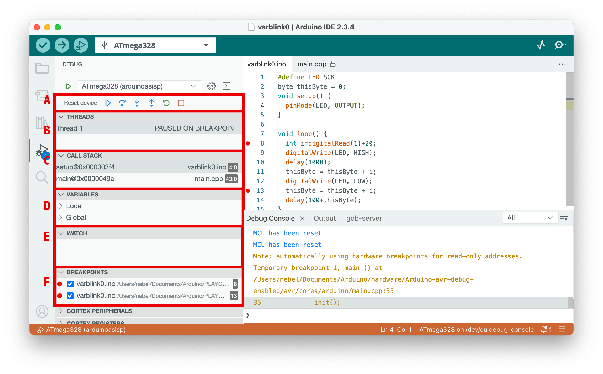

# Debugging

Now we can do serious business ... 

## Command-line interface debugging

Using avr-gdb, the GDB version for AVR chips, is straightforward, provided avr-gdb is already installed.
After compiling your program, you need to start the avr-gdb debugger, giving the name of the binary as an argument. Once inside GDB, you need to set the baud rate and then connect to dw-link using the serial line, as shown below. Since the hardware debugger is platform agnostic, this will work with all operating systems.

```text
> avr-gdb program.ino.elf
GNU gdb ...
...
(gdb) set serial baud 115200
(gdb) target remote /dev/cu.usbmodem1234
Remote debugging using /dev/cu.usbmodem1234
0x00000000 in __vectors ()
(gdb) monitor debugwire enable
*** Please power-cycle target ***
Ignoring packet error, continuing...
Connected to ATmega328P
debugWIRE is enabled, bps: 125244
(gdb) 
```

If you have come to this point, I trust that you know what you are doing and know how to proceed from there.

## Arduino IDE 2 debugging

If, instead, you want to use dw-link in the Arduino IDE 2, read on. Using dw-link in the Arduino IDE 2 is straightforward. Before starting, you must [install only some new board manager URLs and the respective board packages](installation.md#setting-up-the-debugging-software). And then you can use the debugging feature of the Arduino IDE 2. 

### Compiling the sketch 

You must load the sketch into the editor and select a board as usual. If you want to debug an Arduino UNO board, choose ATmega328 from the Minicore in the `Tools` menu. 

Before clicking the `Verify` button in the upper left corner, choose `Optimize for Debugging` in the `Sketch` menu. This is necessary so that the compiler optimizes the code in a way that makes debugging straightforward. Otherwise, the compiler may rearrange source code lines, and one will get confused when single-stepping through the code.


### Debugging

After having verified the sketch (which also compiled it), it is time to start debugging by clicking on the debug button in the top row. This will start the debug server, which will notice that the MCU is not yet in debugWIRE mode and ask you to power-cycle the target board by displaying a message to that effect. 

Instead of the message shown in the following screenshot, it may happen that a warning "No hardware debugger discovered" is shown. The reason may be that the Arduino IDE 2 reserved the debugger's serial line for the `Serial Monitor`. Close the `Serial Monitor` console and try again.

As mentioned in Section 2, power cycling is only necessary once. The next time you start a debugging session, the MCU will already be in debugWIRE mode, and the debugger will not stop at this point. 


After power-cycling the target, the debugger starts. Eventually, execution is stopped in line 35 of the Arduino internal file `main.cpp` at an initial internal breakpoint, indicated by the yellow triangle left of the line in the following screenshot. It might take a while before we reach that point because the debugger must also load the program. 

After stopping, the IDE rearranges the layout, showing the debugging panes on the left and the sketch on the right. It will also switch from showing the `gdb-server` console to the `Debug Console`, which shows the output of the GDB debugger. 

 

Now is a good time to familiarize yourself with the window's layout. The source code is on the right side. Below that is a console window, and to the left are the debug panes. If you want to set a breakpoint, you can do that by clicking to the left of the line numbers. Such breakpoints are displayed as red dots, such as those left of lines 8 and 13.

The debugging panes are organized as follows. Pane A contains the debug controls. From left to right:

- *Reset*ting the device
- *Continue* execution or *pause*
- *Step over*: execute one source line
- *Step into*: execute stepping into the function, if in this line one is called
- *Step out*: finish the current function and stop after the line where it was called
- *Restart*: Same as Reset
- *Stop*: Terminate debugging

Pane B shows the active threads, but there is just one in our case. Pane C displays the call stack starting from the bottom, i.e., the current frame is the topmost. Pane D displays variable values. Unfortunately, global variables are not shown. Pane E can be populated with watch expressions.  Finally, in pane F, the active breakpoints are listed. The panes below are useless in our case. Some more information about debugging can be found in the Arduino [debugging tutorial](https://docs.arduino.cc/software/ide-v2/tutorials/ide-v2-debugger/). 

### Some Pro Tips

If you want to switch from the dw-link debugger to a professional hardware debugger, e.g., [MPLAP SNAP](https://www.microchip.com/en-us/development-tool/pg164100) or [Atmel-ICE](https://www.microchip.com/en-us/development-tool/atatmel-ice), these debuggers can be used as a drop-in replacement! So you do not have to change anything in the hardware or software configuration. And the SNAP is really cheap these days!

The I/O registers are displayed in the `CORTEX PERIPHERALS` debugger pane. There, you can also change single register values.

Global variables are, by default, not displayed. However, you can set a watch expression in the Watch pane to display a global variable's value. Or you can disable link time optimization (LTO) in the `Tools` menu. Then all global variables show up, except for one (which is an error of the IDE).

If you select the Debug Console, you can type GDB commands in the bottom line. This can be useful for changing the value of global variables using the GDB command `set var <varname>=<value>`. This can also be used to disable the debugWIRE mode using the command `monitor debugwire disable`. The following section describes more monitor commands.

## Monitor commands

| Command                                                      | Action                                                       |
| ------------------------------------------------------------ | ------------------------------------------------------------ |
| `monitor` `atexit` [`stayindebugwire` \| `leavedebugwire`]   | When specifying `leavedebugwire`, then debugWIRE mode will be left when exiting the debugger. This is useful when dealing with embedded debuggers such as the Xplained Mini boards. The default is `stayindebugwire`, i.e., debugWIREmode will not be left when exiting the debugger. |
| `monitor` `breakpoints` [`all` \| `software` \| `hardware`]  | Restricts the kind of breakpoints that can be used. Either `all` types are permitted, only `software` breakpoints are allowed, or only `hardware` breakpoints can be used. Using `all` kinds is the default. |
| `monitor` `caching` [`enable` \| `disable`]                  | This command is not implemented in dw-link.                  |
| `monitor` `debugwire` [`enable` \| `disable`]                | DebugWIRE mode will be `enable`d or `disable`d. When enabling it, the MCU will be reset, and you may be asked to power-cycle the target. After disabling debugWIRE mode, one has to exit the debugger. Afterward, the MCU can be programmed again using SPI programming. |
| `monitor`  `erasebeforeload` [`enable` \| `disable`]         | This command is not implemented in dw-link because there is no way to erase the flash memory in debugWIRE mode. |
| `monitor` `help`                                             | Display help text.                                           |
| `monitor` `info`                                             | Display information about the target and the state of the debugger. |
| `monitor` `load` [`readbeforewrite` \| `writeonly` \| `onlycache`] | When loading an executable, either each flash page is compared with the content to be loaded, and flashing is skipped if the content is already there (`readbeforewrite`), or each flash page is written without reading the current contents beforehand (`writeonly`). The first option is the default option for debugWIRE targets. For JTAG targets, the overhead of checking whether the page content is identical is so high that the `writeonly` option is the default. The third option (`onlycache`) will disable loading code into flash memory, but only fill the cache of PyAvrOCD. This is useful when one knows that the code is already loaded and one wants to avoid the overhead of reading flash memory content. |
| `monitor` `onlywhenloaded` [`enable` \| `disable`]           | Execution is only possible when a `load` command was previously executed, which is the default. If you want to start execution without loading an executable first, you need to `disable` this mode. |
| `monitor` `rangestepping `[`enable` \| `disable`]            | The GDB range-stepping command is supported or disabled. The default is that it is `enable`d. |
| `monitor` `reset`                                            | Resets the MCU.                                              |
| `monitor` `singlestep` [`safe` \| `interruptible`]           | Single-stepping can be performed in a `safe` way, where single steps are shielded against interrupts. Otherwise, a single step can lead to a jump into the interrupt dispatch table. The `safe` option is the default. |
| `monitor` `timer` [`run` \| `freeze`]                        | Timers can either be `frozen` when execution is stopped, or they can `run` freely. The latter option is helpful when PWM output is crucial, and it is the default. When the mode is changed, the MCU is reset. |
| `monitor` `verify` [`enable `\|` disable`]                   | Verify flash after loading each flash page. The default setting is for this option to be `enable`d. |
| `monitor` `version`                                          | Show version of the gdbserver.                               |

All commands can, as usual, be abbreviated. For example, `mo d e` is equivalent to `monitor debugwire enable`. If you use a command without an argument, the current setting is printed. All state-changing commands (except `debugwire`) can also be specified as command-line options when invoking PyAvrOCD, e.g., `--verify disable`.


## Restoring an Uno to its native state

When you want to restore the target so that it behaves again like an ordinary UNO after a debugging session, you have two options: you can restore it as a MiniCore 328P board or as an original UNO board. The former one is the more attractive alternative in my eyes. Just check out the pages about [MiniCore](https://github.com/MCUdude/MiniCore). Further, the command `Burn Bootloader` does apparently not work so well with some programmers or debuggers when doing it for the Uno setting. However, the dw-link built-in programmer has no problems. 

In order to restore your board, you need to do the following steps:

1. You need the target board to exit the debugWIRE mode. This could be done by typing `monitor debugwire disable` into the debugger just before exiting. Or it will be done automagically using the built-in programmer mentioned in the following step.
2. Now you have to flash the bootloader. Since version 2.2.0, the hardware debugger can also act as a programmer! This means that you leave the whole hardware setup as it was. However, you can, of course, use any other ISP programmer.
3. Select `Arduino UNO` or the `ATmega328 board` as the target board in the `Tools` menu, select `AVR ISP` as the Programmer, choose the correct serial port, and use  `Burn Bootloader` from the `Tools` menu. This will revert the MCU to its normal state (if it is still in debugWARE state) and will restore the fuses, the bootloader, and the lock bits to their original state. 
4. Reestablish the `RESET EN` connection by putting a solder blob on the connection or soldering pins to the connections that can be shortened using a jumper, as shown in the following picture. It does not look pretty, but it does its job. After that, your UNO is as good as new. Note that in the future, code uploading should be done by choosing the type of board you used when executing the `Burn Bootloader` command.

<p align="center">

</p>


