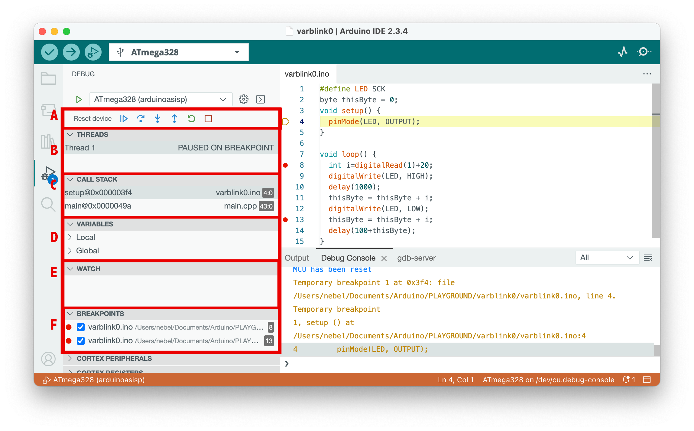

# Debugging

Now we can do serious business ... 

## Command-line interface debugging

Using avr-gdb, the GDB version for AVR chips, is straightforeward, provided avr-gdb is already installeda.
After compiling your program, you need to start the avr-gdb debugger, giving the name of the binary as an argument. Once inside GDB, you need to set the baud rate and then connect to dw-link using the serial line, as shown below. Since the hardware debugger is platform agnostic, this will work with all operating systems.

```text
> avr-gdb program.ino.elf
GNU gdb ...
...
(gdb) set serial baud 115200
(gdb) target remote /dev/cu.usbmodem1234
Remote debugging using /dev/cu.usbmodem1234
0x00000000 in __vectors ()
(gdb) monitor debugwire enable
*** Please power-cycle target ***
Ignoring packet error, continuing...
Connected to ATmega328P
debugWIRE is enabled, bps: 125244
(gdb) 
```

If you have come to this point, I trust that you know what you are doing and know how to proceed from there.

## Arduino IDE 2 debugging

If, instead, you want to use dw-link in the Arduino IDE 2, read on. Using dw-link in the Arduino IDE 2 is straightforward. Before starting, you only must [install three new board manager URLs and the respective board packages](installation.md#setting-up-the-debugging-software). And then you can use the debugging feature of the Arduino IDE 2. 

### Compiling the sketch 

You must load the sketch into the editor and select a board as usual. If you want to debug an Arduino UNO board, choose ATmega328 from the Minicore in the `Tools` menu. 

Before clicking the `Verify` button in the upper left corner, choose `Optimize for Debugging` in the `Sketch` menu. This is necessary so that the compiler optimizes the code in a way that makes debugging straightforward. Otherwise, the compiler may rearrange source code lines, and one will get confused when single-stepping through the code.


### Debugging

After having verified the sketch (which also compiled it), it is time to start debugging by clicking on the debug button in the top row. This will start the debug server, which will notice that the MCU is not yet in debugWIRE mode and ask you to power-cycle the target board by displaying a message to that effect. 

Instead of the message shown in the following screen shot, it may happen that a warning "No hardware debugger discovered" is shown. The reason may be that the Arduino IDE 2 reserved the debugger's serial line for the `Serial Monitor`. Simply close the `Serial Monitor` console and try again.

As mentioned in Section 2, power cycling is only necessary once. The next time you start a debugging session, the MCU will already be in d ebugWIRE mode, and the debugger will not stop at this point. 


After power-cycling the target, the debugger starts. Eventually, execution is stopped in line 4 at an initial internal breakpoint, indicated by the yellow triangle left of line 4 in the following screenshot. It might take a while before we reach that point because the debugger must also load the program. 

After stopping, the IDE rearranges the layout, showing the debugging panes on the left and the sketch on the right. It will also switch from showing the `gdb-server` console to the `Debug Console`, which shows the output of the GDB debugger. 

 

Now is a good time to familiarize yourself with the window's layout. The source code is on the right side. Below that is a console window, and to the left are the debug panes. If you want to set a breakpoint, you can do that by clicking to the left of the line numbers. Such breakpoints are displayed as red dots as the ones left of line 8 and 13.

The debugging panes are orgnized as folloes. Pane A contains the debug controls. From left to right:

- *Reset*ting the device
- *Continue* execution or *pause*
- *Step over*: execute one source line
- *Step into*: execute stepping into the function, if in this line one is called
- *Step out*: finish the current function and stop after the line where it had been called
- *Restart*: Same as Reset
- *Stop*: Terminate debugging

Pane B shows the active threads, but there is just one in our case. Pane C displays the call stack starting from the bottom, i.e., the current frame is the topmost. Pane D displays variable values. Unfortunately, global variables are not shown. Pane E can be populated with watch expressions.  Finally, in pane F, the active breakpoints are listed. The panes below are useless in our case. Some more information about debugging can be found in the Arduino [debugging tutorial](https://docs.arduino.cc/software/ide-v2/tutorials/ide-v2-debugger/). 

### Some Pro Tips

If you want to switch from the dw-link debugger to a professional hardware debugger, e.g., [MPLAP SNAP](https://www.microchip.com/en-us/development-tool/pg164100) or [Atmel-ICE](https://www.microchip.com/en-us/development-tool/atatmel-ice), these debuggers can be used as a drop-in replacement! So you do not have to change anything in the hardware or software configuration. And the SNAP is really cheap these days!

The I/O registers are displayed in the `CORTEX PERIPHERALS` debugger pane. There, you also can change single register values.

Global variables are, for some reason, not displayed. However, you can set a watch expression in the Watch pane to display a global variable's value.

If you select the Debug Console, you can type GDB commands in the bottom line. This can be useful for changing the value of global variables using the GDB command `set var <varname>=<value>`. This can also be used to disable the debugWIRE mode using the command `monitor debugwire disable`. The following section describes more monitor commands.

### Monitor commands

| Command                                                | Action                                                       |
| :----------------------------------------------------- | ------------------------------------------------------------ |
| `monitor` `help`                                       | Give a help message on monitor commands.                     |
| `monitor` `info`                                       | Give information about target and debugger.                  |
| `monitor` `version`                                    | Print version number of firmware.                            |
| `monitor` `debugwire` [`enable |`disable`]`            | **Enable** or **disable** debugWIRE mode.                    |
| `monitor` `reset`                                      | Reset the MCU.                                               |
| `monitor load` [`readbeforewrite`\|`writeonly`]        | When loading, either **read before write** or **write only**. The first option is faster and reduces flash wear. So, it is the default. |
| `monitor` `verify` [`enable`\|`disable`]               | **Enable** to verify flash loads or **disable** this feature. |
| `monitor` `onlyloaded` [`enable`\|`disable`]           | **Enable** the check that execution is only possible after a load command or **disable** this feature. |
| `monitor` `timers` [`freeze`\|`run`]                   | **Freeze** timers or let them **run** when the program is stopped. |
| `monitor` `breakpoint` [`all`\|`software`\|`hardware`] | Allow for **all** kinds of breakpoints, for **software** breakpoints only, or for **hardware** breakpoints only (of which there exists only one). |
| `monitor` `singlestep` [`safe`\|`interuptible`]        | Sets single stepping to **safe** or **interruptible**.       |
| `monitor` `speed` [`low`\|`high`]                      | Set the communication speed limit to **low** (=150kbps) (default) or to **high** (=300kbps); without an argument, the current communication speed and speed limit is printed. |

The default setting is always the first one listed, except for `debugwire`, which depends on the MCU itself. All commands can, as usual, be abbreviated. For example, `mo d e` is equivalent to `monitor debugwire enable`. 

### Restoring an Uno to its native state

When you want to restore the target so that it behaves again like an ordinary UNO after a debugging session, you have two options: you can restore it as a MiniCore 328P board or as an original Uno board. The former one is the more attractive alternative in my eyes. Just check out the pages about [MiniCore](https://github.com/MCUdude/MiniCore). Further, the command `Burn Bootloader` does apparently not work so well with some programmers or debuggers when doing it for the Uno setting. However, the dw-link built-in programmer has no problems. 

In order to restore your board, you need to do the following steps:

1. You need the target board to exit the debugWIRE mode. This could be done by typing `monitor debugwire disable` into the debugger just before exiting. Or it will be done automagically using the built-in programmer mentioned in the following step.
2. Now you have to flash the bootloader. As mentioned in Section 1, since version 2.2.0, the hardware debugger can also act as a programmer! This means that you leave the whole hardware setup as it was. However, you can, of course, use any other ISP programmer.
3. Select `Arduino UNO` or the `ATmega328 board` as the target board in the `Tools` menu, select `AVR ISP` as the Programmer, choose the right serial port, and use  `Burn Bootloader` from the `Tools` menu. This will revert the MCU to its normal state (if it still in debugWARE state) and will restore the fuses, the bootloader, and the lock bits to their original state. 
be4. Reestablish the `RESET EN` connection by putting a solder blob on the connection or soldering pins to the connections that can be shortened using a jumper as shown in the next picture. It does not look pretty, but it does its job. After that, your UNO is as good as new. Note that in the future, code uploading should be done by choosing the type of board you used when executing the `Burn Bootloader` command.

<p align="center">

</p>


