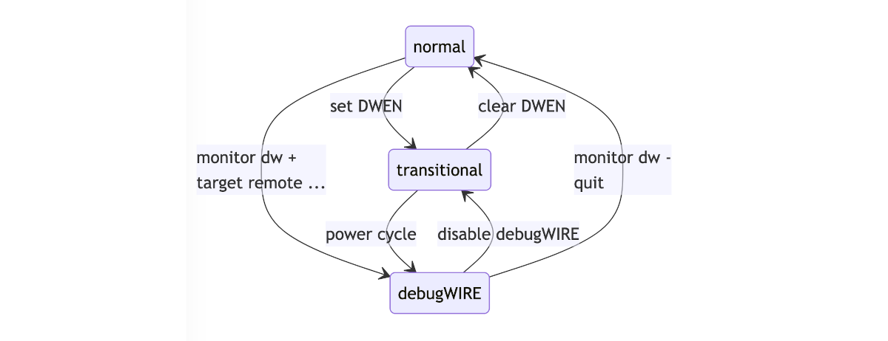
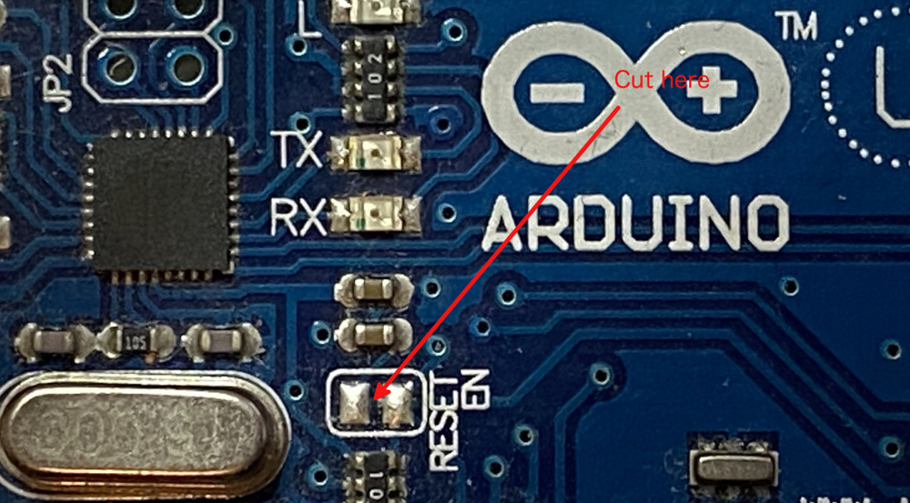
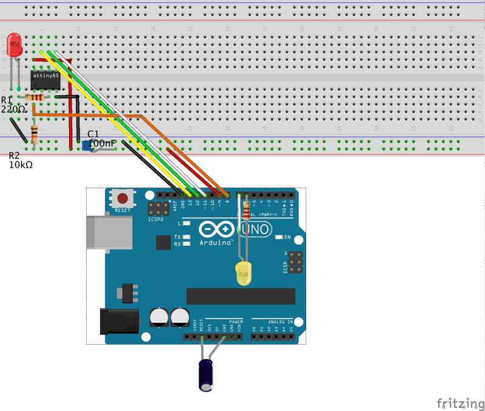
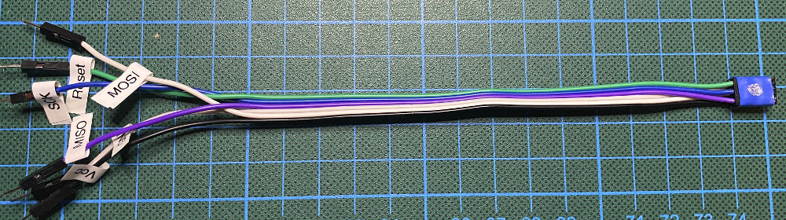
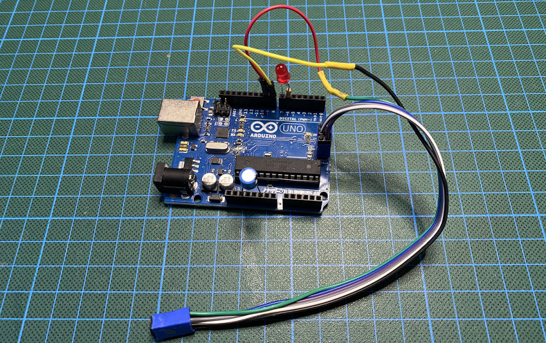
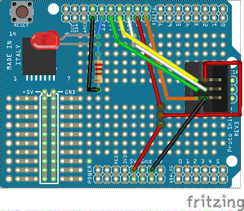
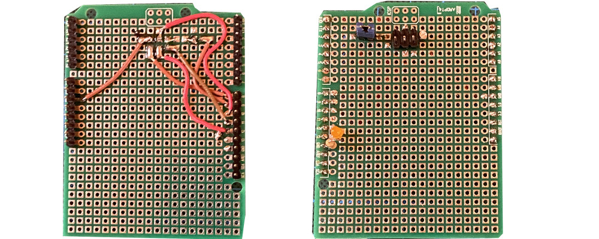
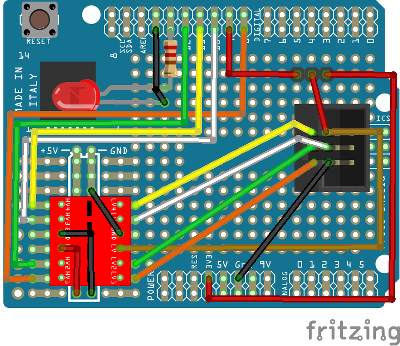
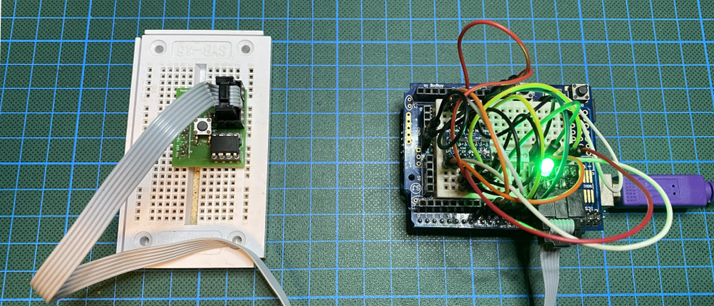
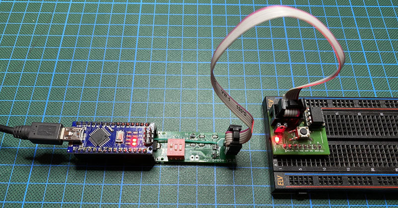

#   dw-link

# An Arduino-based debugWIRE debugger

**Bernhard Nebel**

**Version 1.2 - January 2022**

<a rel="license" href="http://creativecommons.org/licenses/by/4.0/"></a><br />This work is licensed under a <a rel="license" href="http://creativecommons.org/licenses/by/4.0/">Creative Commons Attribution 4.0 International License</a>.

<div style="page-break-after: always"></div>

[TOC]

## 1. Introduction

The Arduino IDE is very simple and makes it easy to get started. After a while, however, one notes that a lot of important features are missing. In particular, the current IDE does not support any kind of debugging. So what can you do when you want to debug your Arduino project on small ATmegas (such as the popular ATmega328) or ATtinys? The usual way is to insert print statements and see whether the program does the things it is supposed to do. However, supposedly one should be able to do better than that because the above mentioned MCUs support [on-chip debugging](https://en.wikipedia.org/wiki/In-circuit_emulation#On-chip_debugging) via [debugWIRE](https://en.wikipedia.org/wiki/DebugWIRE).

When you want real debugging support, you could buy expensive hardware-debuggers such as the Atmel-ICE and you have to use the development IDE [Microchip Studio](https://www.microchip.com/en-us/development-tools-tools-and-software/microchip-studio-for-avr-and-sam-devices) (for Windows) or [MPLAB X IDE](https://www.microchip.com/en-us/development-tools-tools-and-software/mplab-x-ide) (for all platforms). You may try to get the open-source software AVaRICE running; I was not successful in doing that on a Mac, though.

So, are there alternatives if you are in need of a debugging tool and you either want to develop on a Mac or you do not want to spend more than € 100 (or both)? Preferably, such a solution should interface to `avr-gdb`, the [GNU debugger](https://www.gnu.org/software/gdb/) for AVR MCUs.  This would make it possible to use IDEs such as [Eclipse](https://www.eclipse.org/) and [PlatformIO](https://platformio.org). Perhaps, one will also be able to integrate such a solution into the new Arduino IDE 2.0. 

There exists a software simulator called [SIMAVR](https://github.com/buserror/simavr) and there is a [GDB remote stub](https://sourceware.org/gdb/onlinedocs/gdb/Remote-Stub.html) for some ATmegas, called [avr_debug](https://github.com/jdolinay/avr_debug). Both are integrated into PlatformIO as debuggers. However, both tools come with a lot of restrictions and using them is not the same as debugging on the hardware where your firmware should finally run. 

Based on RikusW's work on [reverse engineering the debugWIRE protocol](http://www.ruemohr.org/docs/debugwire.html), you can find a few attempts at building debuggers using debugWIRE. First of all, there is an implementation called [dwire-debug](https://github.com/dcwbrown/dwire-debug) for host systems that use just the serial interface to talk with a target using the debugWIRE interface. This program implements [GDB's remote serial protocol](https://sourceware.org/gdb/current/onlinedocs/gdb/Remote-Protocol.html#Remote-Protocol).  However, only one breakpoint (the hardware breakpoint on the target system) is supported and the particular way of turning a serial interface into a one-wire interface does not seem to work under macOS, as far as I can tell. Additionally, there exists a similar implementation in Pascal called [debugwire-gdb-bridge](https://github.com/ccrause/debugwire-gdb-bridge) that appears to be more 'complete'. However, I was not able to install it. That is probably based on the fact that my knowledge of Pascal is rusty and I have no experience with the Lazarus IDE. Finally, there is the Arduino based hardware debugger called [DebugWireDebuggerProgrammer](https://github.com/wholder/DebugWireDebuggerProgrammer). Unfortunately, it is not able to program flash memory and it does not provide an interface for GDB's remote serial protocol. 

So, I took all of the above ideas (and some of the code) and put it together in order to come up with a cheap debugWIRE hardware debugger supporting GDB's remote serial protocol. Actually, it was a bit more than just throwing the things together. I developed a [new library for single wire serial communication](https://github.com/felias-fogg/SingleWireSerial) that is [much more reliable and robust](https://hinterm-ziel.de/index.php/2021/10/30/one-line-only/) than the usually employed SoftwareSerial library. Further, I fixed a few loose ends in the existing implementations, sped up communication and flash programming, supported super-slow MCU clocks (16 kHz), implemented an [interrupt-safe way of single-stepping](https://hinterm-ziel.de/index.php/2022/01/02/thats-one-small-step-for-a-man-one-giant-leap-for-a-debugger-on-single-stepping-and-interrupts/), and spent a few nights debugging the debugger. Along the way, I also made [a number of interesting discoveries](https://hinterm-ziel.de/index.php/2021/12/29/surprise-surprise/). 

For your first excursion into the wonderful world of debugging, you need an Arduino Uno (or something equivalent) as the hardware debugger (see [Section 3.1](#section31)) and a chip or board that understands debugWIRE (see [Section 3.2](#section32)). Then you only have to install the firmware for the debugger ([Section 4.1](#section41)) and set up the hardware for a debugging session ([Section 4.2](#section42)). 

Finally, you need to install a debugging environment. I will describe two options for that. The first one, covered in [Section 5](#section5), is the easiest one, which simply adds a ```platform.local.txt``` file to the Arduino configuration and requires you to download ```avr-gdb```. The second option, described in [Section 6](#section6), involves downloading the [PlatformIO](https://platformio.org/) IDE, setting up a project, and starting your first debug session with this IDE. There are numerous other possibilities. In the [guide](https://github.com/jdolinay/avr_debug/blob/master/doc/avr_debug.pdf) to debugging with *avr_debug*, there is an extensive description of how to setup [Eclipse](https://www.eclipse.org/) for debugging with *avr_debug*, which applies to *dw-link* as well. Another option may be [Emacs](https://www.gnu.org/software/emacs/). Unfortunately, so far, I have not been able to get avr-gdb to work under [gdbgui](https://www.gdbgui.com/).

If you have performed all the above steps, then the setup should look like as in the following picture.


The connection between dw-link and the target is something that finally might need some enhancements. Instead of six flying wires, you may want to have a more durable connection using an ISP cable, perhaps even featuring level-shifting and a switchable power-supply. This is all covered in [Section 7](#section7). Finally, possible problems and trouble shooting are covered in [Section 8](#section8) and [Section 9](#trouble), respectively.

<font color="red">

### Warning
</font>

Read [Sections 3.3 & 3.4](#section33) about the requirements on the RESET line carefully before trying to debug a target system. You might very well "brick" your MCU by enabling debugWIRE on a system which does not satisfy these requirements. 

<a name="section2"></a>

## 2. The debugWIRE interface

The basic idea of ***debugWIRE*** is that one uses the RESET line as a communication line between the ***target system*** (the system you want to debug) and the **hardware debugger**, which in turn can then communicate with the development machine or ***host***, which runs a debug program such as `gdb` or in our case `avr-gdb`. The idea of using only a single line that is not used otherwise is very cool because it does not waste any of the other pins for debugging purposes (as does e.g. the [JTAG interface](https://en.wikipedia.org/wiki/JTAG)). However, using the RESET line as a communication channel means, of course, that one cannot use the RESET line to reset the MCU anymore. Furthermore, one cannot any longer use [ISP programming](https://en.wikipedia.org/wiki/In-system_programming) to upload new firmware to the MCU or change the fuses of the MCU. Firmware uploads are possible over the debugWIRE interface, they are a bit slower, however. 

Do not get nervous when your MCU does not react any longer as you expect it, but try to understand in which state the MCU is. With respect to the debugWIRE protocol there are basically three states your MCU could be in:

1. The **normal** **state** in which the DWEN (debugWIRE enable) [fuse](https://microchipdeveloper.com/8avr:avrfuses) is disabled. In this state, you can use ISP programming to change fuses and to upload programs. By enabling the DWEN fuse, one reaches the **transitionary** **state**.
2. The **transitionary** **state** is the state in which the DWEN fuse is enabled. In this state, you could use ISP programming to disable the DWEN fuse again, in order to reach the **normal state**. By *power-cycling* (switching the target system off and on again), one reaches the **debugWIRE** **state**.
3. The **debugWIRE** **state** is the state in which you can use the debugger to control the target system. If you want to return to the **normal** **state**, a particular debugWIRE command leads to a transition to the **transitionary** **state**, from which one can reach the **normal state** using ordinary ISP programming. 
   

The hardware debugger will take care of bringing you from *normal* state to *debugWIRE* state when you connect to the target by using the `target remote` command or when using the ```monitor dwconnect``` command. The system LED will flash in a particular pattern, which signals that you should power-cycle the target. Alternatively, if the target is powered by the hardware debugger, it will power-cycle automatically. The transition from *debugWIRE* state to *normal* state can be achieved by the GDB command ```monitor dwoff```. If things seemed to have not worked out, you can simply reconnect the target to the hardware debugger and try out the two commands again.

<!-- 
mermaid
    stateDiagram
    normal --\> transitionary: set DWEN 
    transitionary --\> normal: clear DWEN
    normal --\> debugWIRE: monitor dwconnect
    transitionary --\> debugWIRE: power cycle
    debugWIRE --\> transitionary: disable debugWIRE
    debugWIRE --\> normal: monitor dwoff
-->



Having said all that, I have to admit that I encountered strange situations that I did not fully understand, and which led to "bricking" MCUs.  Usually, MCUs can be [resurrected by using a high-voltage programmer](#worstcase), though.

<a name="section3"></a>

## 3. Hardware requirements

There are a few constraints on what kind of board you can use as the base for the hardware debugger and some requirements on how to connect the debugger to the target system. Furthermore, there is only a limited set of AVR MCUs that can be debugged using  debugWIRE.

<a name="section31"></a>

### 3.1 The debugger

As mentioned above, as a base for the debugger, in principle one can use any ATmega328, ATmega1284, or ATmega2560 based board. The clock speed  must be 16MHz. Currently, the sketch has been tested on the following boards:

* [Arduino Uno](https://store.arduino.cc/products/arduino-uno-rev3),
* [Arduino Nano](https://store.arduino.cc/products/arduino-nano),
* [Arduino Pro Mini](https://docs.arduino.cc/retired/boards/arduino-pro-mini),
* [Arduino Mega](https://store.arduino.cc/products/arduino-mega-2560-rev3).

If you intend to use a different board, this is possible without too much hassle. You simply need to set up your own pin mapping (see [Sections 7.3.2 & 7.3.3](#section732)) in the source code (a big conditional compilation part in the beginning of the sketch). 

The most basic setup is to use the Uno board and connect the cables as it is shown in the [Fritzing sketch](#Fritzing) further down. If you want to use the debugger more than once, it may payoff to use a prototype shield and put an ISP socket on it. The more luxurious solution is an adapter board for Nano sized Arduino boards or a shield for the Uno sized Arduino boards as described further down in [Section 7](#section7).

<a name="section32"></a>

### 3.2 MCUs with debugWIRE interface

In general, almost all "classic" ATtiny MCUs and some ATmega MCUs have the debugWIRE interface. Specifically, the following MCUs that are supported by the Arduino standard core, by [MicroCore](https://github.com/MCUdude/MicroCore), by [ATTinyCore](https://github.com/SpenceKonde/ATTinyCore), and/or by [MiniCore](https://github.com/MCUdude/MiniCore) can be debugged using this interface:

* __ATtiny13(A)__
* __ATtiny43U__
* __ATtiny2313(A)__, __ATtiny4313__
* __ATtiny24(A)__, __ATtiny44(A)__, __ATtiny84(A)__
* __ATtiny441__, __ATtiny841__
* __ATtiny25__, __ATtiny45__, __ATtiny85__
* __ATtiny261(A)__, __ATtiny461(A)__, __ATtiny861(A)__
* __ATtiny87__, __ATtiny167__
* __ATtiny828__
* __ATtiny48__, __ATtiny88__
* __ATtiny1634__
* <s>__ATmega48__</s>, __ATmega48A__, __ATmega48PA__, ATmega48PB, 
* <s>__ATmega88__</s>, __ATmega88A__, __ATmega88PA__, Atmega88PB, 
* __ATmega168__, __ATmega168A__, __ATmega168PA__, ATmega168PB, 
* __ATmega328__, __ATmega328P__, __ATmega328PB__

I have tested the debugger on MCUs marked bold. The untested PB types appear to be very very difficult to get. The two MCUs that are stroke out have program counters with some bits stuck at one (see [Section 8.9](#section89)). For this reason, GDB has problems debugging them and dw-link rejects these MCUs.

Additionally, there exist a few more exotic MCUs, which also have the debugWIRE interface:

* ATmega8U2, ATmega16U2, ATmega32U2
* ATmega32C1, ATmega64C1, ATmega16M1, ATmega32M1, ATmega64M1
* AT90USB82, AT90USB162
* AT90PWM1, AT90PWM2B, AT90PWM3B
* AT90PWM81, AT90PWM161
* AT90PWM216, AT90PWM316
* <font color="grey">ATmega8HVA, ATmega16HVA, ATmega16HVB, ATmega32HVA, ATmega32HVB, ATmega64HVE2</font>

The debugger contains code for supporting all listed MCUs except for the ones marked grey, which are obsolete. I expect the debugger to work on the supported MCUs. However, there are always surprises. For example, some of my ATmegaX8s require a particular way of changing fuses under some yet not clearly identified circumstances, some ATmegaX8 have a funny way to deal with the program counter, and some ATmegaX8(A) claim to be ATmegaX8P(A) when debugWIRE is activated. 

<a name="section33"></a>

### 3.3 Requirements concerning the RESET line of the target system 

Since the RESET line of the target system is used as an [open-drain](https://en.wikipedia.org/wiki/Open_collector#MOSFET), [asynchronous](https://en.wikipedia.org/wiki/Asynchronous_communication) [half-duplex](https://en.wikipedia.org/wiki/Duplex_(telecommunications)#HALF-DUPLEX) [serial communication](https://en.wikipedia.org/wiki/Serial_communication) line, one has to make sure that there is no capacitive load on the line when it is used in debugWIRE mode. Further, there should be a pull-up resistor of around 10 kΩ. According to reports of other people, 4.7 kΩ might also work. And the RESET line should, of course,  not be directly connected to Vcc and there should not be any external reset sources on the RESET line.

If your target system is an Arduino Uno, you have to be aware that there is a capacitor between the RESET pin of the ATmega328 and the DTR pin of the serial chip, which implements the auto-reset feature. This is used by the Arduino IDE to issue a reset pulse in order to start the bootloader. One can disconnect the capacitor by cutting a solder bridge labeled *RESET EN* on the board (see picture), but then you cannot use the automatic reset feature of the Arduino IDE any longer. 



A recovery method may be to either put a bit of soldering  on the bridge or better to solder two pins on the board and use a jumper. Alternatively, you could always manually reset the Uno before the Arduino IDE attempts to upload a sketch. The trick is to release the reset button just when the compilation process has finished. 

Other Arduino boards, [such as the Nano, are a bit harder to modify](https://mtech.dk/thomsen/electro/arduino.php), while a Pro Mini, for example, can be used without a problem, provided the DTR line of the FTDI connector is not connected. In general, it is a good idea to get hold of a schematic of the board you are going to debug. Then it is easy to find out what is connected to the RESET line, and what needs to be removed. It is probably also a good idea to check the value of the pull-up resistor, if present. 

<a name="worstcase"></a>
### 3.4 Worst-case scenario 

So, what is the worst-case scenario when using debugWIRE? As described in [Section 2](#section2), first the DWEN fuse is programmed using ISP programming. Then one has to power-cycle in order to reach the debugWIRE state, in which you can communicate with the target over the RESET line. If this kind of communication fails, you cannot put the target back in a state, in which ISP programming is possible. Your MCU is *bricked*. It still works with the firmware programmed last time. However, the only way to reset the MCU is now to power-cycle it. Further, it is impossible to reprogram it using ISP programming.

There are two ways out. First you can try to make the RESET line compliant with the debugWIRE requirements. Then you should be able to connect to the target using the hardware debugger. Second, you can use high-voltage programming, where 12 volt have to be applied to the RESET pin. So you either remove the chip from the board and do the programming offline or you remove any connection from the RESET line to the Vcc rail and other components on the board. Then you can use either an existing high-voltage programmer or you [build one on a breadboard](https://github.com/felias-fogg/RescueAVR).


## 4. Installation and hardware setup

There are only a few steps necessary for installing the program on an ATmega328 board, most of which you probably already have done. For the hardware setup, you need a breadboard or a development board with one of the chips that speak debugWIRE.

<a name="section41"></a>

### 4.1 Software installation

Since the firmware of the hardware debugger comes in form of an Arduino sketch, you need to download first of all the [Arduino IDE](https://www.arduino.cc/en/software), if you have not done that already. Note that for some of the later software components (e.g., the ATTinyCore) a reasonably recent version is required. It is probably best when you upgrade your installation now. As an alternative, you can also use [PlatformIO](https://platformio.org/). 

Second, you need to download this repository somewhere, where the IDE is able to find the Arduino sketch. If you use PlatformIO, the note that the repository is already prepared to be opened as a PlatformIO project, i.e., it contains a `platformio.ini` file.

Third, you have to connect your ATmega328 (or similar) board to your computer, select the right board in the Arduino IDE and upload the *dw-link.ino* sketch to the board. Similarly, in PlatformIO, you have to choose the right board and choose the `Upload` menu entry.

<a name="section42"></a>

### 4.2 Setting up the hardware

Before you can start to debug, you have to setup the hardware. I'll use an ATtiny85 on a breadboard as the example target system and an Uno as the example debugger. However, any MCU listed above would do as a target. You have to adapt the steps where I describe the modification of configuration files in [Section 5](#section5) accordingly, though. And one could even use an Arduino Uno, provided the modification described in [Section 3.3](#section33) are done.

First of all, notice the capacitor of 10 µF or more between RESET and GND on the Uno board. This will disable auto-reset of the Uno board. This is optional and is helpful to speed up the connection process to the host. Second, note the LED and resistor plugged in to pin 7 and 6. This is the system LED which is used to visualise the internal state of the debugger (see below). Again, this is optional, but very helpful. 

<a name="Fritzing"></a>


Third, as you can see, the Vcc rail of the breadboard is connected to pin D9 of the Arduino Uno so that it will be able to power-cycle the target chip. Furthermore, pin D8 of the Arduino Uno is connected to the RESET pin of the ATtiny (pin 1).   Note the presence of the pull-up resistor of 10kΩ on the ATtiny RESET pin. The remaining connections between Arduino Uno and ATtiny are MOSI (Arduino Uno D11), MISO (Arduino Uno D12) and SCK (Arduino Uno D13), which you need for ISP programming. In addition, there is a LED connected to pin 3 of the ATtiny chip (which is PB4 or pin D4 in Arduino terminology). The pinout of the ATtiny85 is given in the next figure (with the usual "counter-clockwise" numbering of Arduino pins).


Here is a table of all the connections so that you can check that you have made all the connections. 

ATtiny pin# | Arduino Uno pin | component
--- | --- | ---
1 (Reset) | D8 | 10k resistor to Vcc 
2 (D3) |  |
3 (D4) |  |220 Ω resistor to LED (+)
4 (GND) | GND | LED (-), decoupling cap 100 nF, blocking cap of 10µF (-), 
5 (D0, MOSI) | D10 |
6 (D1, MISO) | D11 |
7 (D2, SCK) | D12 |
8 (Vcc) | D9 | 10k resistor, decoupling cap 100 nF 
 | RESET | blocking cap of 10 µF (+) 
 | D7 | system LED (+) 
 | D6 | 200 Ω to system LED (-) 

We are now good to go and 'only' need to install the additional debugging software. Before we do that, let us have a look, in which states the debugger can be and how it signals that using the system LED (the Arduino builtin LED on Arduino pin D13).

### 4.3 States of the hardware debugger

There are six states, the debugger can be in and each is signaled by a different blink pattern of the system LED:

* not connected (LED is off)
* waiting for power-cycling the target (LED flashes every second for 0.1 sec)
* target is connected (LED is on)
* target loads an executable (LED is on, but will be off for 0.1 sec each second)
* target is running (LED blinks 0.7 sec on / 0.7 sec off)
* error state, i.e., not possible to connect to target or internal error (LED blinks furiously every 0.1 sec)

If the hardware debugger is in the error state, one should try to find out the reason by typing the command `x/1db 0xffffffff`, study the [error message table](#fatalerror) at the end of the document, finish the GDB session, reset the debugger, and restart everything. If the problem persists, please check the section on [trouble shooting](#trouble).

### 4.4 Configuring dw-link by setting compile-time constants

Usually, it should not be necessary to change a compile-time constant in dw-link. I will nevertheless document all these constants here. If you want to change one of them, you can do that when using `arduino-cli` by using the `--build-property` option or by changing the value in the source code.

 Name | Default | Meaning
 --- | --- | ---
__VERSION__ | current version number | Current version number of dw-link; should not be changed. 
__NANOVERSION__ | 3 | The version of the Nano board used as a hardware debugger; this value is relevant only if a Nano board is used. 
__INITIALBPS__ | 230400 | The initial communication speed for communicating with the host; if communcation using this value cannot be established, 115200, 57600, 38400, 19200, 9600 bps are tried if __ADAPTSPEED__ is set to 1. 
__CONSTHOSTSPEED__ | 0 | If 0, then dw-link will try out different communication speeds to the host, otherwise it will stick to INITIALBPS 
__CONSTDWSPEED__ | 0 | If 0, the communication speed to the target will be changed so that it is as fast as possible, given the restriction that speed should not exceed 125000 bps. If 1, the initial speed of clk/128 is used. 
__STUCKAT1PC__ | 0 | If this value is set to 1, then dw-link will accept connections to targets that have program counters with stuck-at-one bits; one can then use the debugger, but GDB can get confused at many points, e.g., when single-stepping or when trying to produce a stack backtrace. 
__OFFEX2WORD__ | 0 | If 0, then 2-word instructions at breakpoints and when single-stepping will be simulated inside the hardware debugger; if 1, then they will be  executed off-line in the debugWIRE instruction register. While the latter alternative appears to work, one has no guarantee that it will always work. In any case, there should be no visible difference in behavior between the two alternatives. 
__TXODEBUG__ | 0 | If 1, debug output over the debug serial line is enabled.
__SCOPEDEBUG__ | 0 | If 1, `DDRC` is used for signaling the internal state by producing pulses on `PORTC`.
__FREERAM__ | 0 | If 1, then the amount of free RAM is measured, which can be queried using the command `monitor ramusage`.
__UNITALL__ | 0 | If 1, all unit tests are activated; they can be executed by using the command `monitor testall`.
__UNITDW__ | 0 | If 1, the unit tests for the debugWIRE layer are activated; execute them by using `monitor testdw`.
__UNITTG__ | 0 | If 1, the unit tests for the target layer are activated; use `monitor testtg` to execute them.
__UNITGDB__ | 0 | If 1, the unit tests for the GDB layer are activated, use `monitor testgdb` to execute them. 
__ARDUINO\_AVR\___*XXX* | undef | These constants are set when using the compile command of the Arduino IDE or CLI. They determine the pin mapping if an adapter board or shield is used (see [Section 7.3.2 & 7.3.3](#section732)). 


<a name="section5"></a>

## 5. Arduino IDE and avr-gdb

Assuming that you are working with the Arduino IDE and/or Arduino CLI, the simplest way of starting to debug your code is to use the GNU debugger. You only have to download the debugger and make a few changes to some of the configuration files. Please take notes on what you change because these changes will vanish when you upgrade to a new version of the Arduino package.

### 5.1 Installing ATTinyCore

Since ATtinys are not supported by default, one needs to download and install [ATTinyCore](https://github.com/SpenceKonde/ATTinyCore/blob/master/Installation.md), an Arduino core for the classic ATtinys using the boards manager. After you have done that, you need to create a ```platform.local.txt``` file in the right directory and might want to add some lines to the ```boards.txt``` file. 

<a name="section52"></a>

### 5.2 Modifications of platform.local.txt

When you have chosen the **Boards Manager Installation**, then you will find the ATTinyCore configuration files under the following directories:

* macOS: ~/Library/Arduino15/packages/ATTinyCore/hardware/avr/1.5.2
* Linux: ~/.arduino15/packages/ATTinyCore/hardware/avr/1.5.2
* Windows: C:\Users\\*USERNAME*\AppData\Local\Arduino15\packages\ATTinyCore\hardware\avr\1.5.2

If you have chosen **Manual Installation**, then you know where to look. In the directory with the ```platform.txt``` file create ```platform.local.txt``` (see `example/platform-local`) with the following contents:

```
recipe.hooks.savehex.postsavehex.1.pattern.macosx=cp "{build.path}/{build.project_name}.elf" "{sketch_path}"
recipe.hooks.savehex.postsavehex.1.pattern.linux=cp "{build.path}/{build.project_name}.elf" "{sketch_path}"
recipe.hooks.savehex.postsavehex.1.pattern.windows=cmd /C copy "{build.path}\{build.project_name}.elf" "{sketch_path}"
```

These three lines make sure that you receive an [*ELF*](https://en.wikipedia.org/wiki/Executable_and_Linkable_Format) file in your sketch directory when you select ```Export compiled Binary``` under the menu ```Sketch```. This is a machine code file that contains machine-readable symbols and line number information. It is needed when you want to debug a program using `avr-gdb`. 

### 5.3 Changing the optimization level: arduino-cli option or board.txt modification

Because of the compiler optimization level that is used by the Arduino IDE, the machine code produced by the compiler does not follow straightforwardly your source code. For this reason, it is advisable to use the optimization flag **-Og** (compile in a debugging friendly way) instead of the default optimization flag **-Os** (optimize to minimize space). 

I recently noticed that single-stepping does not appear to be supported properly when **-Og** is used. Also, assignments to local variables do often not work. So, if you want to do proper source code level debugging, you probably should use the **-O0** optimization level, where almost all optimizations are switched off, resulting in significantly more code. If you are using the console line interface `arduino-cli`, then this is easily achieved by adding the following option to the `arduino-cli compile` command:

```
--build-property build.extra_flags="-O0" 
```

I noticed recently, that another optimization setting can significantly impact your "debugging experience." Usually, [link-time optimization](https://en.wikipedia.org/wiki/Interprocedural_optimization#WPO_and_LTO) is enabled in the Arduino IDE, which has the effect that [most information about class inheritance and object attributes vanishes](https://hinterm-ziel.de/index.php/2021/12/15/link-time-optimization-and-debugging-of-object-oriented-programs-on-avr-mcus/). So, if you want to debug object-oriented code, then it makes sense to disable this kind optimization and add the flag **-fno-lto**:

```
--build-property build.extra_flags="-O0 -fno-lto" 
```

What can you do, if you do not want to use the CLI interface, but the IDE? You can modify the ```boards.txt``` file (residing in the same directory as the `platform.txt`file) and introduce for each type of MCU a new menu entry ```debug``` that when enabled adds the build option ```-Og```. For the ATTinyCore platform, you could simply add another menu entry in `boards.txt` under the first couple of lines as follows:

`
menu.debug=Debug Compile Flag
`

If you now want to be able to modify the debug flag for the ATtinyX5, scroll down to the line 

`
attinyx5.build.extra_flags={build.millis} -DNEOPIXELPORT=PORTB {build.pllsettings}
`

and add `{build.debug}` to the end of this line. Before the line, you have to insert the following four lines:

```
attinyx5.menu.debug.disabled=Disabled
attinyx5.menu.debug.disabled.build.debug=
attinyx5.menu.debug.enabled=Enabled
attinyx5.menu.debug.enabled.build.debug=-O0 -fno-lto
```

Now you have to restart the Arduino IDE. If you select `ATtiny25/45/85 (No bootloader)` from the menu of possible MCUs, then you will notice that there is a new menu option `Debug`. By the way, the LTO option can also be disabled separately. 

What can be done for the ATtiny `board.txt` configuration file can be be applied to other such files as well, of course. It is a bit of work and, as mentioned earlier, you may want to save a copy because the changes you made will vanish when a new version of the ATTinyCore is installed.

### 5.4 Installing avr-gdb

Unfortunately, the debugger is not any longer part of the toolchain integrated into the Arduino IDE. This means, you have to download it and install it by yourself:

* macOS: Use [**homebrew**](https://brew.sh/index_de) to install it. 

* Linux: Just install avr-gdb with your favorite packet manager.

* Windows: You can download the AVR-toolchain from the [Microchip website](https://www.microchip.com/en-us/development-tools-tools-and-software/gcc-compilers-avr-and-arm) or from [Zak's Electronic Blog\~\*](https://blog.zakkemble.net/avr-gcc-builds/). This includes avr-gdb.

### 5.5 Example session with avr-gdb

Now we are ready to start a debug session. So compile the example `varblink.ino` with debugging enabled, require the binary files to be exported, which gives you the file `varblink.ino.elf` in the sketch directory. Then connect your Uno to your computer and start avr-gdb. All the lines starting with either the **>** or the **(gdb)** prompt contain user input and everything after # is a comment. **\<serial port\>** is the serial port you use to communicate with the Uno.

```
> avr-gdb -b 115200 varblink.ino.elf 
GNU gdb (GDB) 10.1
Copyright (C) 2020 Free Software Foundation, Inc.
...
Reading symbols from varblink.ino.elf...
(gdb) target remote <serial port>              # connect to the serial port of debugger  
Remote debugging using <serial port>           # connection made
0x00000000 in __vectors ()                     # we always start at location 0x0000
(gdb) monitor dwconnect                        # show propertied of the debugWIRE connection
Connected to ATtiny85
debugWIRE is now enabled, bps: 125736
(gdb) load                                     # load binary file
Loading section .text, size 0x714 lma 0x0
Loading section .data, size 0x4 lma 0x714
Start address 0x00000000, load size 1816
Transfer rate: 618 bytes/sec, 113 bytes/write.
(gdb) list loop                                # list part of loop and shift focus
6       byte thisByte = 0;
7       void setup() {
8         pinMode(LED, OUTPUT);
9       }
10      
11      void loop() {
12        int i=random(100);
13        digitalWrite(LED, HIGH);  
14        delay(1000);              
15        digitalWrite(LED, LOW);              
(gdb) break loop                               # set breakpoint at start of loop function
Breakpoint 1 at 0x494: file ..., line 12.
(gdb) br 15                                    # set breakpoint at line 15
Breakpoint 2 at 0x4bc: file ..., line 15.
(gdb) c                                        # start execution at PC=0
Continuing.

Breakpoint 1, loop () at /.../varblink.ino:12
12        int i=random(100);
(gdb) next                                     # single-step over function                                         
13        digitalWrite(LED, HIGH);  
(gdb) n                                        # again
14        delay(1000);              
(gdb) print i                                  # print value of 'i'
$1 = 7
(gdb)  print thisByte                          # print value of 'thisByte'
$2 = 0 '\000'
(gdb) set var thisByte = 20                    # set variable thisByte
(gdb) p thisByte                               # print value of 'thisByte' again
$3 = 20 '\024'
(gdb) step                                     # single-step into function
delay (ms=1000) at /.../wiring.c:108
108             uint32_t start = micros();
(gdb) finish                                    # execute until function returns
Run till exit from #0  delay (ms=1000)
    at /.../wiring.c:108

Breakpoint 2, loop () at /.../varblink.ino:15
15        digitalWrite(LED, LOW);              
(gdb) info br                                   # give inormation about breakpoints
Num     Type           Disp Enb Address    What
1       breakpoint     keep y   0x00000494 in loop() 
                                           at /.../varblink.ino:12
        breakpoint already hit 1 time
2       breakpoint     keep y   0x000004bc in loop() 
                                           at /.../varblink.ino:15
        breakpoint already hit 1 time
(gdb) delete 1                                  # delete breakpoint 1
(gdb) detach                                    # detach from remote target
Detaching from program: /.../varblink.ino.elf, Remote target
Ending remote debugging.
[Inferior 1 (Remote target) detached]
(gdb) quit                                      # quit debugger
>
```


### 5.6 Disabling debugWIRE mode 

Note that the ATtiny MCU is still in debugWIRE mode and the RESET pin cannot be used to reset the chip. If you want to bring the MCU back to the normal state, you need to call `avr-gdb` again.

```
> avr-gdb
GNU gdb (GDB) 10.1
...

(gdb) set serial baud 115200            # set baud rate 
(gdb) target remote <serial port>       # connect to serial port of debugger    
Remote debugging using <serial port>
0x00000000 in __vectors ()
(gdb) monitor dwoff                     # terminate debugWIRE mode 
Connected to ATtiny85
debugWIRE is now disabled
(gdb) quit
>
```
Of course, you could have done that before leaving the debug session in the previous section.

### 5.7 GDB commands

In the example session above, we saw a number of relevant commands already. If you really want to debug using gdb, you need to know a few more commands, though. Let me just give a brief overview of the most interesting commands (anything between square brackets can be omitted, a vertical bar separates alternative forms, arguments are in italics). You also find a good reference card and a very extensive manual on the [GDB website](https://sourceware.org/gdb/current/onlinedocs/). I also recommend these [tips on using GDB](https://interrupt.memfault.com/blog/advanced-gdb) by [Jay Carlson](https://jaycarlson.net/). 

command | action
--- | ---
h[elp] | get help on gdb commands
h[elp] *command* | get help on a specific command
s[tep] [*number*] | single step statement, descending into functions (step in), *number* times 
n[ext] [*number*] | single step statement without descending into functions (step over)
stepi \| si [*number*] | single step a machine instruction, descending into functions
nexti \| ni [*number*] | single step a machine instruction without descending into functions
fin[ish] | finish current function and return from call (step out)
c[ontinue] [*number*] | continue from current position
r[un] | reset MCU and restart program at address 0x0000
ba[cktrace] \| bt | show call stack
up | go one stack frame up (in order to display variables)
down | go one stack frame down (only possible after up)
b[reak] *function* | set breakpoint at beginning of *function*
b[reak] [*file*:]*number* | set breakpoint at source code line *number* in the current file or the given *file* 
b[reak] **addr* | set a breakpoint at address *addr* 
i[nfo] b[reakpoints] | list all breakpoints
dis[able] *number* ... | disable breakpoint(s) *number*
en[able] *number* ... | enable breakpoint(s) *number*
d[elete] *number* ... | delete breakpoint(s) *number*
d[elete] | delete all breakpoints
cond[ition] *number* *expression* | stop at breakpoinit *number* only if *expression* is true
cond[ition] *number* | make breakpoint *number* unconditional

In order to display information about the program and variables in it, the following commands are helpful.

command | action
--- | ---
l[ist] | show source code around current point
l[ist] *function* | show source code around start of code for *function* and shift focus to function
l[ist] [*filename*:]*number* | show source code around line *number* in *filename* 
disas[semble] *function* | show assembly code of *function*
disas[semble] *address* | show assembly code of function around memory location *address*
p[rint] *expression* | evaluate expression and print 
i[nfo] reg[isters] | print contents of all registers
i[nfo] reg[isters] *regname* ... | print contents of specified register(s)
x *address* | examine memory contents at *address* and print it as a 4-byte hex-number
x/*nfu* *address* | examine memory contents at *address* with repeat count *n*, format *f*, and unit size *u* (they are all optional); format can be, e.g., **d** for decimal, **u** for unsigned decimal, **x** for hexadecimal, **c** for ASCII characters, **i** for machine instruction, and **s** for string; unit size can be **b** for one byte, **h** for a halfword, i.e., a 2-byte word, **w** for a 4-byte word, and **g** for a giant 8-byte word 
disp[lay]\[/*f*] *expression* | display expression using format *f* each time the program halts
disp[lay]/*nfu* *address* | display memory contents using *nfu* each time the program halts
i[nfo] di[splay] | print all auto-display commands
dis[able] d[display] *number* ... | disable auto-display command(s) numbered *number*
en[able]  d[display] *number* ... | enable auto-display command(s)
d[elete] d[display] *number* ... | delete auto-display commands(s)
d[elete] d[display] | delete all auto-display commands(s)

*address* in the above commands can be any numerical value or also the register names prefixed with a \$-sign, e.g., `$pc`. `display/i $pc`, for example, displays after each stop the machine instruction at the location where the program has stopped.

<a name="controlcommands"></a>
In addition to the commands above, you have to know a few more commands that control the execution of `avr-gdb`.

command | action
--- | ---
set se[rial] b[aud] *number* | set baud rate of serial port to the hardware debugger (same as using the `-b` option when starting `avr-gdb`); only effective when called before establishing a connection with the `target` command 
tar[get] rem[ote] *serialport* | establish a connection to the hardware debugger via *serialport*, which in turn will set up a connection to the target via debugWIRE (use only after baud rate has been specified!) 
tar[get] ext[ended-remote] *serialport* | establish a connection in the *extended remote mode*, i.e., one can restart the program using the `run` command
det[ach] | detach from target and let it run 
fil[e] *name*.elf | load the symbol table from the specified ELF file (should be done before establishing the connection to the target)
lo[ad] | load the ELF file into flash memory (should be done every time after the `target remote` command; it will only change the parts of the flash memory that needs to be changed)
q[uit] | exit from GDB 

<a name="monitor-commands"></a>

Finally, there are commands that control the settings of the debugger and the MCU, which are particular to dw-link. They all start with the keyword `monitor`.

command | action
--- | ---
mo[nitor] dwc[onnect] | establishes the debugWIRE link to the target (is already executed by the `target remote` command); will report MCU type and communication speed (even when already connected)
mo[nitor] dwo[ff] | disable debugWIRE mode in the target
mo[nitor] re[set] | resets the MCU
mo[onitor] er[ase] | erases the flash memory 
mo[nitor] ck8[prescaler] | program the CKDIV8 fuse (i.e., set MCU clock to 1MHz if running on internal oscillator)
mo[nitor] ck1[prescaler] | un-program the CKDIV8 fuse (i.e., set MCU to 8MHz if running on internal oscillator)
mo[nitor] rc[osc] | set clock source to internal RC oscillator
mo[nitor] ex[tosc] | set clock source to external clock
mo[nitor] xt[alosc] | set clock source to crystal oscillator
mo[nitor] sl[owosc] | set clock source to internal low frequency oscillator (125 kHz)
mo[nitor] hw[bp] | set number of allowed breakpoints to 1 (i.e., only HW BP) 
mo[nitor] sw[bp] | set number of allowed user breakpoints to 32 (+1 system breakpoint), which is the default
mo[nitor] sp[eed] [\<option>] | set communication speed limit to **l**ow (=125kbps) or to **h**igh (=250kbps); **l** is the default; without an argument, the current communication speed is printed 
mo[onitor] ser[ial] | print current communication speed of the connection to the host computer
mo[nitor] fla[shcount] | reports on how many flash-page write operation have taken place since start  
mo[nitor] sa[festep] | single-stepping is uninterruptible and time is frozen during single-stepping, which is the default 
mo[nitor] un[safestep] | single stepping is interruptible and time advances during single-stepping 
mo[nitor] ve[rsion] | print version number of firmware

Note that all monitor commands that change fuses also implicitly reset the MCU. In other words, all commands except the last eight will do that.

<a name="section6"></a>

## 6 PlatformIO

[platformIO](https://platformio.org/) is an IDE aimed at embedded systems and is based on [Visual Studio Code](https://code.visualstudio.com/). It supports many MCUs, in particular almost all AVR MCUs. And it is possible to import Arduino projects, which are then turned into ordinary C++ projects. Projects are highly configurable, that is a lot of parameters can be set for different purposes. However, that makes things in the beginning a bit more challenging. 

### 6.1 Installing PlatformIO

Installing PlatformIO is straight forward. Download and install Visual Studio Code. Then start it and click on the extension icon on the left, search for the PlatformIO extension and install it, as is described [here](https://platformio.org/install/ide?install=vscode). Check out the [quick start guide](https://docs.platformio.org/en/latest//integration/ide/vscode.html#quick-start). Now we are all set.

### 6.2 Import an Arduino project into PlatformIO

Now let us prepare a debugging session with the same project we had before. Startup Visual Studio Code and click on the home symbol in the lower navigation bar. Now PlatformIO offers you to create a new project, import an Arduino project, open a project, or take some project examples. Choose **Import Arduino Project** and PlatformIO will ask you which platform you want to use. Type in **attiny85** and choose **ATtiny85 generic**. If you have a different board, you can, of course, select a different board. After that, you can navigate to the directory containing the Arduino project and PlatformIO will import it. 


### 6.3 Debugging with PlatformIO


If you now click on the debug symbol in the left navigation bar (fourth from the top), PlatformIO enables debugging using **simavr**, the default debugger for this chip. You can now start a debug session by clicking the green triangle at the top navigation bar labeled **PIO Debug**. On the right, the debug control bar shows up, with symbols for starting execution, step-over, step-in, step-out, reset, and exit. On the left there are a number of window panes giving you information about variables, watchpoints, the call stack, breakpoints, peripherals, registers, memory, and disassembly. Try to play around with it!

But, of course, this is not the real thing. No LED is blinking. So close the window and copy the following two files from `examples/pio-config` to the project directory of your new PlatformIO project:

* `platformio.ini`
* `extra_script.py`

In the file `platformio.ini`, you need to put in the serial port your Arduino debugger uses. In general, you can use the `platformio.ini` configuration as a blueprint for other projects, where you want to use the hardware debugger. Note one important point, though. PlatformIO debugging will always choose the *default environment* or, if this is not set, the first environment in the config file. 

After having copied the two files into the project directory and reopened the project window, you should be able to debug your project as described above. Only now you are debugging the program on the target system, i.e., the LED really blinks!

A very [readable introduction to debugging](https://piolabs.com/blog/insights/debugging-introduction.html) using PlatformIO has been written by [Valerii Koval](https://www.linkedin.com/in/valeros/). It explains the general ideas and all the many ways how to interact with the PlatformIO GUI.

### 6.4 Disabling debugWIRE mode

There are two ways of switching off the debugWIRE mode. If you click on the ant symbol (last symbol in the left navigation bar), there should be the option *debug* environment. When you then click on *Custom*, you should see you the option *DebugWIRE Disable*. Clicking on it will set the MCU back to its normal state, where the RESET line can be used for resets and ISP programming is possible.  Alternatively, you should be able to bring back you MCU to the normal state by typing `monitor dwoff` in the debugging terminal window of the PlatformIO IDE.

<a name="section7"></a>

## 7. A "real" hardware debugger

The hardware part of our hardware debugger is very limited so far. You can, of course, use 6 jumper wires to connect dw-link to your target as described in [Section 4.2](#section42). However, if you want to use this tool more than once, then there should be at least something like a ISP cable connection. As a first approximation, I built something along  this line using a 6-wire Dupont jumper cable and heat shrink tubing.



While it is better then just 6 jumpers wires, you still have to remember which wire has to be connected to which Arduino pin. 

For most of the wires, we use the same pins on the debugger and the target. So, it makes sense to think about something similar to an ISP cable people use when employing an Arduino Uno as an ISP programmer. Such cables can be easily constructed with some Dupont wires and a bit of heat shrink tube as, for example, demonstrated in [this instructable](https://www.instructables.com/Arduino-ICSP-Programming-Cable/). And in contrast to such a programmer cable, it makes sense to also break out the Vcc wire.


As argued in [my blog post on being cheap](https://hinterm-ziel.de/index.php/2022/01/13/a-debugwire-hardware-debugger-for-less-than-10-e/), with such a wire we have sort of constructed a hardware debugger for less than 10 €, which can be considered as semi-durable.




The relevant pins are therefore as defined in the following table. <a name="simplemap"></a>

| Arduino pin          | ISP pin | Function    |
| -------------------- | ------- | ----------- |
| D13                  | 3       | SCK         |
| D12                  | 1       | MISO        |
| D11                  | 4       | MOSI        |
| D9 (or Vcc)          | 2       | VTG         |
| D8 (or D49 for Mega) | 5       | RESET       |
| GND                  | 6       | GND         |
| D7                   |         | System LED+ |
| D6                   |         | System LED- |

<a name="section71"></a>

### 7.1 A simple shield

Taking it one one step further, one might think about a shield for an Uno or adapter board for an Arduino Nano. It is actually very straightforward to build a basic hardware debugger that can be used without much preparation. Just take a prototype shield for an Uno or Mega, put an ISP socket on it, and connect the socket to the respective shield pins. You probably should also plan to have jumper pins in order to be able to disconnect the target power supply line from the Arduino pin that delivers the supply voltage. And finally, you probably also want to place the system LED on the board. So, it could look like as in the following Fritzing sketch. 

Note that here we use a somewhat different pin mapping then the one above in order to use the pin 13 builtin LED. In order to signal that to the sketch, pin D14 (=A0) on a Uno board needs to be connected to GND (see also the pin mapping for shields and adapter boards in Section [7.3.2](#section732) & [7.3.3](#section733).)





In reality, it probably will more look like as in the next picture.




This works very well on an Arduino Uno. On an Arduino Mega, you have to use Arduino pin 49 for the debugWIRE line, i.e., you have to make a flying wire connection. By the way, this is all taken care of already in the `dw-link.ino` sketch. You can also do the same thing with the Nano sized Arduinos. You should just be aware of the pin mapping as described in [Section 7.3.2 & 7.3.3](#section732). 


### 7.2 A shield with level shifters

If you work also with 3.3 volt systems, you probably would like to have a version with level-shifters. Again, this is easily achievable using, e.g., the Sparkfun [level-shifter breakout board with four BSS138 N-channel MOSFETs](https://www.sparkfun.com/products/12009). Of course, similar breakout boards work as well. Note that the target can now be powered with 3.3 V or 5 V and the level-shifter will take care of it; that is, even if no level-shifting is needed, it will work.




Now the reality check! How could a prototype look like? Instead of soldering it, I used a breadboard prototype shield with the level shifter breakout hidden under jumper wires on the left side of the breadboard.




Maybe it does not look completely convincing, but it does what it is supposed to do. In particular, the level-shifting works flawlessly. However, it is definitely not made for eternity. And even when I would give it a more sustainable form, this prototype has a few shortcomings. First, it has pull-up resistors on the SPI lines, i.e., it changes the electrical properties of these lines considerably. Second, when powering it with 3.3 volt from the Arduino board, one should source not more than 50 mA. Third, the board cannot power-cycle the target board when interfacing to a 3.3V board.

### 7.3 Adapter board/shield with level-shifter and switchable power supply

So, it would be great to have a board with the following features: 

* switchable target power supply (supporting power-cycling by the hardware debugger),
* offering 5 volt and 3.3 volt supply at 200 mA, 
* a bidirectional level-shifter on the debugWIRE line,
* an optional pull-up resistor of 10 kΩ on this line,
* unidirectional level-shifters on the ISP lines, and
* tri-state buffers for the two output signals MOSI and SCK.

I have designed a base board for the Arduino Nano V2, Nano V3, and Pro Mini,  with these features. You only have to set three DIP switches, then plug in a USB cable on one side and an ISP cable on the other side, and off you go. The following picture shows the version 1.0 dw-probe board in action hosting a Nano board. It all works flawlessly. The only problem I encountered is that Arduino Nanos with a CH340 serial chip appear not to be able to use a communication speed faster than 115200 to the host. 



The Eagle design files of the Version 1.1 board are in the [pcb](../pcb/) directory. This design is currently untested but should work based on the (faulty) V1.0 design. There is also a design for an Uno-sized shield in the directory, untested as well. But the boards should arrive soon. 


#### 7.3.1 DIP switch configuration

There are three different DIP switches labelled **Von**, **5V**, and **10k**. 

Label | On | Off
--- | --- | ---
**Von** | The debugger supplies power to the target (should be less than 200 mA) and the line is power-cycled when debugWIRE mode needs to be enabled | The debugger does not supply power to the target, which means that power has to be supplied externally and power-cycling needs to be done manually
**5V** | The debugger provides 5 V to the target board (if Von is on) | The debugger provides 3.3 V to the target board (if Von is on)
**10k** | A 10kΩ pull-up resistor is connected to the RESET line of the target | 

<a name="section732"></a>

#### 7.3.2 Functional pins of the adapter board 

In order to be able to accommodate different boards on the adapters, the pin mapping of the adapter boards is somewhat complex. First of all, let me list the functional pins.

Functional pin | Direction | Explanation
--- | --- | ---
DEBTX | Output | Serial line for debugging output (when debugging the debugger) 
DWLINE | Input/Output | debugWIRE communication line to be connected to RESET on the target board
GND | Supply | Ground
TISP | Output | Control line: If low, then ISP programming is enabled 
TMISO | Input | SPI signal "Master In, Slave Out"
TMOSI | Output | SPI signal "Master Out, Slave In"
TSCK | Output | SPI signal "Master clock"
SNSGND | Input | If open, signals that the debugger should use the [pin mapping tuned for an ISP cable](#simplemap), if low, use the pin mapping for the particular board as specified in the [table below](#complexmap) 
V33 | Output | Control line to the MOSFET to switch on 3.3 volt supply for target
V5  | Output | Control line to switch on the 5 volt line
Vcc | Supply | Voltage supply from the board (5 V) that can be used to power the target
VHIGH | Input from switch | If low, then choose 5 V supply for target, otherwise 3.3 V 
VON | Input from switch | If low, then supply target (and use power-cycling)
VSUP | Output | Used as a target supply line driven directly by an ATmega pin, i.e., this should not source more than 20 mA (this is the cheap alternative to using MOSFETs to drive the supply for the target board, e.g., when using a prototype board as sketched in [Section 7.1](#section71)) 

<a name="section733"></a>

#### 7.3.3 Pin mapping

If you plug in your Arduino into the adapter board or use the shield, you do not have to bother about pin assignments. The only important thing is to set the DIP switches (if you have those) and plug in the USB and ISP cable. 

When you use an Arduino Nano, you should be aware that  there are apparently two different versions around, namely version 2 and version 3. The former one has the A0 pin close to the 5V pin, while version 3 boards have the A0 pin close to the REF pin. If you use a Nano on the adapter board, you need to set the compile time constant `NANOVERSION`, either by changing the value in the source or by defining the value when compiling. The default value is 3.

In the table below, the mapping between functional pins of the debugger and the Arduino pins is given. 

<a name="complexmap"></a>

Pin | Nano V2 | Nano V3 |  Pro Mini | Uno | Mega 
--- | --- | --- | --- | --- | --- 
DEB-TX |A3=D17|A4=D18| D5 |D3|D3
DW-LINE | D8 | D8 |D8| D8 |D49
GND | GND | GND | GND | GND | GND 
TISP | D2 | D2 | D11 |D6|D6
TMISO | A2= D16 | A5= D19 | D6 |D11|D11
TMOSI | A5= D19 | A2= D16 | D3 |D10|D10
TSCK | D3 | D3 | D12 |D12|D12
SNS-GND | D11 | D11 | D10 |A0=D14|A0=D54
V33 | D5 | D5 | A0= D14 |D7|D7
V5 | D6 | D6  | A1= D15 |D9|D9
Vcc | 5V | 5V | Vcc |5V|5V
VHIGH | D7 | D7  | A2= D16 |D2|D2
VON | A1= D15 | A1= D15  | D2 |D5|D5
VSUP | D4 | D4 |  |A1=D15|A1=D55 


<a name="section8"></a>

## 8. Problems and shortcomings

*dw-link* is still in ***alpha*** state. The most obvious errors have been fixed, but there are most probably others. If something does not go according to plan, please try to isolate the reason for the erroneous behaviour, i.e., identify a sequence of operations to replicate the error. One perfect way to document a debugger error is to switch on logging and command tracing in the debugger:

```
set trace-commands on
set logging on
```

I have prepared an *[issue form](issue_form.md)* for you, where I ask for all the information necessary to replicate the error. 

Apart from bugs, there are, of course, shortcomings that one cannot avoid. I will present some of them in the next subsections.

### 8.1 Flash memory wear

Setting and removing *breakpoints* is one of the main functionality of a debugger. Setting a breakpoint is mainly accomplished by changing an instruction in flash memory to the BREAK instruction. This, however, implies that one has to *reprogram flash memory*. Since flash memory wears out, one should try to minimize the number of flash memory reprogramming operations.

One now has to understand that gdb does not pass *breakpoint set* and *breakpoint delete* commands from the user to the hardware debugger, but instead it sends a list of *breakpoint set* commands before execution starts. After execution stops, it sends *breakpoint delete* commands for all breakpoints. In particular, when thinking about conditional breakpoints, it becomes clear that gdb may send a large number of *breakpoint set* and *breakpoint delete* commands for one breakpoint during one debug session. Although it is guaranteed that flash memory can be reprogrammed at least 10,000 times according to the data sheets, this number can easily be reached even in a few debug sessions, provided there are loops which are often executed and where a conditional breakpoint has been inserted. Fortunately, the situation is not as bad as it looks since there are a number of ways of getting around the need of reprogramming flash memory.

First of all, *dw-link* leaves the breakpoint in memory, even when gdb requests to remove them. Only when gdb requests to continue execution, the breakpoints in flash memory are updated. Well, the same happens before loading program code, detaching, exiting, etc. Assuming that the user does not change breakpoints too often, this will reduce flash reprogramming significantly.  

Second, if there are many breakpoints on the same flash page, then the page is reprogrammed only once instead of reprogramming it for each breakpoint individually.

Third, when one restarts from a location where a breakpoint has been set, gdb removes this breakpoint temporarily, single steps to the next instruction, reinserts the breakpoint, and only then continues execution. This would lead to two reprogramming operations. However, *dw-link* does not update flash memory before single-stepping. Instead, if the instruction is a single-word instructions, it loads the original instruction into the *instruction register* of the MCU and executes it there. 

For two-word instructions (i.e., LDS, STS, JUMP, and CALL), things are a bit more complicated. The Microchip documents state that one should refrain from  inserting breakpoints at double word instructions, implying that this would create problems. Indeed, RikusW noted in his [reverse engineering notes about debugWIRE](http://www.ruemohr.org/docs/debugwire.html):
>Seems that its not possible to execute a 32 bit instruction this way.
The Dragon reflash the page to remove the SW BP, SS and then reflash again with the SW BP!!! 

I noticed that this is still the case, i.e., MPLAB-X in connection with ATMEL-ICE still reprograms the  page twice for hitting a breakpoint at a two-word instruction. The more sensible solution is to simulate the execution of these instructions, which is at least as fast and saves two reprogramming operations. And this is what *dw-link* does.

Fourth, each MCU contains one *hardware breakpoint register*, which stops the MCU when the value in the register equals the program counter. *dw-link* uses this for the breakpoint introduced most recently. With this heuristic, temporary breakpoints (as the ones GDB generates for single-stepping) will always get priority and more permanent breakpoints set by the user will end up in flash. 

Fifth, when reprogramming of a flash page is requested, *dw-link* first checks whether the identical contents should be loaded, in which case it does nothing. Further, it checks whether it is possible to achieve the result by just turning some 1's into 0's. Only if these two things are not possible, the flash page is erased and reprogrammed. This helps in particular when reloading a file with the GDB `load` command after only a few things in the program have been changed.  

With all of that in mind, you do not have to worry too much about flash memory wear when debugging. As a general rule, you should not make massive changes of the breakpoints each time the MCU stops executing. Finally, Microchip recommends that chips that have been used for debugging using debugWIRE should not been shipped to customers. Well, I never ship chips to customers anyway.

<a name="paranoid"></a>
For the really paranoid,  there is the option that permits only one breakpoint, i.e., the hardware breakpoint: `monitor hwbp`. In this case, one either can set one breakpoint or on can single-step, but not both. So, if you want to continue after a break by single-stepping, you first have to delete the breakpoint. By the way, with `monitor swbp`, one switches back to normal mode, in which 32 (+1 temporary) breakpoints are allowed.

In addition, there is the debugger command `monitor flashcount`, which returns the number of how many flash page reprogramming commands have been executed since the debugger had been started. This includes also the flash reprogramming commands needed when loading code.

<a name="section82"></a>

### 8.2 Slow responses when loading or single-stepping

Sometimes, in particular when using a clock speed below 1 MHz, responses from the MCU can be quite sluggish. This shows, e.g., when loading code or single-stepping. The reason is that a lot of communication over the RESET line is going on in these cases and the communication speed is set to the MCU clock frequency divided by 8, which is roughly 16000 bps in case of a 128 kHz MCU clock. If the CKDIV8 fuse is programmed, i.e., the MCU clock uses a prescaler of 8, then we are down to 16 kHz MCU clock and 2000 bps. The [Atmel AVR JTAGICE mkII manual ](https://onlinedocs.microchip.com/pr/GUID-73C92233-8EC5-497C-92C3-D52ED257761E-en-US-1/index.html) states under [known issues](https://onlinedocs.microchip.com/pr/GUID-73C92233-8EC5-497C-92C3-D52ED257761E-en-US-1/index.html?GUID-A686427B-0B7C-465A-BCFF-F093FD6B7A8F):

>Setting the CLKDIV8 fuse can cause connection problems when using debugWIRE. For best results, leave this fuse un-programmed during debugging. 

"Leaving the fuse un-programmed" means that you probably have to change the fuse to be un-programmed using a fuse-programmer, because the fuse is programmed by default. In order to simplify life, I added the two commands `monitor ck8prescaler` and `monitor ck1prescaler` to the hardware debugger that allows you to change this fuse. `monitor ck8prescaler` programs the fuse, i.e., the clock is divided by 8, `monitor ck1prescaler` un-programs this fuse. In addition to changing the CKDIV8 fuse, you can also change the clock source with monitor commands, whereby always the slowest startup time is chosen (see [monitor commands](#monitor-commands)). Be careful about setting it to *XTAL* or *external clock*! Your MCU will get unresponsive if there is no crystal oscillator or external clock, respectively. Note that after executing the commands, the MCU is reset (and the register values shown by the GDB `register info` command are not valid anymore). 

Another reason for slow loading times can be that the communication speed to the host is low. Check the speed by typing the command `monitor serial`. You can set the speed to 230400 by supplying the speed when using the `set serial baud` command. This has to done *before* connecting to the hardware debugger using the `target remote` command. 

With an optimal setting, i.e., 125 kbps for the debugWIRE line and 230400 kbps for the host communication line, loading is done with 500-700 bytes/second. It is should be 3-5 KiB/second when the identical file is loaded again (in which case only a comparison with the already loaded file is performed).

### 8.3 Program execution is very slow when conditional breakpoints are present

If you use *conditional breakpoints*, the program is slowed down significantly.  The reason is that at such a breakpoint, the program has to be stopped, all registers have to be saved, the current values of the variables have to be inspected, and then the program needs to be started again, whereby registers have to be restored first. For all of these operations, debugWIRE communication takes place. This takes roughly 100 ms per stop, even for simple conditions and an MCU running at 8MHz. So, if you have a loop that iterates 1000 times before the condition is met, it may easily take 2 minutes (instead of the fraction of a second) before execution stops.

<a name="section84"></a>

### 8.4 Single-stepping and interrupt handling clash

In many debuggers, it is impossible to do single-stepping when timer interrupts are active since after each step the program ends up in the interrupt routine. This is not the case with `avr-gdb` and *dw-link*. Instead, time is frozen and interrupts cannot be raised while the debugger single-steps. Only when the `continue` command is used, interrupts are serviced and the timers are advanced. One can change this behavior by using the command `monitor unsafestep`. In this case it can happen that control is transferred to the interrupt vector table while single-stepping.

### 8.5 Limited number of breakpoints

The hardware debugger supports only a limited number of breakpoints. Currently, 32 breakpoints (+1 temporary breakpoint for single-stepping) are supported by default. You can reduce this to 1 by issuing the command `monitor hwbp` ([see above](#paranoid)). If you set more breakpoints than the maximum number, it will not be possible to start execution. Instead one will get the warning `Cannot insert breakpoint ... Command aborted`. You have to delete or disable some breakpoints before program execution can continue. However, you should not use that many breakpoints in any case. One to five breakpoints are usually enough. 

### 8.6 Power saving is not operational 

When you activate *sleep mode*, the power consumed by the MCU is supposed to go down significantly. If debugWIRE is active, then some timer/counters will never be stopped and for this reason the power reduction is not as high as in normal state.

<a name="section87"></a>

### 8.7 MCU operations interfering with debugWIRE

There are a few situations, which might lead to problems. The above mentioned list of [known issues](https://onlinedocs.microchip.com/pr/GUID-73C92233-8EC5-497C-92C3-D52ED257761E-en-US-1/index.html?GUID-A686427B-0B7C-465A-BCFF-F093FD6B7A8F) mentions the following:

* BOD and WDT resets lead to loss of connection 
* The voltage should not be changed during a debug session
* The OSCCAL and CLKPR registers should not be changed during a debug session
* The PRSPI bit in the power-saving register should not be set
* The CKDIV8 fuse should not be in the programmed state when running off a 128 kHz clock source
* Breakpoints should not be set at the last address of flash memory
* Do not single step over a SLEEP instruction
* Do not insert breakpoints immediately after an LPM instruction

If you do one of these things, either you might lose the connection to the target or, in the last three cases, the instruction might do something wrong. If you lose connection to the target, then it is very likely that there are still BREAK instructions in flash memory. So, after reconnecting, you need to issue the `load` command in order to get a clean copy of your binary into flash memory.

### 8.8 BREAK instructions in your program

It is possible to put the BREAK instruction, which is used to implement breakpoints, in ones program by using the inline assembly statement asm("break"). This does not make any sense since without the debugger, the MCU will stop at this point and will not do anything anymore. Such a BREAK instruction may also be in the program because a previous debugging session was not terminated in a clean way. If such a BREAK is detected, one may want to issue the `load` command again.

When running under the debugger, the program will be stopped in the same way as if there is a software breakpoint set by the user. However, one cannot continue execution from this point with the `step`, `next`, or `continue` command. Instead, the debugger gets an "illegal instruction" signal. So, one either needs to reload the program code or, set the PC to a different value, or restart the debugging session.

<a name="section89"></a>

### 8.9 Some MCUs have stuck-at-one bits in the program counter

Some debugWIRE MCUs appear to have program counters in which some unused bits are stuck at one. ATmega48s and ATmega88s (without the A-suffix), which I have sitting on my bench,  have their PC bits 11 and 12 or only PC bit 12 always stuck at one. In other words the PC has at least the value 0x1800 or 0x1000, respectively (note that the AVR program counter addresses words, not bytes!). The hardware debugger can deal with it, but GDB gets confused when trying to perform a stack backtrace. It gets also confused when trying to step over a function call or tries to finalize a function call. For these reasons, debugging these MCUs does not make much sense and dw-link rejects these MCUs with an error message when one tries to connect to one of those (see also [this blog entry](https://hinterm-ziel.de/index.php/2021/12/29/surprise-surprise/)). 

 The only reasonable way to deal with this problem is to use a different MCU, one with an A, PA, or PB suffix. If you really need to debug this particular MCU and are aware of the problems and limitations, you can recompile the sketch with the compile time constant `STUCKAT1PC` set to 1.

### 8.10 The start of the debugger takes a couple of seconds

The reason is that when the host establishes a connection to the debugger, the debugger is reset and the bootloader waits a couple of seconds. You can avoid that by either disabling the auto-reset by putting a capacitor of 10 µF or more between RESET and GND or by cutting the RESET EN solder bridge on an Arduino Uno. Alternatively, you can flash the debugger firmware with an ISP programmer so that the boot loader is not active any longer, speeding up the reset process.

<a name="trouble"></a>

## 9 Trouble shooting

#### Problem: After changing optimization options, the binary is still too large/very small

You switched optimization option from **-O0 -fno-lto** back to normal and you recompiled, but your program still looks very big. The reason for that can be that the Arduino IDE/CLI does not always recompile the core, but reuses the compiled and linked archive. You can force a recompile of the core by touching a file in the 'core' file folder, e.g., in order to recompile the core files for the standard Arduino cores: 

```
touch ~/Library/Arduino15/packages/arduino/hardware/avr/1.8.4/platform.local.txt
```

#### Problem: When starting the debug session in PlatformIO, you get the message *pioinit:XX: Error in sourced command file*

Something in the `platformio.ini` file is not quite right. Perhaps a missing declaration of the `debug_port`. Sometimes an additional line of information is given that identifies the problem.

One common problem is that the debug environment is not the first environment or the default environment. In this case, the wrong environment is used to configure the debug session and probably some environment variables are not set at all or set to the wrong values. So, you need to edit the `platformio.ini` file accordingly.

#### Problem: When connecting to the target using the *target remote* command, it takes a long time and then you get the message *Remote replied unexpectedly to 'vMustReplyEmpty': timeout*

Probably, the serial connection to the hardware debugger could not be established. The most likely reason for that is that there is a mismatch of the bit rates. The Arduino tries out 230400, 115200, 57600, 38400, 19200, and 9600 bps when connecting. If you specified something differently, either as the argument to the `-b` option when starting `avr-gdb` or as an argument to the GDB command `set serial baud ...`, you should change that. I also noticed that some Arduino Nanos that use the CH340 USB-to-serial converter should not be used with high bitrates. The highest sustainable bitrate appears to be 115200  bps for those boards. A further (unlikely) reason might be that a different communication format was chosen (parity, two stop bits, ...). 

#### Problem: It is not possible to connect to an ATmega48 or ATmega88 using the *target remote* command

This is most probably an MCU with stuck-at-one bits in the program counter (see [Section 8.9](#section89)). These MCUs cannot be debugged with GDB. 

#### Problem: You receive the message *Protocol error with Rcmd* 

This is a generic GDB error message that indicates that the last `monitor` command you typed could not be successfully executed. Usually, also a more specific error message is displayed, e.g., *debugWIRE could NOT be disabled*. These messages are suppressed in some GUIs, though. 

<a name="lost"></a>
#### Problem: You get the message *Connection to target lost*, the program receives a `SIGHUP` signal when you try to start execution, and/or the system LED is off

The target is not responsive any longer. Possible reasons for such a loss of connectivity could be that the RESET line of the target system does not satisfy the necessary electrical requirements (see [Section 3.3](#section33)). Other reasons might be that the program disturbed the communication by changing, e.g., the MCU clock frequency (see [Section 8.7](#section87)). Try to identify the reason, eliminate it and then restart the debug session.  Most probably, there are still BREAK instructions in flash memory, so the `load` command should be used to reload the program.


#### Problem: When stopping the program with Ctrl-C (or with the stop button), you get the message *Cannot remove breakpoints because program is no longer writable.*

The reason is most probably that the communication connection to the target system has been lost ([see above](#lost)).


#### Problem: The debugger responses are very sluggish   

One reason for that could be that the target is run with a clock less than 1 MHz, e.g. at 128 kHz. Since the debugWIRE communication speed is MCU clock/8 or clock/16, the communication speed could be 8kbps. If the CKDIV8 fuse is programmed, it could even be only 1kbps. Unprogram CKDIV8 and if possible choose a higher clock frequency  (see [Section 8.2](#section82)). 

Another reason may be that the communication speed between hardware debugger and host is low. If you do not specify anything, it will be only 9600 bps. Check the speed by typing the command `monitor serial`. It will print the current connection speed. 

You can choose 230400, 115200, 57600, 38400, 19200, or 9600 when starting `avr-gdb` by giving the bit rate as an argument to the `-b` option or by specifying the bit rate as an argument to the command `set serial baud ...` before establishing a connection with the `target` command.

#### Problem: The debugger does not start execution when you request *single-stepping* or *execution* and you get the warning *Cannot insert breakpoint ... Command aborted* 

You use more than the allowed number of breakpoints, i.e., usually 32 (+1 for a temporary breakpoint for single-stepping). If you have executed the `monitor hwbp` command, this number is reduced to 1. In this case, you can either set a breakpoint or you can single-step, but not both! In any case, you need to reduce the number of breakpoints before you can continue.

#### Problem: While single-stepping, time seems to be frozen, i.e., the timers do not advance and no timer interrupt is raised

This is a feature, not a bug.  It allows you to single-step through the code without being distracted by interrupts that transfer the control to the interrupt service routine. Time passes and interrupts are raised only when you use the `continue` command (or when the `next` command skips over a function call). You can change this behavior by using the command `monitor unsafestep`, which enables the timers and interrupts while single-stepping. In this case, however, it may happen that during single-stepping control is transferred into an interrupt routine.

#### Problem: When single stepping with `next` or `step` , the program ends up at the start of flash memory, e.g., 0x0030

This should only happen when you have used the command `monitor unsafestep` before, which  enables interrupts while single-stepping. In this case an interrupt might have raised which has transferred control to the interrupt vector table at the beginning of flash memory. If you want to continue debugging, set a breakpoint at the line you planned to stop with the single-step command and use the `continue` command. If you want to avoid this behavior in the future, issue the debugger command `monitor safestep`. 

#### Problem: The debugger does step into a function even though you used the `next` command, or it ends up somewhere else

 This happens even if you have chosen the optimization **-Og** (debugging friendly). It is not yet clear to my why this happens, but the reason appears to be in `avr-gdb` and I plan to further investigate this.

In any case, recompile with **-O0** and preferably also with **-fno-lt**. Then single-stepping works as expected.

#### Problem: When single stepping with `next` or `step` , you receive the message *Warning: Cannot insert breakpoint 0* and the program is stopped at a strange location

The problem is similar to the one above: You used too many breakpoints and there is no temporary breakpoint left for gdb. The program is probably stopped somewhere you have not anticipated. You may be able to recover by deleting one or more breakpoints, setting a breakpoint close to where you wanted to step, and then using the `continue` command. If this is not possible, restart and use fewer breakpoints.

#### Problem: The debugger does not start execution when you request *single-stepping* or *execution*, you get the message *illegal instruction*, and the program receives a `SIGILL` signal

The debugger checks whether the first instruction it has to execute is a legal instruction according to the Microchip specification. Additionally, a BREAK instruction (which has not been inserted by the debugger) is considered as illegal since it would halt the MCU. Such a BREAK instruction might have been inserted as part of the program code or may be a leftover from a previous debugging session that has not been terminated in a clean way.

Check the instruction by using the command `x/i $pc`. If the BREAK instruction is a leftover from a previous debug session, you can remove it using the `load` command. Note that the program counter is set to 0x0000 and you should use the `monitor reset` command to reset your MCU before restarting.

If you simply want to continue, you can set the PC to another value, e.g., one that is higher by two or four. Do that by using the command `set $pc=...`. 

#### Problem: The debugger does not stop at the line a breakpoint was set

Not all source lines generate machine code so that it is sometimes impossible to stop at a given line. The debugger will then try to stop at the next possible line. This effect can get worse with different compiler optimization levels. For debugging, `-O0` is recommended, which removes all optimization. This is also the default for PlatformIO and the Arduino IDE (if one has applied the changes described in [Section 5.2](#section52)). You can change that to `-Og` if too much flash memory is used. But then, the debugger can do strange things when single-stepping, for example.

#### Problem: You have set the value of a local variable using the `set var <var>=<value>` command, but the value is still unchanged when you inspect the variable using the `print` command

This appears to happen even when the optimization level is set to **-Og**, but not when you use **-O0**. So, if it is important for you to change the value of local variables, you should use the latter optimization level.

#### Problem: The debugger does things that appear to be strange

I encountered such behavior more than once and it very often turned out that I had forgotten to load the binary code into flash. Remember to use the `load` command ***every time*** after you have started a debugging session. Otherwise it may be the case that the MCU flash memory contains old code! Note that after the `load` command the program counter is set to zero. However, the MCU and its registers have not been reset. You should probably do that by using the command `monitor reset`. Alternatively, when you initiated your session with `target extended-remote ...`, you can use the `run` command that resets the MCU and starts at address zero. 

Another possible reason for strange behavior is the chosen compiler optimization level. If you have not chosen **-O0** and **-fno-lto**, then single-stepping may not work as expected, you may not be able to assign values to local variables, and the objects may not be printed the right way. 

#### Problem: In PlatformIO, the global variables are not displayed

I have no idea, why that is the case. If you want to see the value of a global variable, you can set a `watchpoint`.

#### Problem: The disassembly cannot be displayed

Older versions of avr-gdb had a problem with disassembly: [https://sourceware.org/bugzilla/show_bug.cgi?id=13519](https://sourceware.org/bugzilla/show_bug.cgi?id=13519). In the current version the problem has been fixed, though. So, you might want to get hold of a current version.

<a name="fatalerror"></a>

#### Problem: The system LED blinks furiously and/or the program receives an `ABORT` signal when trying to start execution

In this case some serious internal error had happened. You have to stop the current debug session and restart. 

The reason for such an error could be that the connection to the target could not be established or that there was an internal debugger error. It may be that the corresponding error message has already been displayed. If it is a connection error that happened when you tried to establish a connection, you may get the error message by typing `monitor dwconnect`. You can also find out what kind of error happened by examining the memory at address `0xFFFFFFFF`. Type the following command:

```
x/db 0xFFFFFFFF
```

The (virtual) memory cell at this address contains the relevant error number. If the error number is less than 100, then it is a connection error. Errors above 100 are serious internal debugger errors (see below).

If you have encountered an internal debugger error, then please try to reproduce the problem and tell me how it happened. Please try to distill a minimal example leading to the problem and fill out the [*issue form*](issue_form.md). By the way: `monitor dwoff` can still be executed, provided there is still a functioning connection to the target. So you should still be able to disable debugWIRE on the target MCU even if a fatal error has happened. 


Error #  | Meaning
--:|---
1 | Connection error: No response to ISP and debugWIRE communication; check wiring
2 | Connection error: MCU type is not supported
3 | Connection error: Lock bits are set; erase MCU and try again
4 | Connection error: MCU has PC with stuck-at-one bits 
5 | Unknown connection error
101 | No free slot in breakpoint table
102 | Packet length too large
103 | Wrong memory type
104 | Packet length is negative
105 | Reset operation failed
106 | Memory address in flash read operation does not point to page start
107 | Could not complete flash read operation
108 | Could not complete RAM read operation
109 | Memory address in flash write operation does not point to page start
110 | Could not complete flash page erase operation
111 | Could not load data into the flash buffer for writing
112 | Error when programming flash page from buffer
113 | Assignment of hardware breakpoint is inconsistent
114 | BREAK inserted by debugger at a point where a step or execute operation is required
115 | Trying to read flash word at an uneven address
116 | Error when single-stepping
117 | A relevant breakpoint has disappeared
118 | Input buffer overflow
119 | Wrong fuse 
120 | Breakpoint update while flash programming is active 

## Revision history

#### V1.1 

Initial version

#### V 1.2

- Changed pin mapping. The default is now to use ISP pins on the debugger so that a simple ISP cable with broken out RESET line is sufficient. System LED is pin D7, GND for the system LED is provided at pin D6. In order to use the pin mapping for shields/adapters, one has to tie SNSGND to ground, whereby the pin number of SNSGND depends on the Arduino board dw-link is compiled for (see mapping described in [Section 7.3.3](#section733)).
- Added wording to recommend optimization level -O0 instead of -Og, because otherwise single-stepping and assignments to local variables will not work. I will look into that in the future.
