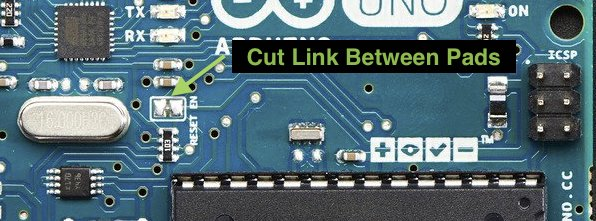
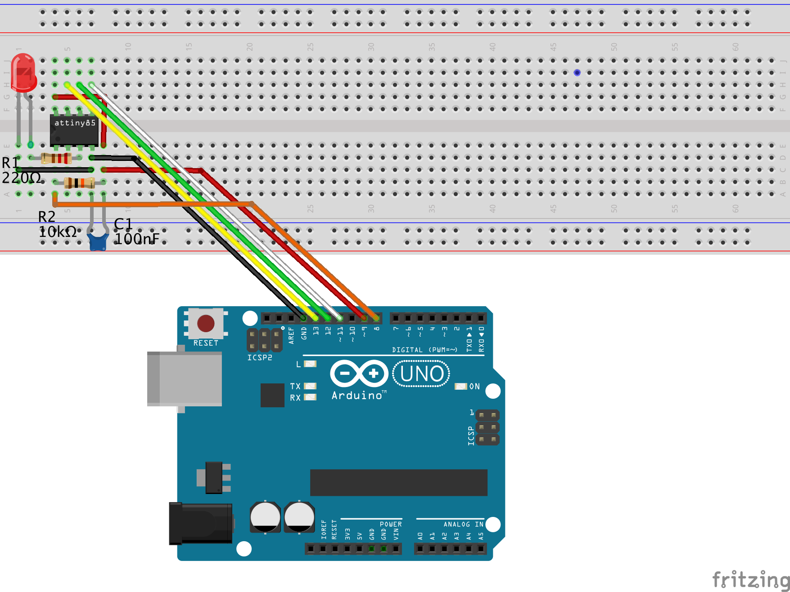

# debugWIRE-probe

The Arduino IDE is very simple and makes it easy to get started. After a while, however, one notices that a lot of important features are missing. In particular, the IDE does not support any kind of debugging. So what can you do, when you want to debug you Arduino project? The usual way is to insert print statements and see whether the program does the things it is supposed to do.  

When you want real debugging support, you could buy expensive hardware-debuggers such as the Atmel-ICE, but then you have to use the development IDE [Microchip Studio](https://www.microchip.com/en-us/development-tools-tools-and-software/microchip-studio-for-avr-and-sam-devices), which only runs under Windows (and is not easy to work with). If you want to use open source software, you will notice that there is AVaRICE, however, Atmel-ICE cannot be used under macOS. So, what are the alternatives if you want to develop programs for AVR ATtinys and small ATmegas and you are in need of a debugging tool and do not to spend more than € 100?

There exists a software simulator called [SIMAVR](https://github.com/buserror/simavr) and there is a [remote stub](https://sourceware.org/gdb/onlinedocs/gdb/Remote-Stub.html) for some ATmegas, called [AVR8-STUB](https://github.com/jdolinay/avr_debug). Both are integrated into PlatformIO as debuggers. However, using them is not the same as debugging on the hardware where your firmware should finally run. There exists a gdbserver implementation, called [dwire-debug](https://github.com/dcwbrown/dwire-debug), for host systems that uses just the serial interface of the host to talk with a target using the debugWIRE interface. However, only one breakpoint (the hardware breakpoint on the target system) is supported and the particular way of turning a serial interface into a one-wire interface does not seem to work under macOS, as far as I can tell (after some time of experimentation). Finally, there exists an Arduino based hardware debugger called [DebugWireDebuggerProgrammer](https://github.com/wholder/DebugWireDebuggerProgrammer). Unfortunately, it does not provide a gdbserver interface.

So, I took all of the above ideas and put them together in order to come up with a cheap hardware debugger supporting the gdbserver interface that is able to debug the classic ATtinys and some smaller ATmegas (such as the popular ATmega328).

## 1. The debugWIRE interface

The basic idea of *debugWIRE* is that one uses the RESET line as a communication line between the target system (the system you want to debug) and the development machine, which runs a debug program such as GDB. This idea is very clever because it does not waste any of the other pins for debugging purposes (as does e.g. the [JTAG interface](https://en.wikipedia.org/wiki/JTAG)). However, using the RESET line as a communication channel means, of course, that one cannot use the RESET line to reset the MCU anymore. Furthermore, one cannot any longer use [ISP programming](https://en.wikipedia.org/wiki/In-system_programming) to upload new firmware to the MCU. 

Do not get nervous when your MCU does not react any longer as you expect it, but try to understand, in which state the MCU is. With respect to the debugWIRE protocol there are three states your MCU could be in:

1. The **normal** state in which the DWEN (debugWIRE enable) [fuse](https://microchipdeveloper.com/8avr:avrfuses) is disabled. In this state, you can use ISP programming to change fuses and to upload programs. By enabling the DWEN fuse, one reaches the **transitionary** state.
2. The **transitionary** state, in which the DWEN fuse is enabled. In this state, you could use ISP programming to disable the DWEN fuse again, in order to reach the **normal state**. By *power-cycling* (switching the target system off and on again), one reaches the **DebugWIRE** state.
3. The **debugWIRE** state is the state in which you can use the debugger to control the target system. If you want to return to the **normal** state, a particular debugWIRE command leads to a transition to the **transitionary** state, from which one can reach the normal state.

The hardware debugger will take care of bringing you from state 1 to state 3 in order start debugging by either power-cycling itself or asking you to do it. This is accomplished with the gdb command ```monitor init```. The transition from state 3 to state 1 can be achieved by the gdb command ```monitor stop```.


## 2. Hardware requirements

There are a few constraints on what kind of board you can use as the base for the hardware debugger and some requirements on how to connect the debugger to the target system.

### 2.1 The debugger
As mentioned above, as a base for the debugger you can use any ATmega328 based board (or anything compatible with more memory). The clock speed  should be 16MHz, otherwise you may not be able to debug targets that use 16MHz. The basic solution is just to use this board and connect the cables (as it is shown in the example sketch for an ATtiny85 as the target system further down).

If you want to use the debugger more than once, it may payoff to configure an ISP cable with the RESET line broken out, similar to what has been described by dmjlambert in [his instructables](https://www.instructables.com/Arduino-ICSP-Programming-Cable/). Going one step further, one could break out the Vcc line on ICSP pin 2 as well and 

* connect it to Arduino pin 9 in order to be able to power-cycle the target system automatically when necessary; note that in this case he target system should draw no more than 20 mA;
* leave it open when the target system has an external power source;
* or connect it to Vcc of the Arduino board powering the target system from the Uno.

In the latter two cases, you need to power-cycle the target system manually.

How much more luxuriously can it get? One could have level shifters so that also 3.3 volt systems can be debugged. In addition, one could provide more power to source the target system. Well, this could all be done on a small adapter PCB for an Arduino Nano, which is actually in the planning stage.


### 2.2 MCUs with debugWIRE interface

In general, most ATtiny MCUs except for the most recent ones and the ATmegaXX8 series have the debugWIRE interface. Specifically, the following MCUs can be debugged using this interface:

* ATtiny13
* ATtiny43
* ATtiny2313, ATTiny4313
* ATtiny24, ATtiny44, ATtiny84
* ATtiny441, ATtiny841
* ATtiny25, ATtiny45, ATtiny85
* ATtiny261, ATtiny461, ATtiny861
* ATtiny87, ATtiny167
* ATtiny828
* ATtiny1634
* ATmega48A, ATmega48PA, ATmega88A, ATmega88PA, ATmega168A, ATmega168PA, ATmega328, ATmega328P
* ATmega8U2, ATmega16U2, ATmega32U2

I believe that the list is complete. However, if you happen to know MCUs with debugWIRE not covered here, drop me a note. I will then make it possible to also debug them.


### 2.3 Requirements concerning the RESET line of the target system 

Since the RESET line of the target system is used as an asynchronous serial communication line, one has to make sure that there is no capacitive load on the line when it is used in debugWIRE mode. On an Arduino Uno and similar boards, there is unfortunately a capacitor between the RESET pin of the ATmega328 and the DTR pin of the serial chip. This is used by the Arduino IDE to issue a reset pulse in order to start the bootloader. One can disconnect the capacitor by cutting a solder bridge labeled *RESET EN* on the board (see picture), but then you cannot use the board any longer with the Arduino IDE. A recovery method may be to either put a bit of soldering  on the bridge or better to solder two pins on the board and use a jumper.



Solder bridge (picture copied from [https://sites.google.com/site/wayneholder/debugwire3](https://sites.google.com/site/wayneholder/debugwire3))

Further, one needs a 10 kΩ pullup resistor on the RESET line. According to reports of other people, 4.7 kΩ might also work. Higher values than 10 kΩ are not advisable, though, because the signal quality might suffer. Pullups with less than 4.7kΩ probably will not work because the debugWIRE interface is not strong enough. The Arduino Uno has already a pullup of 10 kΩ, so one does not need another one. 

Other Arduino boards, such as the Nano, are a bit harder to modify, while a Pro Mini, for example, can be used without a problem, provided the DTR line of the FTDI connector is not connected. In general, I suggest to use debugWIRE on boards you have complete control over the hardware, e.g., the boards you have designed yourself.

## 3. Installation and example sessions

Assuming that you have already downloaded and installed the [Arduino](https://www.arduino.cc/) IDE, as a first step, you have to download this repository and install it in a directory where the Arduino IDE recognizes Arduino sketches. Then you have to upload the ```dw-probe``` sketch to your Uno, Nano, or whatever board you want to use as the hardware debugger. 

I will describe two options of using the hardware debugger. The first one is the easiest one, which simply adds a ```platform.local.txt``` file to the Arduino configuration and requires you to download ```avr-gdb```. With that you can start to debug. The second option involves downloading the [PlatformIO](https://platformio.org/) IDE, setting up a project, and starting your first debug session with this IDE. There are numerous other possibilities. In the [guide](https://github.com/jdolinay/avr_debug/blob/master/doc/avr_debug.pdf) to debugging with *avr_debug*, there is an extensive description of how to setup [Eclipse](https://www.eclipse.org/) for debugging with *avr_debug*, which should apply to *debugWIRE-probe* as well. Another option may be [Emacs](https://www.gnu.org/software/emacs/).

However, before you can start to debug, you have to setup the hardware. I'll use an ATtiny85 on a breadboard as the example target system. However, any MCU listed above would do. You have to adapt the steps where I describe the modification of configuration files accordingly, though.  

### 3.1 Setting up the hardware




As you can see, the Vcc pin of the ATtiny85 (which is pin 8) is connected to pin 9 of the Arduino, so that the Uno will be able to power-cycle the target chip. Furthermore, pin 8 of the Arduino is connected to the RESET pin of the ATtiny (pin 1). Note the presence of the pullup resistor of 10kΩ on the ATtiny RESET pin. The remaining connections between Arduino and ATtiny are MOSI, MISO and SCK, which you need for ISP programming. 

Finally, there is a LED connected to pin 3 of the ATtiny (which is PB4 or digital pin 4 in Arduino terminology). The pinout of the ATtiny85 is given in the next figure (with the usual "clockwise" assignment of hardware pins to Arduino pins).


We are now good to go and 'only' need to install the additional debugging software. Before we do that, let us have a look, in which states the debugger can be and how it signals that.

#### 3.1.1 States of the hardware debugger

There are basically 5 states, the debugger can be in and each is signaled by a different blink pattern of the builtin LED:

* inactive state (LED is off)
* waiting for power-cycling the target (LED flashes every second)
* connected and target is stopped (LED is on)
* connected and target is running (LED blinks every half second)
* error state, i.e., not possible to connect to target (LED blinks furiously every 100 ms)

### 3.2 Arduino IDE and avr-gdb

Assuming that you are working with the Arduino IDE, the simplest way of starting to debug your code is to use the GNU debugger. You only have to download the debugger and make a few changes to some of the configuration files.

#### 3.2.1 Installing ATTinyCore

Since ATtinys are not supported by default, one needs to download and install [ATTinyCore](https://github.com/SpenceKonde/ATTinyCore/blob/master/Installation.md). After you have done that, you need to create a ```platform.local.txt``` file in the right directory and might want to add some lines to the ```boards.txt``` file. 

#### 3.2.2 Modifications of platform.txt

When you have chosen the **Boards Manager Installation**, then you will find the ATTinyCore configuration files under the following directories:

* macOS: ~/Library/Arduino15/packages/ATTinyCore/hardware/avr/1.5.2
* Linux: ~/.arduino15/packages/ATTinyCore/hardware/avr/1.5.2
* Windows: C:\Users\\*USERNAME*\AppData\Local\Arduino15\packages\ATTinyCore\hardware\avr\1.5.2

If you have chosen **Manual Installation**, then you know where to look. In the directory with the ```platform.txt``` file create ```platform.local.txt``` with the following contents:

```
recipe.hooks.savehex.postsavehex.1.pattern.macosx=cp "{build.path}/{build.project_name}.elf" "{sketch_path}"
recipe.hooks.savehex.postsavehex.2.pattern.macosx=cp "{build.path}/{build.project_name}.lst" "{sketch_path}"
recipe.hooks.savehex.postsavehex.1.pattern.linux=cp "{build.path}/{build.project_name}.elf" "{sketch_path}"
recipe.hooks.savehex.postsavehex.2.pattern.linux=cp "{build.path}/{build.project_name}.lst" "{sketch_path}"
recipe.hooks.savehex.postsavehex.1.pattern.windows=cmd /C copy "{build.path}\{build.project_name}.elf" "{sketch_path}"
recipe.hooks.savehex.postsavehex.2.pattern.windows=cmd /C copy "{build.path}\{build.project_name}.lst" "{sketch_path}"

compiler.c.extra_flags=-Og
compiler.cpp.extra_flags=-Og
```

The first four lines make sure that you receive an **ELF** and a **LST** file in your sketch directory when you select ```Export compiled Binary``` under the menu ```Sketch```. The former type of file contains machine-readable symbol and line number information and is needed when you want to debug a program using avr-gdb. The latter type is informative when you want to know how your program maps to assembler statements. Note that **LST** files are only generated with the the ATTinyCore. So, if you want to debug another AVR MCU, you have to either delete the number 2 hooks or copy the *presave hooks* from the ATTinyCore ```platform.txt``` together with the appropriate batch/shell scripts. 

The last two lines enforce that the compiler optimizations are geared towards being debugging friendly. Strictly speaking, this compiler option is not necessary. However, without it, the execution of the program may not follow step by step the way you had specified it in the program. Please also note that the code size of the program may grow.

If you do not want to have '-Og' as the standard option, you can rename ```platform.local.txt``` to something else, when you are not debugging. Another alternative can be to modify the `boards.txt` file in order to set the debug flags.

#### 3.2.3 Optional modification of boards.txt

Instead of setting the compiler flag globally for the platform, you can modify the ```boards.txt``` file (residing in the same directory as the `platform.txt`file) and introduce for each type of MCU a new menu entry ```debug``` that when enabled adds the build option ```-Og```. For the ATTinyCore platform, you could simply add another menu entry in `boards.txt` under the first couple of lines as follows:

`
menu.debug=Debug Compile Flag
`

If you now want to be able modify the debug flag for the ATtinyX5, scroll down to the line 

`
attinyx5.build.extra_flags={build.millis} -DNEOPIXELPORT=PORTB {build.pllsettings}
`

Now add `{build.debug}` to the end of this line. Before the line, you have to insert the following four lines:

```
attinyx5.menu.debug.disabled=Disabled
attinyx5.menu.debug.disabled.build.debug=
attinyx5.menu.debug.enabled=Enabled
attinyx5.menu.debug.enabled.build.debug=-Og
```

Now you have to restart the Arduino IDE. If you select `ATtiny25/45/85 (No bootloader)` from the menu of possible MCUs, then you will notice that there is a new menu option `Debug`. This works, of course, also for other board definitions, e.g., for the Arduino Uno. 

#### 3.2.4 Installing avr-gdb

Unfortunately, the debugger is not any longer part of the toolchain integrated into the Arduino IDE. This means, you have to download it and install it by yourself:

* macOS: Use **homebrew** to install it. Unfortunately, currently the downloadable binaries do not work. So the only way around (as I figured) is to follow the advice given [here](https://github.com/osx-cross/homebrew-avr/issues/216):

	1. ```brew install gcc@10```
	2. ```HOMEBREW_CC=gcc-10 HOMEBREW_CXX=g++-10 brew reinstall --build-from-source avr-gdb```

* Linux: Just install avr-gdb with you packet manager.

* Windows: You can download the AVR-toolchain from the [Microchip website](https://www.microchip.com/en-us/development-tools-tools-and-software/gcc-compilers-avr-and-arm). This includes avr-gdb.

#### 3.2.5 Example session with avr-gdb

Now we are ready to start a debug session. So compile the example `tiny85blink.ino` with debugging enabled, require the binary files to be exported, which gives you the file `tiny85blink.ino.elf` in the sketch directory. Then connect your Uno to you computer and start avr-gdb. All the lines starting with either the **>** or the **(gdb)** prompt contain user input and everything after # is a comment: 

```
> avr-gdb
GNU gdb (GDB) 10.1
Copyright (C) 2020 Free Software Foundation, Inc.
...

(gdb) file tiny85blink.ino.elf                # load symbol table from executable file
Reading symbols from tiny85blink.ino.elf...
(gdb) set serial baud 115200                  # set baud rate 
(gdb) target remote <serial port>             # connect to the serial port of the hardware debugger    
Remote debugging using <serial port>
0x00000000 in __vectors ()
(gdb) monitor init                            # now start debugWIRE
Please power-cycle the target system          # the LED on the UNO will now flash every second
Ignoring packet error, continuing...
Please power-cycle the target system 
debugWire is now enabled                      # now we are connected to the MCU and UNO LED is on
(gdb) load                                    # load binary file
Loading section .text, size 0x374 lma 0x0
Start address 0x00000000, load size 884
Transfer rate: 621 bytes/sec, 221 bytes/write.
(gdb) breakpoint loop                         # set breakpoint at start of loop
Breakpoint 1 at 0x1f2: file /.../tiny85blink/tiny85blink.ino, line 39.
(gdb) br 42                                   # set breakpoint at line 42 or later
Breakpoint 2 at 0x202: file /.../tiny85blink/tiny85blink.ino, line 43.
(gdb) continue                                # start execution (at PC=0)
Continuing.

Breakpoint 1, loop ()
    at /.../tiny85blink/tiny85blink.ino:39
39	  digitalWrite(LED, HIGH);   // turn the LED on (HIGH is the voltage level)
(gdb) set var thisByte=20                     # set variable thisByte
(gdb)  print i                                # print value of variable i
$1 = 10
(gdb) step                                    # make one step (even stepping into functions)
delay (ms=1000)
    at /.../ATTinyCore/hardware/avr/1.5.2/cores/tiny/wiring.c:518
518	    uint16_t start = (uint16_t)micros();
(gdb) finish                                  # finish current function and return
Run till exit from #0  delay (ms=1000)
    at /.../ATTinyCore/hardware/avr/1.5.2/cores/tiny/wiring.c:518

Breakpoint 2, loop ()                         # reached second breakpoint
    at /.../tiny85blink/tiny85blink.ino:43
43	  digitalWrite(LED, LOW);    // turn the LED off by making the voltage LOW
(gdb) info breakpoints                        # show all breakpoints
Num     Type           Disp Enb Address    What
1       breakpoint     keep y   0x000001f2 in loop() 
                                           at /.../tiny85blink/tiny85blink.ino:39
	breakpoint already hit 2 times
2       breakpoint     keep y   0x00000202 in loop() 
                                           at /.../tiny85blink/tiny85blink.ino:43
	breakpoint already hit 1 time
(gdb) delete breakpoint 1                     # remove breakpoint 1
(gdb) detach                                  # detach from remote target
Detaching from program: /Users/nebel/Development/GitHub/debugWIRE-probe/examples/tiny85blink/tiny85blink.ino.elf, Remote target
Ending remote debugging.
[Inferior 1 (Remote target) detached]
(gdb) quit                                    # exit from avr-gdb                

```

#### 3.2.6 Switch off debugWIRE mode 

Note that the ATtiny MCU is still in debugWIRE mode and the RESET pin cannot be used to reset the chip. If you want to bring the MCU back to the normal state, you need to call avr-gdb again.

```
> avr-gdb
GNU gdb (GDB) 10.1
Copyright (C) 2020 Free Software Foundation, Inc.
...

(gdb) set serial baud 115200              # set baud rate 
(gdb) target remote <serial port>         # connect to the serial port of the hardware debugger    
Remote debugging using <serial port>
0x00000000 in __vectors ()
(gdb) monitor stop                        # terminate debugWIRE mode 
debugWire is now disabled
(gdb) quit
>
```        
Of course, you could have done that before leaving the debug session.

#### 3.2.7 GDB commands

In the example session above, we saw a number of relevant commands already. If you really want to debug using gdb, you need to know a few more commands, though. Let me just give a brief overview of the most interesting commands (anything between square brackets can be omitted, arguments are in italics).

command | action
--- | ---
h[elp] | get help on gdb commands
h[elp] *command* | get help on a specific command
s[tep] | single step, descending into functions (step in)
n[ext] | single step without descending into functions (step over)
fin[ish] | finish current function and return from call (step out)
c[ontinue] | continue (or start) from current position
ba[cktrace] | show call stack
up | go one stack frame up (in order to display variables)
down | go one stack frame  (only possible after up)
l[ist] | show source code around current point
l[list] *function* | show source code around start of code for *function*
p[rint] *name* | show value of variable called *name* 
p[rint] **name* | show value of what *name* points to
b[reak] *function* | set breakpoint at beginning of *function*
b[reak] *number* | set breakpoint at source code line *number* in the current file
i[nfo] b[reakpoints] | list all breakpoints
dis[able] *number* | disable breakpoint *number*
en[able] *number* | enable breakpoint *number*
d[elete] *number* | delete breakpoint *number*
d[elete] | delete all breakpoints
cond[ition] *number* *expression* | stop at breakpoinit *number* only if *expression* is true
cond[ition] *number* | make breakpoint *number* unconditional
comm[ands] *number* | Add a list of commands to be executed when the breakpoint is hit

In addition to the commands above, you have to know a few more commands that control the execution of avr-gdb.

command | action
--- | ---
set se[rial] b[aud] *number* | set baud rate of the serial line to the gdbserver
tar[get] rem[ote] *serial line* | specify the serial line to the gdbserver (use only after baud rate has been set)
fil[e] *name*.elf | load the symbol table from the specified ELF file
lo[ad] | load the ELF file into flash memory
mo[nitor] init | establishes the debugWIRE link to the target
mo[nitor] stop | disable debugWIRE mode
mo[nitor] reset | resets the MCU
mo[nitor] flashcount | reports on how many flash-page write operation have taken place since start  
mo[nitor] ckdiv8 | program the CKDIV8 fuse (i.e., set MCU clock to 1MHz if running on internal oscillator)
mo[nitor] ckdiv1 | un-program the CKDIV8 fuse (i.e., set MCU to 8MHz if running on internal oscillator)
tu[i] e[nable] | enable text window user interface
tu[i] d[isable] | diable text window user interface

The two last commands are particularly interesting because you get a nicer user interface, which can show the source code, disassembled code and the registers (see [manual](https://sourceware.org/gdb/onlinedocs/gdb/TUI-Commands.html#TUI-Commands)).

### 3.3 PlatformIO

[platformIO](https://platformio.org/) is an IDE aimed at embedded systems and it is based on [Visual Studio Code](https://code.visualstudio.com/). It supports many MCUs, in particular all AVR MCUs. And it is possible to import Arduino projects, which are then turned into ordinary C++ projects. Projects are highly configurable, that is a lot of parameters can be set for different purposes. However, that makes things in the beginning a bit more difficult. 

#### 3.3.1 Installing PlatformIO

Installing PlatformIO is straight forward. Download and install Visual Studio Code. Then start it and click on the extension icon on the left, search for the PlatformIO extension and install it, as is described [here](https://platformio.org/install/ide?install=vscode).
Check out the [quick start guide](https://docs.platformio.org/en/latest//integration/ide/vscode.html#quick-start). Now we are all set.

#### 3.3.2 Import an Arduino project into PlatformIO

Now let us prepare a debugging session with the same project we had before. Startup Visual Studio Code and click on the home symbol in the lower navigation bar. Now PlatformIO offers you to create a new project, import an Arduino project, open a project, or take some project examples. Choose **Import Arduino Project** and PlatformIO will ask you which platform you want to use. Type in **attiny85** and choose **ATtiny85 generic**. After that, you can navigate to the directory containing the Arduino project and PlatformIO will import it. 


#### 3.3.3 Debugging with PlatformIO


If you now click on the debug symbol in the left navigation bar (fourth from the top), PlatformIO enables debugging using **simavr**, the default debugger for this chip. You can now start a debug session by clicking the green triangle at the top navigation bar labeled **PIO Debug**. On the right, the debug control bar shows up, with symbols for starting execution, step-over, step-in, step-out, reset, and exit. On the left there are a number of window panes giving you information about variables, watchpoints, the call stack, breakpoints, peripherals, registers, memory, and disassembly. Try to play around with it!

But, of course, this is not the real thing. No LED is blinking. So close the window and copy the following two files from `examples/pio-config` to the project directory of your new PlatformIO project:

* `platformio.ini`
* `extra_script.py`

You can use the `platformio.ini` configuration as blueprint for other projects, where you want to use the hardware debugger. Note one important point, though. PlatformIO debugging will always choose the *default environment* or, if this is not set, the first environment in the config file. 

After having copied the two files into the project directory and reopened the project window, you should be able to debug your project as described above. Only now you are debugging the program on the target system, i.e., the LED blinks!

#### 3.3.4 Switch off debugWIRE mode

There are two ways of switching off the debugWIRE mode. If you click on the ant symbol (last symbol in the left navigation bar), there should be the option *debug* environment. When you then click on *Custom*, you should see you the option *DebugWire Stop*. Clicking on it will set the MCU back to its normal state, where the RESET line can be used for resets and ISP programming is possible.  Alternatively, you should be able to bring back you MCU to the normal state by typing "monitor stop" in the debugging terminal window of the PlatformIO IDE.

## 4. Problems and shortcomings

debugWIRE-probe is still in ***alpha*** state. The most obvious errors have been fixed, but there might still be others. If something does not go according to plan, please provide me with enough information so that I can identify the bug. So, please send me the source code of the program you have trouble with debugging, describe the problem you have encountered. I, of course, value if you have a minimal example! Please tell me then what you did in order to produce the problem you have identified. Please tell me also what target system you used.

Apart from bugs, there are, of course, shortcomings that one cannot avoid. We will discuss some of them in the next subsections.

### 4.1 Flash memory wear

Setting and removing *breakpoints* is one of the main functionality of a debugger. Setting a breakpoint is mainly accomplished by changing an instruction in flash memory to the BREAK instruction. This, however, implies that one has to *reprogram flash memory*. Since flash memory wears out, one should try to minimize the number of flash memory reprogramming operations.

One now has to understand that gdb does not pass *breakpoint set* and *breakpoint delete* commands from the user to the gdbserver, but instead it sends a list of *breakpoint set* commands before execution starts. After execution stops, it sends *breakpoint delete* commands for all breakpoints. In particular, when thinking about conditional breakpoints, it becomes clear that gdb may send a large number of *breakpoint set* and *breakpoint delete* commands for one breakpoint during one debug session. Although it is guaranteed that flash memory can be reprogrammed at least 10000 times according to the data sheets, this number can easily be reached even in a few debug sessions, provided there are loops which are often executed and where a conditional breakpoint has been inserted. Fortunately, the situation is not as bad as it looks since there are a number of ways of getting around the need of reprogramming flash memory.

First of all, *dw-probe* leaves the breakpoint in memory, even when gdb requests to remove them. Only when gdb requests to continue execution, the breakpoints in flash memory are updated. Assuming that the user does not change breakpoints too often, this will reduce flash reprogramming significantly.  

Second, if there are many breakpoints on the same flash page, then the page is reprogrammed only once instead of reprogramming it for each breakpoint individually.

Third, when one restarts from a location where a breakpoint has been set, gdb removes this breakpoint temporarily, single steps to the next instruction, reinserts the breakpoint, and only then continues execution. This would lead to two reprogramming operations. However, *dw-probe* does not update flash memory before single-stepping. Instead, it checks whether the current location is a breakpoint. If this is not the case, *dw-probe* issues a single-step command. Otherwise, it loads the original instruction into the *instruction register* of the MCU and executes it there. This works for all one word instructions that do not change the program counter. For the others, the flash has to be reprogrammed twice. However, two word instructions and jumping instructions are apparently not often encountered in the machine code at the beginning of a source code line. 

Fourth, each MCU contains one *hardware breakpoint register*, which stops the MCU when the value in the register equals the program counter. This will be used for the first breakpoint set. This means that if you only use one breakpoint during the entire debug session, there is no need to reprogram flash memory. However, when using the `next` or the `finish` commands, gdb might introduce a temporary breakpoint. For this reason, *dw-probe* reallocates the hardware breakpoint when a breakpoint is set twice in a row and there is another breakpoint that has not yet been programmed to flash, i.e., a fresh breakpoint. With this heuristic, temporary breakpoints will always get priority and more permanent breakpoints set by the user will end up in flash.

Fifth, when reprogramming of a flash page is requested, *dw-probe* first checks whether the identical contents should be loaded. Further, it checks whether it is possible to achieve the result by just turning some 1's into 0's. Only if these two things are not possible, the flash page is erased and reprogrammed. This helps in particular when reloading a file with the gdb `load` command after only a few things in the program have been changed.  

With all of that in mind, you do not have to worry too much about flash memory wear when debugging. As a general rule, you should not make massive changes of the breakpoints each time the MCU stops executing. If you are really paranoid about flash memory wear, you should only have one active breakpoint at a time. Finally, Microchip recommends that chips that have been used for debugging using debugWIRE should not been shipped to customers. 


### 4.2 Slow responses when loading or single-stepping

Sometimes, in particular when using 1MHz clock speed, the responses from the MCU are quite sluggish, in particular when loading code or single-stepping. The reason is that a lot of communication over the RESET line is going on in these cases and the communication speed is set to the MCU clock frequency divided by 128, which is roughly 8000 Baud in case of a 1MHz MCU clock. In theory it is possible to choose higher speeds. However, I was not able to establish a reliable connection in this case. So, the only workaround is setting the MCU clock frequency to 8MHz. Indeed, the [Atmel AVR JTAGICE mkII manual ](https://onlinedocs.microchip.com/pr/GUID-73C92233-8EC5-497C-92C3-D52ED257761E-en-US-1/index.html) states under [known issues](https://onlinedocs.microchip.com/pr/GUID-73C92233-8EC5-497C-92C3-D52ED257761E-en-US-1/index.html?GUID-A686427B-0B7C-465A-BCFF-F093FD6B7A8F):

>Setting the CLKDIV8 fuse can cause connection problems when using debugWIRE. For best results, leave this fuse un-programmed during debugging. 

"Leaving the fuse un-programmed" means that you probably have to change the fuse to be un-programmed using a fuse-programmer, because the fuse is programmed by default. My favorite tool for fuse programming is [AVRFuses](https://vonnieda.org/software/avrfuses) for MACs. I am not aware if there are other similar tools for Windows and Linux. In any case, I added the two commands `monitor ckdiv8` and `monitor ckdiv1` to the hardware debugger that allows you to change this fuse. `monitor ckdiv8` programs the fuse, i.e., the clock is divided by 8, `monitor ckdiv1` un-programs this fuse. This applies only to MCUs that run on their internal oscillator. 

### 4.3 Limited number of breakpoints

The hardware debugger supports only a limited number of breakpoints. Currently, 32 breakpoints are supported. If you set more than those, it will not be possible to start execution. Instead one will get the warning message `Cannot insert breakpoint X`. Currently, the interaction between PlatformIO and avr-gdb then leads to a state where PlatformIO thinks that the program runs and it cannot be stopped. In this case, you have to restart the debug session completely. Further, because gdb sometimes uses temporary breakpoints, the error may also happen when you only use one less than the maximum. However, you should not use that many breakpoints in any case. One to five breakpoints are usually enough. 

### 4.4 Power saving is not operational 

When you activate sleep mode, the power consumed by the MCU goes significantly down, e.g., to 100 nA. When debugWIRE is active, this is not the case. So, validate power consumption when debugWIRE is inactive.

### 4.5 MCU operations interfering with debugWIRE

There are a few more situations, which might lead to problems. The above mentioned list of [known issues](https://onlinedocs.microchip.com/pr/GUID-73C92233-8EC5-497C-92C3-D52ED257761E-en-US-1/index.html?GUID-A686427B-0B7C-465A-BCFF-F093FD6B7A8F) mentions the following:

* BOD and WDT resets lead to loss of connection 
* Breakpoints should not be set at the last address of flash memory
* The voltage should not be changed during a debug session
* The OSCCAL and CLKPR registers should not be changed during a debug session
* The PRSPI bit in the power-saving register should not be set
* The CKDIV8 fuse should not be in the programmed state when running off a 128 kHz clock source
* Do not single step over a SLEEP instruction
* Do not insert breakpoints immediately after an LPM instruction

If you do one of these things, either you might lose the connection to the target or, in the last two cases, the instruction might do something wrong. 

