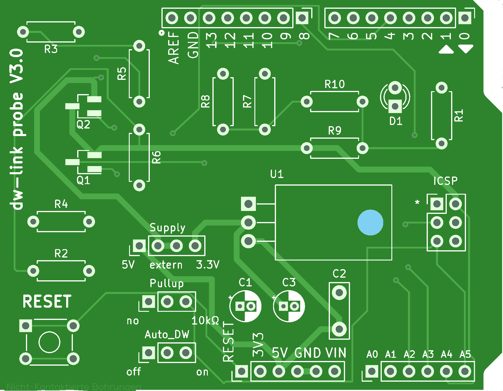

# dw-link

# An Arduino-based debugWIRE debugger

**Bernhard Nebel**

**Version 3.0 - August 2023**

<a rel="license" href="http://creativecommons.org/licenses/by/4.0/"></a><br />This work is licensed under a <a rel="license" href="http://creativecommons.org/licenses/by/4.0/">Creative Commons Attribution 4.0 International License</a>.


<div style="page-break-after: always"></div>

[TOC]

## 1. Introduction 

The Arduino IDE is very simple and makes it easy to get started. After a while, however, one notices that a lot of important features are missing. In particular, neither the old nor the new IDE supports any kind of debugging for the classic AVR chips. So what can you do when you want to debug your Arduino project on small ATmegas (such as the popular ATmega328) or ATtinys? The usual way is to insert print statements and see whether the program does the things it is supposed to do. However, supposedly one should be able to do better than that because the above mentioned MCUs support [on-chip debugging](https://en.wikipedia.org/wiki/In-circuit_emulation#On-chip_debugging) via [debugWIRE](https://en.wikipedia.org/wiki/DebugWIRE).

When you want hardware debugging support, you could buy expensive hardware-debuggers such as the Atmel-ICE or the MPLAB Snap and you have to use the propriatery development IDE [Microchip Studio](https://www.microchip.com/en-us/development-tools-tools-and-software/microchip-studio-for-avr-and-sam-devices) (for Windows) or [MPLAB X IDE](https://www.microchip.com/en-us/development-tools-tools-and-software/mplab-x-ide) (for all platforms). The question is, of course, whether there are open-source alternatives. Preferably supporting *avr-gdb*, the [GNU debugger](https://www.gnu.org/software/gdb/) for AVR MCUs.  With *dw-link*, you have such a solution. It turns an Arduino UNO into a hardware debugger that implements the GDB remote serial protocol. Meanwhile, you can also buy an UNO shield called [*dw-link probe* at Tindie](https://www.tindie.com/products/31798/), which allows to debug also 3.3 Volt systems and is able to provide up to 300 mA current supply.

### 1.1 Enter the wonderful world of debugging in a few easy steps 

For your first excursion into the wonderful world of debugging, you need an Arduino UNO (or something equivalent) as the hardware debugger (see [Section 3.1](#section31)) and a chip or board that understands debugWIRE (see [Section 3.2](#section32)), i.e., a classic ATtiny or an ATmegaX8. Then you only have to install the firmware for the debugger on the UNO ([Section 4.1](#section41)) and to set up the hardware for a debugging session ([Section 4.2](#section42)).

Finally, you need to install a debugging environment. I will describe two approaches. The first one, covered in [Section 5](#section5), is the easiest one. In addition to installing new board definition files, it requires you to download *avr-gdb*. Debugging will then take place in a shell window, in which you have to start *avr-gdb*. For people unhappy with command line interfaces, [Section 5.7](#section57) covers how to install and use a graphical user interface (which works only for maxOS and Linux, though).  The second method, described in [Section 6](#section6), involves downloading the [PlatformIO](https://platformio.org/) IDE, setting up a project, and starting your first debug session with this IDE. 

There are numerous other possibilities, which you might try out. In the [guide](https://github.com/jdolinay/avr_debug/blob/master/doc/avr_debug.pdf) to debugging with *avr_debug*, there is an extensive description of how to setup [Eclipse](https://www.eclipse.org/) for debugging with avr_debug, which applies to dw-link as well. Another option may be [Emacs](https://www.gnu.org/software/emacs/). 

If you have performed all the above steps, then the setup should look like as in the following picture.


Your development machine, the *host*, is connected to the UNO acting as a *hardware debugger* over the usual USB connection. The  two devices use the *GDB remote serial protocol* to communicate with each other. The hardware debugger in turn is connected to the *target system*, whereby the *debugWIRE protocol* is used for communication. 

The physical connection between the hardware debugger and the target, as described in [Section 4.2](#section42), is something that might need some enhancements. Instead of six flying wires you may want to have a more durable connection. This is covered in [Section 7](#section7). Finally, possible problems and trouble shooting are covered in [Section 8](#section8) and [Section 9](#trouble), respectively.

And what do you with your hardware debugger once you have debugged all your programs and they work flawlessly? Since version 2.2.0, you can use dw-link also as an STK500 v1 ISP programmer. If you connect to dw-link either with 19200 or 115200 bps and start *avrdude*, then dw-link turns into an ISP programmer.

### 1.2 Other debugging approaches for classic ATtinys and ATmegaX8s

While dw-link is my preferred open source solution for debugging classic tiny AVRs and ATmegaX8s, there are a number of other possible approaches. 

There exists a software simulator called [SIMAVR](https://github.com/buserror/simavr) and there is a [GDB remote stub](https://sourceware.org/gdb/onlinedocs/gdb/Remote-Stub.html) for some ATmegas, called [avr_debug](https://github.com/jdolinay/avr_debug). Both are integrated into [PlatformIO](https://platformio.org/) as debuggers. However, both tools come with a lot of restrictions and using them is not the same as debugging on the hardware where your firmware should finally run. 

Based on RikusW's work on [reverse engineering the debugWIRE protocol](http://www.ruemohr.org/docs/debugwire.html), you can find a few attempts at building debuggers using debugWIRE. First of all, there is an implementation called [dwire-debug](https://github.com/dcwbrown/dwire-debug) for host systems that use just the serial interface to talk with a target using the debugWIRE interface. This program implements [GDB's remote serial protocol](https://sourceware.org/gdb/current/onlinedocs/gdb/Remote-Protocol.html#Remote-Protocol).  However, only one breakpoint (the hardware breakpoint on the target system) is supported and the particular way of turning a serial interface into a one-wire interface did not work for me. This approach has been further developed resulting in an interesting solution for [debugging Arduino UNOs using a CH552 board](https://github.com/DeqingSun/unoDebugTestPackage). 

Additionally, there exists a similar implementation in Pascal called [debugwire-gdb-bridge](https://github.com/ccrause/debugwire-gdb-bridge) that appears to be more complete. However, I was not able to install it. That is probably based on the fact that my knowledge of Pascal is rusty and I have no experience with the Lazarus IDE. Finally, there is the Arduino based hardware debugger called [DebugWireDebuggerProgrammer](https://github.com/wholder/DebugWireDebuggerProgrammer). Unfortunately, it is not able to program flash memory when in debugging mode, and it does not provide an interface for GDB's remote serial protocol. 

I took all of the above ideas (and some of the code) and put it together in order to come up with a cheap debugWIRE hardware debugger supporting GDB's remote serial protocol. Actually, it was a bit more than just throwing the things together. I developed a [new library for single wire serial communication](https://github.com/felias-fogg/SingleWireSerial) that is [much more reliable and robust](https://hinterm-ziel.de/index.php/2021/10/30/one-line-only/) than the usually employed SoftwareSerial library. Further, I fixed a few loose ends in the existing implementations, sped up communication and flash programming, supported super-slow MCU clocks (4 kHz), implemented an [interrupt-safe way of single-stepping](https://hinterm-ziel.de/index.php/2022/01/02/thats-one-small-step-for-a-man-one-giant-leap-for-a-debugger-on-single-stepping-and-interrupts/), and spent a few nights debugging the debugger. Along the way, I also made [a number of interesting discoveries](https://hinterm-ziel.de/index.php/2021/12/29/surprise-surprise/). And I tested the debugger on almost all MCUs supported by [ATTinyCore](https://github.com/SpenceKonde/ATTinyCore) and [MiniCore](https://github.com/MCUdude/MiniCore). 

<font color="red">

### Warning

</font>

Read [Sections 3.3 & 3.4](#section33) about the requirements on the RESET line carefully before trying to debug a target system. You might very well "brick" your MCU by enabling debugWIRE on a system which does not satisfy these requirements. 

<a name="section2"></a>

## 2. The debugWIRE interface

The basic idea of ***debugWIRE*** is that the RESET line is used as a communication line between the ***target system*** (the system you want to debug) and the ***hardware debugger***, which in turn can then communicate with the development machine or ***host***, which runs a debug program such as GDB or in our case *avr-gdb*. The idea of using only a single line that is not used otherwise is very cool because it does not waste any of the other pins for debugging purposes (as does e.g. the [JTAG interface](https://en.wikipedia.org/wiki/JTAG)). However, using the RESET line as a communication channel means, of course, that one cannot use the RESET line to reset the MCU anymore. Furthermore, one cannot any longer use [ISP programming](https://en.wikipedia.org/wiki/In-system_programming) to upload new firmware to the MCU or change the fuses of the MCU. Although dw-link tries to hide all this from you by enabling the debugWire mode when starting a debugging session and disabling it, when terminating the session, it is a good idea to get an idea what is going on behind the scene.

With respect to the debugWIRE protocol there are basically three states your MCU could be in:

1. The **normal** **state** in which the DWEN (debugWIRE enable) [fuse](https://microchipdeveloper.com/8avr:avrfuses) is disabled. In this state, you can use ISP programming to change fuses and to upload programs. By enabling the DWEN fuse, one reaches the **transitional** **state**.
2. The **transitional** **state** is the state in which the DWEN fuse is enabled. In this state, you could use ISP programming to disable the DWEN fuse again, in order to reach the **normal state**. By *power-cycling* (switching the target system off and on again), one reaches the **debugWIRE** **state**.
3. The **debugWIRE** **state** is the state in which you can use the debugger to control the target system. If you want to return to the **normal** **state**, a particular debugWIRE command leads to a transition to the **transitional  state**, from which one can reach the **normal state** using ordinary ISP programming. 

The hardware debugger will take care of bringing you from *normal* state to *debugWIRE* state when you connect to the target by using the `target remote` command or when using the ```monitor dwire +``` command. The system LED will flash in a particular pattern, which signals that you should power-cycle the target. Alternatively, if the target is powered by the hardware debugger, it will power-cycle automatically. The transition from *debugWIRE* state to *normal* state will take place when you terminate GDB. It can also be achieved by the GDB command ```monitor dwire -```. If things seemed to have not worked out, you can simply reconnect the target to the hardware debugger and issue `monitor dwire -` again.

<!-- mermaid
    stateDiagram
    normal --\> transitional: set DWEN 
    transitional --\> normal: clear DWEN
    normal --\> debugWIRE: monitor dw +\ntarget remote ...
    transitional --\> debugWIRE: power cycle
    debugWIRE --\> transitional: disable debugWIRE
    debugWIRE --\> normal: monitor dw -\nquit -->


<a name="section3"></a>

## 3. Hardware requirements

There are a few constraints on what kind of board you can use as the base for the hardware debugger and some requirements on how to connect the debugger to the target system. Furthermore, there is only a limited set of AVR MCUs that can be debugged using  debugWIRE.

<a name="section31"></a>

### 3.1 The hardware debugger

As a base for the debugger, in principle one can use any ATmega328 based board. The clock speed  must be 16MHz. Currently, the sketch has been tested on the following boards:

* [Arduino UNO](https://store.arduino.cc/products/arduino-uno-rev3),
* [Arduino Nano](https://store.arduino.cc/products/arduino-nano),
* [Arduino Pro Mini](https://docs.arduino.cc/retired/boards/arduino-pro-mini).

If you intend to use dw-link on a board with an MCU different from ATmega328P, you should be aware that dw-link makes heavy use of the particular hardware features of the ATmega328P and operates close to the limit. I tried it out on the Leonardo and on the Mega256, but was not successful. 

The most basic setup is to use the UNO board and connect the cables as it is shown in the [Fritzing sketch](#Fritzing) further down. If you want to use the debugger more than once, it may pay off to use a prototype shield and put an ISP socket on it. The more luxurious solution is a shield for the UNO as described further down in [Section 7](#section7).

<a name="section32"></a>

### 3.2 MCUs with debugWIRE interface

In general, almost all "classic" ATtiny MCUs and some ATmega MCUs have the debugWIRE interface. Specifically, the following MCUs that are supported by the Arduino standard core,  by [ATTinyCore](https://github.com/SpenceKonde/ATTinyCore), and/or by [MiniCore](https://github.com/MCUdude/MiniCore) can be debugged using this interface:

* <s>__ATtiny13__</s>
* __ATtiny43U__
* __ATtiny2313(A)__, __ATtiny4313__
* __ATtiny24(A)__, __ATtiny44(A)__, __ATtiny84(A)__
* __ATtiny441__, __ATtiny841__
* __ATtiny25__, __ATtiny45__, __ATtiny85__
* __ATtiny261(A)__, __ATtiny461(A)__, __ATtiny861(A)__
* __ATtiny87__, __ATtiny167__
* __ATtiny828__
* __ATtiny48__, __ATtiny88__
* __ATtiny1634__
* <s>__ATmega48__</s>, __ATmega48A__, __ATmega48PA__, ATmega48PB, 
* <s>__ATmega88__</s>, __ATmega88A__, __ATmega88PA__, Atmega88PB, 
* __ATmega168__, __ATmega168A__, __ATmega168PA__, ATmega168PB, 
* __ATmega328__, __ATmega328P__, __ATmega328PB__

I have tested the debugger on MCUs marked bold. The untested PB types appear to be very very difficult to get. I excluded the ATtiny13 because it behaved very strangely and I was not able to figure out why. The two ATmegas that are stroke out have program counters with some bits stuck at one (see [Section 8.9](#section89)). For this reason, GDB has problems debugging them and dw-link rejects these MCUs. 

Additionally, there exist a few more exotic MCUs, which also have the debugWIRE interface:

* ATmega8U2, ATmega16U2, ATmega32U2
* ATmega32C1, ATmega64C1, ATmega16M1, ATmega32M1, ATmega64M1
* AT90USB82, AT90USB162
* AT90PWM1, AT90PWM2B, AT90PWM3B
* AT90PWM81, AT90PWM161
* AT90PWM216, AT90PWM316
* <s>ATmega8HVA</s>, <s>ATmega16HVA</s>, <s>ATmega16HVB</s>, <s>ATmega32HVA</s>, <s>ATmega32HVB</s>, <s>ATmega64HVE2</s>

The debugger contains code for supporting all listed MCUs except for the ones stroke out, which are obsolete. I expect the debugger to work on the supported MCUs. However, there are always [surprises](https://arduino-craft-corner.de/index.php/2021/12/29/surprise-surprise/). If you are able to debug such an MCU using dw-link, please drop me a note.

<a name="section33"></a>

### 3.3 Requirements concerning the RESET line of the target system 

Since the RESET line of the target system is used as an [open-drain](https://en.wikipedia.org/wiki/Open_collector#MOSFET), [asynchronous](https://en.wikipedia.org/wiki/Asynchronous_communication) [half-duplex](https://en.wikipedia.org/wiki/Duplex_(telecommunications)#HALF-DUPLEX) [serial communication](https://en.wikipedia.org/wiki/Serial_communication) line, one has to make sure that there is no capacitive load on the line when it is used in debugWIRE mode. Further, there should be a pull-up resistor of around 10 kΩ. According to reports of other people, 4.7 kΩ might also work. And the RESET line should, of course,  not be directly connected to Vcc and there should not be any external reset sources on the RESET line.

If your target system is an Arduino UNO, you have to be aware that there is a capacitor between the RESET pin of the ATmega328 and the DTR pin of the serial chip, which implements the auto-reset feature. This is used by the Arduino IDE to issue a reset pulse in order to start the bootloader. One can disconnect the capacitor by cutting the solder bridge labeled *RESET EN* on the board (see picture), but then you cannot use the automatic reset feature of the Arduino IDE any longer. 


A recovery method is to put a bit of soldering  on the bridge. 

Other Arduino boards, [such as the Nano, are a bit harder to modify](https://mtech.dk/thomsen/electro/arduino.php). A Pro Mini, on the other hand, can be used without a problem, provided the DTR line of the FTDI connector is not connected. In general, it is a good idea to get hold of a schematic of the board you are going to debug. Then it is easy to find out what is connected to the RESET line, and what needs to be removed. It is probably also a good idea to check the value of the pull-up resistor, if present. 

<a name="worstcase"></a>
### 3.4 Worst-case scenario 

So, what is the worst-case scenario when using debugWIRE? As described in [Section 2](#section2), first the DWEN fuse is programmed using ISP programming. Then one has to power-cycle in order to reach the debugWIRE state, in which you can communicate with the target over the RESET line. If this kind of communication fails, you cannot put the target back in a state, in which ISP programming is possible. Your MCU is *bricked*. It still works with the firmware programmed last time. However, the only way to reset the MCU is now to power-cycle it. Further, it is impossible to reprogram it using ISP programming.

There are two ways out. First you can try to make the RESET line compliant with the debugWIRE requirements. Then you should be able to connect to the target using the hardware debugger. Second, you can use high-voltage programming, where 12 volt have to be applied to the RESET pin. So you either remove the chip from the board and do the programming offline or you remove any connection from the RESET line to the Vcc rail and other components on the board. Then you can use either an existing high-voltage programmer or you [build one on a breadboard](https://github.com/felias-fogg/RescueAVR).

<a name="section4"></a>


## 4. Installation of firmware and hardware setup

There are only a few steps necessary for installing the dw-link firmware on the hardware debugger, most of which you probably already have done. For the hardware setup, you need a breadboard or a development board with one of the chips that speak debugWIRE.

<a name="section41"></a>

### 4.1 Firmware installation

Since the firmware of the hardware debugger comes in form of an Arduino sketch, you need to download first of all the [Arduino IDE](https://www.arduino.cc/en/software), if you have not done that already. Note that for some of the later software components (e.g., ATTinyCore), a reasonably recent version of the IDE is required, i.e. 1.8.13+. It is probably best when you upgrade your installation now. As an alternative, you can also use [PlatformIO](https://platformio.org/). 

Second, you need to download the dw-link firmware somewhere, where the IDE is able to find the Arduino sketch. If you use PlatformIO, note that the repository is already prepared to be opened as a PlatformIO project, i.e., it contains a `platformio.ini` file. Either download the dw-link repository or download a release.

Third, you have to connect your future hardware debugger, i.e., the ATmega328 board, to your computer, select the right board in the Arduino IDE and upload the `dw-link.ino` sketch to the board. Similarly, in PlatformIO, you have to choose the right board and choose the `Upload` menu entry.

Usually, it should not be necessary to change a compile-time constant in dw-link. I will nevertheless document all these constants here. If you want to change one of them, you can do that when using `arduino-cli` by using the `--build-property` option or by changing the value in the source code.

| Name            | Default                | Meaning                                                      |
| --------------- | ---------------------- | ------------------------------------------------------------ |
| __VERSION__     | current version number | Current version number of dw-link; should not be changed, except when one generates a new version |
| **HOSTBPS**     | 115200                 | Communication speed for host interface                       |
| **HIGHSPEEDDW** | 0                      | If 1, the speed limit of debugWIRE communication is 300 kbps, otherwise it is 150kbps |
| **NOAUTODWOFF** | 0                      | If 1, disables the feature that debugWIRE mode is automatically disabled when leaving the debugger (makes startup of consecutive sessions a bit faster) |
| __STUCKAT1PC__  | 0                      | If this value is set to 1, then dw-link will accept connections to targets that have program counters with stuck-at-one bits; one can then use the debugger, but GDB can get confused at many points, e.g., when single-stepping or when trying to produce a stack backtrace. |

<a name="section42"></a>

### 4.2 Setting up the hardware

Before you can start debugging, you have to setup the hardware. I'll use an ATtiny85 on a breadboard as the example target system and an UNO as the example debugger. However, any MCU listed above would do as a target. You have to adapt the steps where I describe the modification of configuration files in [Section 5](#section5) accordingly, though. And one could even use an Arduino UNO, provided the modification described in [Section 3.3](#section33) are done.

#### 4.2.1 Debugging an ATtiny85

In order to debug an ATtiny85, we will assume it is completely "naked" and plugged into a breadboard as shown below. 

<a name="Fritzing"></a>


First of all, notice the capacitor of 10 µF or more between RESET and GND on the UNO board. This will disable auto-reset of the UNO board. Second, note the yellow LED plugged into pin D7. This is the system LED which is used to visualise the internal state of the debugger (see below).  You can also build an LED with a series resistor soldered on and then use pin D6 and D7, where D6 is used as GND.

As you can see, the Vcc rail of the breadboard is connected to pin D9 of the Arduino UNO so that it will be able to power-cycle the target chip. Furthermore, pin D8 of the Arduino UNO is connected to the RESET pin of the ATtiny (pin 1).   Note the presence of the pull-up resistor of 10kΩ on the ATtiny RESET pin. The remaining connections between Arduino UNO and ATtiny are MOSI (Arduino UNO D11), MISO (Arduino UNO D12) and SCK (Arduino UNO D13), which you need for ISP programming. In addition, there is a LED connected to pin 3 of the ATtiny chip (which is PB4 or pin D4 in Arduino terminology). The pinout of the ATtiny85 is given in the next figure (with the usual "counter-clockwise" numbering of Arduino pins).


Here is a table of all the connections so that you can check that you have made all the connections. 

ATtiny pin# | Arduino UNO pin | component
--- | --- | ---
1 (Reset) | D8 | 10k resistor to Vcc 
2 (D3) |  |
3 (D4) |  |220 Ω resistor to (red) target LED (+)
4 (GND) | GND | both LED (-), decoupling cap 100 nF, RESET blocking cap of 10µF (-) 
5 (D0, MOSI) | D11 |
6 (D1, MISO) | D12 |
7 (D2, SCK) | D13 |
8 (Vcc) | D9 | 10k resistor, decoupling cap 100 nF 
&nbsp;|RESET|RESET blocking cap of 10 µF (+)
&nbsp;|D7|220 Ω resistor to (yellow) system LED (+)

<a name="section452"></a>

#### 4.5.2 Debugging an UNO

If instead of an ATtiny85, you want to debug an UNO board, everything said above applies here as well. The Fritzing sketch below shows you the connections. Here, the series resistor for the system LED is soldered to the LED cathode so that we do not need a breadboard at all. 

Remember to cut the `RESET EN` solder bridge on the target board (see [Section 3.3](#section33))! When you first establish a connection with the UNO as a target, the target will be completely erased (including the boot loader), because the lock bits have to be cleared.


When after a debugging session you want to restore the target so that it behaves again like an ordinary UNO, you have to execute the following steps:

1. Exit the debugWIRE state as described in [Section 2](#section2). This should have happened automatically when last quitting GDB. However, to make sure the UNO is not in debugWIRE state, you should use the method described in [Section 5.5](#exlpicit1) or [Section 6.4](#explicit2). 
2. Reestablish the `RESET EN` connection by putting a solder blob on the connection.
3. Burn the bootloader into the UNO again. This means that you need to select the `Arduino UNO` again as the target board in the `Tools` menu, select `AVR ISP` as the `Programmer` , and choose `Burn Bootloader` from the `Tools` menu. As mentioned in Section 1, since version 2.2.0, the hardware debugger can also act as programmer!

We are now good to go and 'only' need to install the additional debugging software on the host. Before we do that, let us have a look, in which states the hardware debugger can be and how it signals that using the system LED.

### 4.3 States of the hardware debugger

There are five states the debugger can be in and each is signaled by a different blink pattern of the system LED:

* not connected (LED is off),
* waiting for power-cycling the target (LED flashes every second for 0.1 sec),
* target is connected (LED is on) ,
* ISP programming (LED is blinking slowly every 0.5 sec), or
* error, i.e., it is not possible to connect to the target or there is an internal error (LED blinks furiously every 0.1 sec).

If the hardware debugger is in the error state, one should try to find out the reason by typing the command `monitor lasterror`, study the [error message table](#fatalerror) at the end of the document, finish the GDB session, reset the debugger, and restart everything. If the problem persists, please check the section on [trouble shooting](#trouble).

<a name="section5"></a>

## 5. Arduino IDE and avr-gdb

Assuming that you are working with the Arduino IDE and/or Arduino CLI, the simplest way of starting to debug your code is to use the GNU debugger. You only have to install the avr-gdb debugger and the appropriate board manager files. Note that this works only with Arduino IDE versions at least 1.8.13. 

### 5.1 Installing avr-gdb

Unfortunately, the debugger is not any longer part of the toolchain integrated into the Arduino IDE. This means, you have to download and install it by yourself:

* macOS: Use [**homebrew**](https://brew.sh/index_de) to install it: 

  ```
  brew tap osx-cross/avr && brew install avr-gdb
  ```

* Linux: Use your favorite packet manager to install the package **gdb-avr**, i.e., under Ubuntu/Debian:

  ```
  sudo apt-get install gdb-avr 
  ```

* Windows: You can download the AVR-toolchain from the [Microchip website](https://www.microchip.com/en-us/development-tools-tools-and-software/gcc-compilers-avr-and-arm) or from [Zak's Electronic Blog\~\*](https://blog.zakkemble.net/avr-gcc-builds/). This includes avr-gdb. You have to copy `avr-gdb.exe` (which you find in the `bin` folder) to some place (e.g., to C:\ProgramFiles\bin) and set the `PATH` variable to point to this folder. Afterwards, you can execute the debugger by simply typing `avr-gdb.exe` into a terminal window (e.g. Windows Powershell).

### 5.2 Installing board manager files

In order to be able to debug the MCUs mentioned in  the Introduction, you need to install 3rd party cores. For the classic ATtiny family, this is [ATTinyCore](https://github.com/SpenceKonde/ATTinyCore/blob/master/Installation.md) and for the ATmegaX8 family (including the Arduino UNO), it is [MiniCore](https://github.com/MCUdude/MiniCore). In order to be able to generate object files that are debug friendly, you need to install my fork of the board manager files. You first have to add URLs under the `Additional Board Manager URLs` in the `Preference` menu:

- ```
  https://felias-fogg.github.io/ATTinyCore/package_drazzy.com_ATTinyCore_index.json
  ```

- ```
  https://felias-fogg.github.io/MiniCore/package_MCUdude_MiniCore_index.json
  ```

After that, you can download and install the board using the `Boards Manager`, which you find in the Arduino IDE menu under `Tools`-->`Board`. Currently, choose the versions that have a `+debug` suffix in its version number! I hope the capability of generating debug-friendly binaries will be incorporated in future versions of these board manager files, in which case you can rely on the regular board manager files by MCUdude and SpenceKonde.

### 5.3 Compiling the sketch

Now we need to compile a sketch. Let us take `varblink.ino` from the `examples` folder of the dw-link package as our example sketch. First select the board you want to compile the sketch for under the `Tools` menu. In particular, you should select an `328P` (with 16MHz clock) from the `MiniCore` when debugging an UNO board. 

Then set additional parameters for the board. Most importantly, you need to select `Debug` for the `Debug Compiler Flags` option. The other possibilities for this option can be chosen when the debugger should create code that more closely mirrors the source code, as described in [Section 8.11](#section811). Now compile the example `varblink.ino` with debugging enabled by requesting to `Export compiled Binary` in the `Sketch` menu. This will generate the file `varblink.ino.elf` in the sketch or build directory, depending on which version of the IDE or CLI you are using.

### 5.4 Example session with avr-gdb

Open now a terminal window, and change into the directory where the Arduino IDE/CLI has copied the ELF file to. Assuming that you have connected the hardware debugger to the target board and to the host computer, we can start a debugging session.

All the lines starting with either the **>** or the **(gdb)** prompt contain user input and everything after # is a comment. **\<serial port\>** is the serial port you use to communicate with the hardware debugger and **\<bps\>** is the baud rate, i.e., 115200, provided you have not changed the compile-time constant `HOSTBPS`.

```
> avr-gdb -b <bps> varblink.ino.elf 
GNU gdb (GDB) 10.1
Copyright (C) 2020 Free Software Foundation, Inc.
...
Reading symbols from varblink.ino.elf...
(gdb) target remote <serial port>              # connect to the HW debugger  
Remote debugging using <serial port>           # connection made
0x00000000 in __vectors ()                     # we always start at location 0x0000
(gdb) monitor dwire                            # show properties of the dW connection 
Connected to ATtiny85
debugWIRE is now enabled, bps: 125736
(gdb) load                                     # load binary file
Loading section .text, size 0x714 lma 0x0
Loading section .data, size 0x4 lma 0x714
Start address 0x00000000, load size 1816
Transfer rate: 618 bytes/sec, 113 bytes/write.
(gdb) list loop                                # list part of loop and shift focus
6       byte thisByte = 0;
7       void setup() {
8         pinMode(LED, OUTPUT);
9       }
10      
11      void loop() {
12        int i=digitalRead(1)+20;
13        digitalWrite(LED, HIGH);  
14        delay(1000);              
15        digitalWrite(LED, LOW);              
(gdb) break loop                               # set breakpoint at start of loop 
Breakpoint 1 at 0x494: file ..., line 12.
(gdb) br 15                                    # set breakpoint at line 15
Breakpoint 2 at 0x4bc: file ..., line 15.
(gdb) c                                        # start execution at PC=0
Continuing.

Breakpoint 1, loop () at /.../varblink.ino:12
12        int i=digitalRead(1)+20;
(gdb) next                                     # single-step over function              
13        digitalWrite(LED, HIGH);  
(gdb) n                                        # again
14        delay(1000);              
(gdb) print i                                  # print value of 'i'
$1 = 21
(gdb)  print thisByte                          # print value of 'thisByte'
$2 = 0 '\000'
(gdb) set var thisByte = 20                    # set variable thisByte
(gdb) p thisByte                               # print value of 'thisByte' again
$3 = 20 '\024'
(gdb) step                                     # single-step into function
delay (ms=1000) at /.../wiring.c:108
108             uint32_t start = micros();
(gdb) finish                                    # execute until function returns
Run till exit from #0  delay (ms=1000)
    at /.../wiring.c:108

Breakpoint 2, loop () at /.../varblink.ino:15
15        digitalWrite(LED, LOW);              
(gdb) info br                                   # give inormation about breakpoints
Num     Type           Disp Enb Address    What
1       breakpoint     keep y   0x00000494 in loop() 
                                           at /.../varblink.ino:12
        breakpoint already hit 1 time
2       breakpoint     keep y   0x000004bc in loop() 
                                           at /.../varblink.ino:15
        breakpoint already hit 1 time
(gdb) delete 1                                  # delete breakpoint 1
(gdb) quit                                      # quit debugger
A debugging session is active.

	Inferior 1 [Remote target] will be killed.

Quit anyway? (y or n) y
>
```


<a name="#explicit1"></a>

### 5.5 Disabling debugWIRE mode explicitly

Exiting GDB should disable debugWIRE mode. However, if something went wrong or you killed the debug session, the ATtiny MCU might still be in debugWIRE mode and the RESET pin cannot be used to reset the chip and you cannot use ISP programming. In this case, you can explicitly disable debugWIRE, as shown below. 

```
> avr-gdb
GNU gdb (GDB) 10.1
...

(gdb) set serial baud 115200            # set baud rate 
(gdb) target remote <serial port>       # connect to serial port of debugger    
0x00000000 in __vectors ()
(gdb) monitor dwire -                   # terminate debugWIRE mode 
Connected to ATtiny85
debugWIRE is now disabled
(gdb) quit
>
```
### 5.6 GDB commands

In the example session above, we saw a number of relevant commands already. If you really want to debug using GDB, you need to know a few more commands, though. Let me just give a brief overview of the most relevant commands (anything between square brackets can be omitted, a vertical bar separates alternative forms, arguments are in italics). For the most common commands, it is enough to just type the first character (shown in boldface). In general, you only have to type as many characters as are necessary to make the command unambiguous. You also find a good reference card and a very extensive manual on the [GDB website](https://sourceware.org/gdb/current/onlinedocs/). I also recommend these [tips on using GDB](https://interrupt.memfault.com/blog/advanced-gdb) by [Jay Carlson](https://jaycarlson.net/). 

command | action
--- | ---
**h**elp [*command*] | get help on a specific command
**s**tep [*number*] | single step statement, descending into functions (step in), *number* times 
**n**ext [*number*] | single step statement without descending into functions (step over)
finish | finish current function and return from call (step out)
**c**ontinue [*number*] | continue from current position and stop after *number* breakpoints have been hit. 
**r**un | reset MCU and restart program at address 0x0000
**b**reak *function* \| [*file*:]*number* | set breakpoint at beginning of *function* or at line *number* in *file* 
**i**nfo **b**reakpoints | list all breakpoints
**d**elete [*number* ...] | delete breakpoint(s) *number* or all breakpoints 

In order to display information about the program and variables in it, the following commands are helpful. Further, you may want to change the value of variables.

command | action
--- | ---
**l**ist [*function* \| [*filename*:]*number*] | show source code around current point, of *function*, or around line *number* in *filename* 
**p**rint *expression* | evaluate expression and print 
set var *variable* = *expression* | set the variable to a new value 
display\[/*f*] *expression* | display expression using format *f* each time the program halts
**i**nfo display | print all auto-display commands
**d**elete display [*number* ...] | delete auto-display commands(s) or all auto-display commands 

<a name="controlcommands"></a>In addition to the commands above, you have to know a few more commands that control the execution of *avr-gdb*.

command | action
--- | ---
set serial baud *number* | set baud rate of serial port to the hardware debugger (same as using the `-b` option when starting *avr-gdb*); only effective when called before establishing a connection with the `target` command 
target [extended-]remote *serialport* | establish a connection to the hardware debugger via *serialport*, which in turn will set up a connection to the target via debugWIRE; if extended is used, then establish a connection in the *extended remote mode*, i.e., one can restart the program using the `run` command 
file *name*.elf | load the symbol table from the specified ELF file 
load | load the ELF file into flash memory (should be done every time after the `target remote` command; it will only change the parts of the flash memory that needs to be changed)
**q**uit | exit from GDB 

Finally, there are commands that control the settings of the debugger and the MCU, which are particular to dw-link. They all start with the keyword `monitor`. You can abbreviate all keywords to 2 characters, if this is unambiguous.

| command                            | action                                                       |
| :--------------------------------- | ------------------------------------------------------------ |
| monitor help                       | give a help message on monitor commands                      |
| monitor version                    | print version number of firmware                             |
| monitor dwire [+\|-]               | **+** activate debugWIRE; **-** disables debugWIRE; without any argument, it will report MCU type and whether debugWIRE is enabled (*) |
| monitor reset                      | resets the MCU (*)                                           |
| monitor ckdiv [1\|8]               | **1** unprograms the CKDIV8 fuse, **8** programs it; without an argument, the state of the fuse is reported (*) |
| monitor oscillator [r\|a\|x\|e\|s] | set clock source to **r**c osc., **a**lternate rc osc., **x**tal, **e**xternal osc., or **s**low osc. (128 kHz); without argument, it reports the fuse setting (*) |
| monitor breakpoint [h\|s]          | set number of allowed breakpoints to 1, when **h**ardware breakpoint only, or 33, when also **s**oftware breakpoints are permitted; without argument it reports setting |
| monitor speed [l\|h]               | set communication speed limit to **l**ow (=150kbps) or to **h**igh (=300kbps); without an argument, the current communication speed and limit is printed |
| monitor singlestep [s\|u]          | Sets single stepping to **s**afe (no interrupts) or **u**nsafe (interrupts can happen); without an argument, it reports the state |
| monitor lasterror                  | print error number of last fatal error                       |
| monitor flashcount                 | reports on how many flash-page write operation have taken place since start |
| monitor timeouts                   | report number of timeouts (should be 0!)                     |

All of the commands marked with (*) reset the MCU.

<a name="section57"></a>

### 5.7 A graphical user interface: *Gede*

If you believe that GDB is too much typing, then you are probably the type of programmer who wants a graphical user interface. As it turns out, it is not completely trivial to come up with a solution that is easy to install and easy to work with. Recently, I stumbled over *Gede*, which appears to be just the right solution. It has been designed for Linux, but after a few small changes it also works under macOS. There was a slight hiccup with the old version of avr-gdb that is the standard version in Debian, but that was also solved. Unfortunately, Windows is not supported. However, you could use [*WSL2*](https://en.wikipedia.org/wiki/Windows_Subsystem_for_Linux) to run Gede, avr-gdb, dw-server.py and the Arduiono IDE. Connecting to a serial port could then be done by using [*usb-ip*](https://github.com/dorssel/usbipd-win). 

Making a long story short, you can download the modified source from my [Github repository](https://github.com/felias-fogg/gede). Just download the most recent **Release** and follow the build instructions. The `dw-server` directory of the dw-link directory contains a Python script called `dw-server.py`, which you should also copy to `/usr/local/bin`. 

Open now a terminal window, `cd` into the folder that contains the ELF file, and type

```
dw-server.py -g
```

The script will try to discover a dw-link adapter connected to a serial line. After that it starts *Gede*, and then it forwards the serial connection over TCP/IP to *Gede*, which will present you with the following window.


`Project dir` and `Program` are specific to your debugging session. The rest should be copied as it is shown. And with clicking on OK, you start a debugging session.

 Johan Henriksson, the author of the GUI, has written up two [short tutorials](https://gede.dexar.se/pmwiki.php?n=Site.Tutorials) about using the GUI. An additional command has been added to the interface that re-downloads the binary to the target. This means that after a small change to the program, you do not have to fire the thing up again, but you simply reload the modified ELF file. The GUI looks as shown in the next figure.


<a name="section6"></a>

## 6 PlatformIO

[*PlatformIO*](https://platformio.org/) is an IDE aimed at embedded systems and is based on [Visual Studio Code](https://code.visualstudio.com/). It supports many MCUs, in particular almost all AVR MCUs. And it is possible to import Arduino projects, which are then turned into ordinary C++ projects. Projects are highly configurable, that is a lot of parameters can be set for different purposes. However, that makes things in the beginning a bit more challenging. 

The main differences to the Arduino IDE are:

1. You do not select the MCU and its parameters using a dropdown menu, but you have to write/modify the INI-style file `platform.ini`.
2. Libraries are not global by default, but they are usually local to each project. That means that a new library version will not break your project, but  you have to update library versions for each project separately.
3. There is no preprocessor that generates function declarations automagically as the Arduino IDE/CLI does for you. You have to add the include statement for the arduino header file and all function declarations by yourself. In addition, you need to import `Arduino.h` explicitly.
4. There is already a powerful editor integrated into the IDE.
5. Most importantly, the IDE contains ways to configure the debugging interface, which makes it possible to integrate dw-link easily. Note that this is still not possible for the Arduino IDE 2.X!

So, moving from the Arduino IDE to PlatformIO is a significant step! 

### 6.1 Installing PlatformIO

Installing PlatformIO is straight-forward. Download and install Visual Studio Code. Then start it and click on the extension icon on the left, search for the PlatformIO extension and install it, as is described [here](https://platformio.org/install/ide?install=vscode). Check out the [quick start guide](https://docs.platformio.org/en/latest//integration/ide/vscode.html#quick-start). Now we are all set.

On a Mac, unfortunately it does not work out of the box, because the gcc-toolchain PlatformIO uses is quite dated, and the included version of avr-gdb is not any longer compatible with recent macOS versions. Simply install avr-gdb with homebrew and copy the file (`/usr/local/bin/avr-gdb`) linto the toolchain directory (`~/.platformio/packages/toolchain-atmelavr/bin/`).

### 6.2 Open an existing project

Now let us prepare a debugging session with the same Arduino sketch as in the last section. However, this time it is a C++ file (with the extension `cpp`) and it contains the necessary `#include <Arduino.h>`. Startup *Visual Studio Code* and click on the Ant symbol in the left bar, then on Open in the list menu, and finally on **Open Project** in the right panel. 


After that you have to navigate through your file structure and find the project that you want to open. Finally click on **Open pio-varblink**.


### 6.2 Adapting the `platformio.ini` file

PlatformIO will then open the project and come up with platform.ini in the editor window. There it is obvious that we need to replace the string SERIAL-PORT with the actual port, our hardware debugger is connected to. 


In order to find out, which port it is, we can ask for the connected serial ports as shown below. Then we can just copy the name of the port by clicking right to the one the paper icon.


After that, the string can be inserted into the `platformio.ini` file.


### 6.3 Debugging with PlatformIO

If you click on the debug symbol in the left navigation bar (fourth from the top), PlatformIO enables debugging using the custom specifications in `platform.ini`. You can now start a debug session by clicking the green triangle at the top navigation bar labeled **PIO Debug**. 


On the right, the debug control bar shows up, with symbols for starting execution, step-over, step-in, step-out, reset, and exit. On the left there are a number of window panes giving you information about variables, watchpoints, the call stack, breakpoints, peripherals, registers, memory, and disassembly. The program has already been started and stopped at the temporary breakpoint set at the first line of `main`.


Before we now play around with the debug control buttons, let us set a breakpoint in the user program. First select the explorer view by clicking an the left top icon, then select the file varblink.cpp.


Now, we can set a breakpoint, e.g. in line 11, by double clicking left to line number. After that, let us start execution by pressing the execute button.


After a brief moment. the debugger will then stop at the breakpoint.


<a name="explicit2"></a>

### 6.4 Disabling debugWIRE mode

There are two ways of switching off the debugWIRE mode. It happens automatically when you terminate the debugger using the exit button. Alternatively, you should be able to bring back your MCU to the normal state by typing `monitor dwire -` in the debugging terminal window after having started a debugging session in PlatformIO IDE. 

### 6.5 Configuring `platformio.ini`

This is not the place to tell you all about what can be configured in the `platformio.ini` file.  There is one important point, though. PlatformIO debugging will always choose the *default environment* or, if this is not set, the first environment in the config file. 

You may have noticed that there is an alternate INI file `platformio.ini-with-dw-server` in the project folder, where a  `debug_sever` is mentioned:

```
debug_server = dw-server.py
      -p 3333
```

Instead of communicating directly over the serial line, which implies that one always has to specify the serial device, which sometimes changes, here a debug server is used, which communicates over a TCP/IP connection. This server discovers the serial line the hardware debugger is connected to and then provides a serial-to-TCP/IP bridge. You can use this alternate INI file (by renaming it `platform.ini`), provided the Python module *PySerial* is installed and the `dw-server.py` script (which you find in the `dw-server` folder) is stored in an executable path, i.e., in /usr/local/bin on a                       *nix machine. 

When creating new projects, you can take this project folder as a blue print and modify and extend `platformio.ini` according to your needs. You can find an extensive description of how to do that in the [PlatformIO documentation](https://docs.platformio.org/en/stable/projectconf/index.html). A very [readable introduction to debugging](https://piolabs.com/blog/insights/debugging-introduction.html) using PlatformIO has been written by [Valerii Koval](https://www.linkedin.com/in/valeros/). It explains the general ideas and all the many ways how to interact with the PlatformIO GUI. [Part II](https://piolabs.com/blog/insights/debugging-embedded.html) of this introduction covers embedded debugging.

<a name="section7"></a>

## 7. A "real" hardware debugger

The hardware part of our hardware debugger is very limited so far. You can, of course, use 6 jumper wires to connect dw-link to your target as described in [Section 4.2](#section42). However, if you want to use this tool more than once, then there should be at least something like an ISP cable connection. Otherwise you might scratch your head which cable goes where every time you start a debugging session.

### 7.1 The basic solution

For most of the wires, we use the same pins on the debugger and the target. So, it makes sense to think about something similar to an ISP cable people use when employing an Arduino UNO as an ISP programmer. Such cables can be easily constructed with some Dupont wires and a bit of heat shrink tube as, for example, demonstrated in [this instructable](https://www.instructables.com/Arduino-ICSP-Programming-Cable/). In contrast to such a programmer cable, it makes sense to also break out the Vcc wire. And you definitely do not want to integrate a capacitor between RESET and GND in such a cable in contrast to what is described in the instructable!


As argued in [my blog post on being cheap](https://hinterm-ziel.de/index.php/2022/01/13/a-debugwire-hardware-debugger-for-less-than-10-e/), with such an ISP cable, we have sort of constructed a hardware debugger for less than 10 €, which can be considered as semi-durable. Just add the optional system LED with an attached resistor and a capacitor between RESET and GND.


The relevant pins are therefore as defined in the following table. 

<a name="simplemap"></a>

| Arduino pin | ISP pin | Function                                                 |
| ----------- | ------- | -------------------------------------------------------- |
| D13         | 3       | SCK                                                      |
| D12         | 1       | MISO                                                     |
| D11         | 4       | MOSI                                                     |
| D9          | 2       | VTG                                                      |
| D8          | 5       | RESET                                                    |
| GND         | 6       | GND                                                      |
| D7          |         | System LED+                                              |
| D6          |         | System LED- (if using a LED with a resistor soldered on) |

### 7.2 A simple shield

Taking it one one step further, one can take a prototype shield for an UNO, put an ISP socket on it, and connect the socket to the respective shield pins. You probably should also plan to have jumper pins in order to be able to disconnect the target power supply line from the Arduino pin that delivers the supply voltage. And finally, you probably also want to place the system LED on the board. So, it could look like as in the following Fritzing sketch. 


In reality, that might look like as in the following picture.


### 7.3 Adapter with level-shifters and switchable power supply: *dw-link probe*

The basic adapter is quite limited. It can only supply 20 mA to the target board, it cannot interact with 3.3 V systems, and it has a high load on the SCK line (because the UNO LED is driven by this pin) when the ISP mode is disabled. Thus, it would be great to have a board with the following features: 

* switchable target power supply (supporting power-cycling by the hardware debugger) offering 5 volt and 3.3 volt supply up to 300 mA, 
* a bidirectional (conditional) level-shifter on the debugWIRE/RESET line,
* an optional pull-up resistor of 10 kΩ on this line,
* unidirectional (conditional) level-shifters on the ISP lines, and
* high-impedance status for the two output signals MOSI and SCK when ISP is inactive.

Such a board does not need to be very complex. In fact, 2 MOS-FETs, a voltage regulator, an LED, and some passive components are enough.  The electronic design is minimalistic. It uses just two MOS-FETs, one LED, one voltage regulator, and some passive components. We need to  level-shift the RESET line in a bidirectional manner and the SPI lines  unidirectionally.  One needs to shift the MISO line from 3.3-5 V up to 5 V, and the MOSI and SCK lines from 5 V down to 3.3-5 V. For the former  case, no level shifting is done at all, relying on the fact that the  input pins of the hardware debugger recognize a logical one already at  3.0 V. For the RESET line, which is open drain, we rely on the same  fact. This means that this hardware debugger cannot deal with systems  that use a supply voltage with less than 3 V, though.

For down shifting, we use the output pins of the hardware debugger in an open drain configuration and have pull-up resistors connected to the target supply voltage. These have to be particularly strong because a  number of possible target boards, e.g., the Arduino UNO, use the SCK  line for driving an LED with a series resistor of 1kΩ. For this reason,  we use 680Ω pull-up resistors which guarantee that the signal level is  above 3V on the SCK line, when we supply the board with 5V. These  pull-ups will be disabled when no ISP programming is active, giving full control of the two lines to the target system. The schematic looks as  follows.


The pin mapping is a bit different from the basic design described above. It is controlled by pin D5, which is tight to ground in order to signal that the more complex pin mapping is used. The additional pins are all in italics.

 

| Arduino pin | ISP pin  | Function                                                     |
| ----------- | -------- | ------------------------------------------------------------ |
| <s>D13</s>  | <s>3</s> | <s>SCK</s>                                                   |
| D12         | 1        | MISO                                                         |
| D11         | 4        | MOSI (open drain)                                            |
| *D10*       | 3        | SCK (open drain)                                             |
| D9          | 2        | VTG                                                          |
| D8          | 5        | RESET                                                        |
| GND         | 6        | GND                                                          |
| D7          |          | System LED+                                                  |
| D6          |          | System LED- (if using a LED with a resistor soldered on)     |
| *D5*        |          | Sense pin: Connected to GND when a board with level shifter is used |
| *D4*        |          | ISP pull-up enable (open drain, active low)                  |
| *D3*        |          | Input: automatic debugWire switching disable (open drain, active low) |
| *D2*        |          | Power enable (open drain, active low)                        |


And here is the breadboard prototype, which works beautifully.


I have turned that into a PCB, which you can buy [at Tindie](https://www.tindie.com/products/31798/).



Before you start, you have to set three jumpers. Then you are all set and can start debugging. 

Label | Left | Middle | Right 
--- | --- | --- | --- 
**Supply** | **5 V** are supplied to the target | **extern**: target needs its own supply and power cycling has to be done manually | **3.3 V** are supplied to the target 
**Pullup** | There is **no** pull-up resistor connected | &nbsp; | A **10kΩ** pull-up resistor is connected to the RESET line of the target 
**Auto_DW** | Atomatic transitions to and from debugWIRE mode is **off** |  | Atomatic transitions to and from debugWIRE mode is **on** 

<a name="section8"></a>

## 8. Problems and shortcomings

dw-link is still in ***beta*** state. The most obvious errors have been fixed, but there are most probably others. If something does not go according to plan, please try to isolate the reason for the erroneous behaviour, i.e., identify a sequence of operations to replicate the error. The most serious errors are *fatal errors*, which stop the debugger from working. With the command `monitor lasterror` you can get information what the cause is (check the [error table at the end](#fatalerror)).

One perfect way to document a debugger error is to switch on logging and command tracing in the debugger:

```
set trace-commands on
set remote debug 1
set logging on
...
set logging off
```

I have prepared an *[issue form](issue_form.md)* for you, where I ask for all the information necessary to replicate the error. 

Apart from bugs, there are, of course, shortcomings that one cannot avoid. I will present some of them in the next subsections.

### 8.1 Flash memory wear

Setting and removing *breakpoints* is one of the main functionality of a debugger. Setting a breakpoint is mainly accomplished by changing an instruction in flash memory to the BREAK instruction. This, however, implies that one has to *reprogram flash memory*. Since flash memory wears out, one should try to minimize the number of flash memory reprogramming operations.

GDB does not pass *breakpoint set* and *breakpoint delete* commands from the user to the hardware debugger, but instead it sends a list of *breakpoint set* commands before execution starts. After execution stops, it sends *breakpoint delete* commands for all breakpoints. In particular, when thinking about conditional breakpoints, it becomes clear that GDB may send a large number of *breakpoint set* and *breakpoint delete* commands for one breakpoint during one debug session. Although it is guaranteed that flash memory can be reprogrammed at least 10,000 times according to the data sheets, this number can easily be reached even in a few debug sessions, provided there are loops which are often executed and where a conditional breakpoint has been inserted. Fortunately, the situation is not as bad as it looks since there are a number of ways of getting around the need of reprogramming flash memory.

First of all, dw-link leaves the breakpoint in memory, even when GDB requests to remove them. Only when GDB requests to continue execution, the breakpoints in flash memory are updated. Well, the same happens before loading program code, detaching, exiting, etc. Assuming that the user does not change breakpoints too often, this will reduce flash reprogramming significantly.  

Second, if there are many breakpoints on the same flash page, then the page is reprogrammed only once instead of reprogramming it for each breakpoint individually.

Third, when one restarts from a location where a breakpoint has been set, GDB removes this breakpoint temporarily, single steps to the next instruction, reinserts the breakpoint, and only then continues execution. This would lead to two reprogramming operations. However, dw-link does not update flash memory before single-stepping. Instead, if the instruction is a single-word instructions, it loads the original instruction into the *instruction register* of the MCU and executes it there. 

For two-word instructions (i.e., LDS, STS, JUMP, and CALL), things are a bit more complicated. The Microchip documents state that one should refrain from  inserting breakpoints at double word instructions, implying that this would create problems. Indeed, RikusW noted in his [reverse engineering notes about debugWIRE](http://www.ruemohr.org/docs/debugwire.html):
>Seems that its not possible to execute a 32 bit instruction this way.
The Dragon reflash the page to remove the SW BP, SS and then reflash again with the SW BP!!! 

I noticed that this is still the case, i.e., MPLAB-X in connection with ATMEL-ICE still reprograms the  page twice for hitting a breakpoint at a two-word instruction. The more sensible solution is to simulate the execution of these instructions, which is at least as fast and saves two reprogramming operations. And this is what dw-link does.

Fourth, each MCU contains one *hardware breakpoint register*, which stops the MCU when the value in the register equals the program counter. dw-link uses this for the breakpoint introduced most recently. With this heuristic, temporary breakpoints (as the ones GDB generates for single-stepping) will always get priority and more permanent breakpoints set by the user will end up in flash. 

Fifth, when reprogramming of a flash page is requested, dw-link first checks whether the identical contents should be loaded, in which case it does nothing. Further, it checks whether it is possible to achieve the result by just turning some 1's into 0's. Only if these two things are not possible, the flash page is erased and reprogrammed. This helps in particular when reloading a file with the GDB `load` command after only a few things in the program have been changed.  

With all of that in mind, you do not have to worry too much about flash memory wear when debugging. As a general rule, you should not make massive changes of the breakpoints each time the MCU stops executing. Finally, Microchip recommends that chips that have been used for debugging using debugWIRE should not been shipped to customers. Well, I never ship chips to customers anyway.

<a name="paranoid"></a>For the really paranoid,  there is the option that permits only one breakpoint, i.e., the hardware breakpoint: `monitor breakpoint h`. In this case, one either can set one breakpoint or on can single-step, but not both. So, if you want to continue after a break by single-stepping, you first have to delete the breakpoint. By the way, with `monitor breakpoint s`, one switches back to normal mode, in which 32 (+1 temporary) breakpoints are allowed.

In addition, there is the debugger command `monitor flashcount`, which returns the number of how many flash page reprogramming commands have been executed since the debugger had been started. This includes also the flash reprogramming commands needed when loading code.

<a name="section82"></a>

### 8.2 Slow responses when loading or single-stepping

Sometimes, in particular when using a clock speed below 1 MHz, responses from the MCU can be quite sluggish. This shows, e.g., when loading code or single-stepping. The reason is that a lot of communication over the RESET line is going on in these cases and the communication speed is set to the MCU clock frequency divided by 8, which is roughly 16000 bps in case of a 128 kHz MCU clock. If the CKDIV8 fuse is programmed, i.e., the MCU clock uses a prescaler of 8, then we are down to 16 kHz MCU clock and 2000 bps. The [Atmel AVR JTAGICE mkII manual ](https://onlinedocs.microchip.com/pr/GUID-73C92233-8EC5-497C-92C3-D52ED257761E-en-US-1/index.html) states under [known issues](https://onlinedocs.microchip.com/pr/GUID-73C92233-8EC5-497C-92C3-D52ED257761E-en-US-1/index.html?GUID-A686427B-0B7C-465A-BCFF-F093FD6B7A8F):

>Setting the CLKDIV8 fuse can cause connection problems when using debugWIRE. For best results, leave this fuse un-programmed during debugging. 

"Leaving the fuse un-programmed" means that you probably have to change the fuse to be un-programmed using a fuse-programmer, because the fuse is programmed by default. In order to simplify life, I added the two commands `monitor ckdiv 8` and `monitor ckdiv 1` to the hardware debugger that allows you to change this fuse. `monitor ckdiv 8` programs the fuse, i.e., the clock is divided by 8, `monitor ckdiv 1` un-programs this fuse. Using the monitor cldiv command with our an argument reports the setting of this fuse. In addition to changing the CKDIV8 fuse, you can also change the clock source with monitor commands, whereby always the slowest startup time is chosen. Be careful about setting it to *XTAL* or *external clock*! Your MCU will get unresponsive if there is no crystal oscillator or external clock, respectively. Note that after executing these commands, the MCU is reset (and the register values shown by the GDB `register info` command are not valid anymore). 

With an optimal setting, i.e., 250 kbps for the debugWIRE line and 230400 bps for the host communication line, loading is done with 500-800 bytes/second. It should be 3-5 KiB/second when the identical file is loaded again (in which case only a comparison with the already loaded file is performed). For the default setting (115200bps to host, 125000bps for debugWIRE), it is probably half the speed.

### 8.3 Program execution is very slow when conditional breakpoints are present

If you use *conditional breakpoints*, the program is slowed down significantly.  The reason is that at such a breakpoint, the program has to be stopped, all registers have to be saved, the current values of the variables have to be inspected, and then the program needs to be started again, whereby registers have to be restored first. For all of these operations, debugWIRE communication takes place. This takes roughly 100 ms per stop, even for simple conditions and an MCU running at 8MHz. So, if you have a loop that iterates 1000 times before the condition is met, it may easily take 2 minutes (instead of the fraction of a second) before execution stops.

<a name="section84"></a>

### 8.4 Single-stepping and interrupt handling clash

In many debuggers, it is impossible to do single-stepping when timer interrupts are active since after each step the program ends up in the interrupt routine. This is not the case with *avr-gdb* and dw-link. Instead, time is frozen and interrupts cannot be raised while the debugger single-steps. Only when the `continue` command is used, interrupts are serviced and the timers are advanced. One can change this behavior by using the command `monitor singlestep u`. In this case it can happen that control is transferred to the interrupt vector table while single-stepping.

### 8.5 Limited number of breakpoints

The hardware debugger supports only a limited number of breakpoints. Currently, 32 breakpoints (+1 temporary breakpoint for single-stepping) are supported by default. You can reduce this to 1 by issuing the command `monitor breakpoint h` ([see above](#paranoid)). If you set more breakpoints than the maximum number, it will not be possible to start execution. Instead one will get the warning `Cannot insert breakpoint ... Command aborted`. You have to delete or disable some breakpoints before program execution can continue. However, you should not use that many breakpoints in any case. One to five breakpoints are usually enough. 

### 8.6 Power saving is not operational 

When you activate *sleep mode*, the power consumed by the MCU is supposed to go down significantly. If debugWIRE is active, then some timer/counters will never be stopped and for this reason the power reduction is not as high as in normal state.

<a name="section87"></a>

### 8.7 MCU operations interfering with debugWIRE

There are a few situations, which might lead to problems. The above mentioned list of [known issues](https://onlinedocs.microchip.com/pr/GUID-73C92233-8EC5-497C-92C3-D52ED257761E-en-US-1/index.html?GUID-A686427B-0B7C-465A-BCFF-F093FD6B7A8F) mentions the following:

* The PRSPI bit in the power-saving register should not be set
* Breakpoints should not be set at the last address of flash memory
* Do not single step over a SLEEP instruction
* Do not insert breakpoints immediately after an LPM instruction and do not single-step LPM code

Since the debugWIRE communication hardware uses the SPI machinery, it is obvious that one should not disable it by setting the power-saving bits. Otherwise the communication will not work any longer. The latter three situations may lead to problems stopping at the breakpoint or executing the instructions, respectively.

The list of known issues mentions also the following four potential problems:

* BOD and WDT resets lead to loss of connection 
* The OSCCAL and CLKPR registers should not be changed during a debug session
* The voltage should not be changed during a debug session
* The CKDIV8 fuse should not be in the programmed state when running off a 128 kHz clock source

However, I had no problems reconnecting to the target when the target had been stopped asynchronously or by a breakpoint. The only problem was that the target will not stop at the hardware breakpoint after a reset, since this hardware breakpoint will be cleared by the reset. So, if you want to be sure to stop after a reset, place two different breakpoints in the startup routine. Changing the clock frequency is also not a problem since at each stop the debugger re-synchronizes with the target. Further, changing the supply voltage can be done, if you have level-shifting hardware in place. Finally, debugging at very low clock frequencies (128 kHz/8 = 16 kHz) is not impossible, but communication is extremely slow. If you go below this clock frequency by using the ULP 32 kHz oscillator, which are present on some MCUs,  and a programmed CKDIV8 fuse (resulting in a 4 kHz clock), dw-link is unable to connect to the MCU (similar to most ISP programmers).

### 8.8 BREAK instructions in your program

It is possible to put the BREAK instruction, which is used to implement breakpoints, in ones program by using the inline assembly statement asm("break"). This does not make any sense since without the debugger, the MCU will stop at this point and will not do anything anymore. Such a BREAK instruction may also be in the program because a previous debugging session was not terminated in a clean way. If such a BREAK is detected, one may want to issue the `load` command again.

When running under the debugger, the program will be stopped in the same way as if there is a software breakpoint set by the user. However, one cannot continue execution from this point with the `step`, `next`, or `continue` command. Instead, the debugger gets an "illegal instruction" signal. So, one either needs to reload the program code or, set the PC to a different value, or restart the debugging session.

<a name="section89"></a>

### 8.9 Some MCUs have stuck-at-one bits in the program counter

Some debugWIRE MCUs appear to have program counters in which some unused bits are stuck at one. ATmega48s and ATmega88s (without the A-suffix), which I have sitting on my bench,  have their PC bits 11 and 12 or only PC bit 12 always stuck at one. In other words the PC has at least the value 0x1800 or 0x1000, respectively (note that the AVR program counter addresses words, not bytes!). The hardware debugger can deal with it, but GDB gets confused when trying to perform a stack backtrace. It gets also confused when trying to step over a function call or tries to finalize a function call. For these reasons, debugging these MCUs does not make much sense and dw-link rejects these MCUs with an error message when one tries to connect to one of those (see also [this blog entry](https://hinterm-ziel.de/index.php/2021/12/29/surprise-surprise/)). 

 The only reasonable way to deal with this problem is to use a different MCU, one with an A, PA, or PB suffix. If you really need to debug this particular MCU and are aware of the problems and limitations, you can recompile the sketch with the compile time constant `STUCKAT1PC` set to 1.

### 8.10 The start of the debugger takes two seconds

The reason is that when the host establishes a connection to the debugger, the debugger is reset and the bootloader waits two seconds. You can avoid that by disabling the auto-reset feature putting a capacitor of 10 µF or more between RESET and GND.

<a name="section811"></a>

### 8.11 Code optimization reorganizes code and makes it impossible to stop at a particular source line or to inspect or change values of local variables

The standard setting of the Arduino IDE and CLI is to optimize for space, which is accomplished by using the compiler option **-Os**. In this case, it may be difficult to stop at some source lines and single-stepping may give strange results. When you choose `Debug` as the value for the option `Debug Compile Flags`, then the compiler optimizes the code in a debugger-friendly way (using the compiler option **-Og**). And this is actually what the GDB people recommend. 

I have encountered situations [when it was impossible to get the right information about C++ objects](https://arduino-craft-corner.de/index.php/2021/12/15/link-time-optimization-and-debugging-of-object-oriented-programs-on-avr-mcus/). This can be avoided by disabling *link-time optimization* (LTO). Choose `Debug (no LTO)` in this case. Finally, if there are still discrepancies between what you expect and what the debugger delivers, you can try `Debug (no LTO, no comp. optim.)`, which effectively switches off any optimization (corresponding to **-O0 -fno-lto**).

 In PlatformIO, you can set the options for generating the debug binary in the `platform.ini` file.

<a name="trouble"></a>

## 9 Trouble shooting

#### Problem: It is impossible to upload the dw-link firmware to the UNO board

Maybe, the dw-link probe shield or the auto-reset disabling capacitor is still plugged into the UNO board? Remove, and try gain.

#### Problem: After debugging, the chip is unresponsive, i.e., does not respond anymore to ISP programming or bootloader upload

There are many possible causes. 

The DWEN fuse is still programmed, i.e., the MCU is still in debugWIRE mode. In this case, it may help to enter and leave the debugger again, provided that there are not any [problems with the RESET line](#worstcase). It may also be helpful to issue the command `monitor dwire -`. 

Another fuse has been programmed by accident. In particular, there are the `monitor` commands that change the clock source. If an external clock or an XTAL has been chosen, then you can recover the chip only by providing such an external clock or XTAL and then use either ISP programming or connect again to dw-link. 

If nothing helps, then [high-voltage programming](#worstcase) might still be a last resort.

#### Problem: After changing optimization options, the binary is still too large/very small

You switched optimization option from **-Og -fno-lto** back to normal and you recompiled, but your program still looks very big. The reason for that can be that the Arduino IDE/CLI does not always recompile the core, but reuses the compiled and linked archive. In the Arduino IDE 1, you can force a recompile of the core by exiting the IDE. In IDE 2, this is not longer an option. You need to look at where the files are compiled and stored and delete them manually.

#### Problem: When starting the debug session in PlatformIO, you get the message *pioinit:XX: Error in sourced command file*

Something in the `platformio.ini` file is not quite right. Sometimes an additional line of information is given that identifies the problem. If you see also see the message `"monitor" command not supported by this target` then the dw-link adapter could not be found.

One other common problem is that the debug environment is not the first environment or the default environment. In this case, the wrong environment is used to configure the debug session and probably some environment variables are not set at all or set to the wrong values. So, you need to edit the `platformio.ini` file accordingly.

#### Problem: When connecting to the target using the *target remote* command, it takes a long time and then you get the message *Remote replied unexpectedly to 'vMustReplyEmpty': timeout*

The serial connection to the hardware debugger could not be established. The most likely reason for that is that there is a mismatch of the bit rates. The Arduino uses by default 115200 baud, but you can recompile dw-link with a changed value of `HOSTBPS`, e.g., using 230400. If GDB is told something differently, either as the argument to the `-b` option when starting *avr-gdb* or as an argument to the GDB command `set serial baud ...`, you should change that. If you did not specify the bitrate at all, GDB uses its default speed of 9600, which will not work!

My experience is that 230400 bps works only with UNO boards. The Arduino Nano cannot  communicate at that speed, though.

A further (unlikely) reason for a failure in connecting to the host might be that a different communication format was chosen (parity, two stop bits, ...). 

#### Problem: In response to the `monitor dwire +` command, you get the error message *Cannot connect: ...*

Depending on the concrete error message, the problem fix varies.

- *Cannot connect: Check wiring*: The debugger can neither establish an ISP nor a debugWIRE connection. Check wiring. It could also be a problem with the RESET line (see [Section 3.3](#section33)).
- *Cannot connect: Unsupported MCU*: This MCU is not supported by dw-link. It most probably has no debugWIRE connectivity. 
- *Cannot connect: PC with stuck-at-one bits*: dw-link tried to connect to an MCU with stuck-at-one bits in the program counter (see [Section 8.9](#section89)). These MCUs cannot be debugged with GDB. 
- *Cannot connect for unknown reasons:* This error message should not be shown at all. If it does, please tell me!

#### Problem: You receive the message *Protocol error with Rcmd* 

This is a generic GDB error message that indicates that the last `monitor` command you typed could not be successfully executed. Usually, also a more specific error message is displayed, e.g., *debugWIRE could NOT be disabled*. These messages are suppressed in some GUIs, though. 

<a name="lost"></a>
#### Problem: You get the message *Connection to target lost*, the program receives a `SIGHUP` signal when you try to start execution, and/or the system LED is off

The target is not responsive any longer. Possible reasons for such a loss of connectivity could be that the RESET line of the target system does not satisfy the necessary electrical requirements (see [Section 3.3](#section33)). Other reasons might be that the program disturbed the communication by changing, e.g., the MCU clock frequency (see [Section 8.7](#section87)). Try to identify the reason, eliminate it and then restart the debug session.  Most probably, there are still BREAK instructions in flash memory, so the `load` command should be used to reload the program.

#### Problem: When trying to start execution with the `run` command, GDB stops with an internal error

This happens with avr-gdb versions older than version 10.1. You can instead use `monitor reset` and `continue`. 


#### Problem: When stopping the program with Ctrl-C (or with the stop button), you get the message *Cannot remove breakpoints because program is no longer writable.*

The reason is most probably that the communication connection to the target system has been lost ([see above](#lost)).


#### Problem: The debugger responses are very sluggish   

One reason for that could be that the target is run with a clock less than 1 MHz, e.g. at 128 kHz. Since the debugWIRE communication speed is MCU clock/8 or clock/16, the communication speed could be 8kbps. If the CKDIV8 fuse is programmed, it could even be only 1kbps. Unprogram CKDIV8 and if possible choose a higher clock frequency  (see [Section 8.2](#section82)). 

#### Problem: The debugger does not start execution when you request *single-stepping* or *execution* and you get the warning *Cannot insert breakpoint ... Command aborted* 

You use more than the allowed number of breakpoints, i.e., usually 32 (+1 for a temporary breakpoint for single-stepping). If you have executed the `monitor breakpoint h` command, this number is reduced to 1. In this case, you can either set a breakpoint or you can single-step, but not both! In any case, you need to reduce the number of breakpoints before you can continue.

#### Problem: When single stepping with `next` or `step` , you receive the message *Warning: Cannot insert breakpoint 0* and the program is stopped at a strange location

The problem is similar to the one above: You used too many breakpoints and there is no temporary breakpoint left for GDB. The program is probably stopped somewhere you have not anticipated. You may be able to recover by deleting one or more breakpoints, setting a breakpoint close to where you wanted to step, and then using the `continue` command. If this is not possible, restart and use fewer breakpoints.

#### Problem: While single-stepping, time seems to be frozen, i.e., the timers do not advance and no timer interrupt is raised

This is a feature, not a bug.  It allows you to single-step through the code without being distracted by interrupts that transfer the control to the interrupt service routine. Time passes and interrupts are raised only when you use the `continue` command (or when the `next` command skips over a function call). You can change this behavior by using the command `monitor singlestep u`, which enables the timers and interrupts while single-stepping. In this case, however, it may happen that during single-stepping control is transferred into an interrupt routine.

#### Problem: When single stepping with `next` or `step` , the program ends up at the start of flash memory, e.g., 0x0030

This should only happen when you have used the command `monitor singlestep u` before, which  enables interrupts while single-stepping. In this case an interrupt might have raised which has transferred control to the interrupt vector table at the beginning of flash memory. If you want to continue debugging, set a breakpoint at the line you planned to stop with the single-step command and use the `continue` command. If you want to avoid this behavior in the future, issue the debugger command `monitor singlestep s`. 

#### Problem: The debugger does not start execution when you request *single-stepping* or *execution*, you get the message *illegal instruction*, and the program receives a `SIGILL` signal

The debugger checks whether the first instruction it has to execute is a legal instruction according to the Microchip specification. Additionally, a BREAK instruction (which has not been inserted by the debugger) is considered as illegal since it would halt the MCU. Such a BREAK instruction might have been inserted as part of the program code or may be a leftover from a previous debugging session that has not been terminated in a clean way.

Check the instruction by using the command `x/i $pc`. If the BREAK instruction is a leftover from a previous debug session, you can remove it using the `load` command. Note that the program counter is set to 0x0000 and you should use the `monitor reset` command to reset your MCU before restarting.

If you simply want to continue, you can set the PC to another value, e.g., one that is higher by two or four. Do that by using the command `set $pc=...`. 

#### Problem: The debugger does not stop at the line a breakpoint was set

Not all source lines generate machine code so that it is sometimes impossible to stop at a given line. The debugger will then try to stop at the next possible line. This effect can get worse with different compiler optimization levels. For debugging, **-Og** is the recommended optimization option, which applies optimizations in a debug-friendly way. This is also the default for PlatformIO. In the Arduino IDE, you have to select the `Debug` option. You can also disable all possible optimizations (choose `Debug (no comp. optim.)` in the Arduino IDE).

#### Problem: The debugger does things that appear to be strange

The debugger starts execution, but it never stops at a breakpoint it should stop, single-stepping does not lead to the expected results, etc. I have seen three possible reasons for that (apart from a programming error that you are hunting).

Often, I had forgotten to load the binary code into flash. Remember to use the `load` command ***every time*** after you have started a debugging session. Otherwise it may be the case that the MCU flash memory contains old code! Note that after the `load` command the program counter is set to zero. However, the MCU and its registers have not been reset. You should probably do that by using the command `monitor reset`. Alternatively, when you initiated your session with `target extended-remote ...`, you can use the `run` command that resets the MCU and starts at address zero. 

Second, you may have specified a board/MCU different from your actual target. This happens quite easily with PlatformIO when you work with different targets. In this case, some things appear to work, but others do not work at all. 

Another possible reason for strange behavior is the chosen compiler optimization level. If you have not chosen **-Og** (or **-O0**), then single-stepping may not work as expected and/or you may not be able to assign values to local variables. If objects are not printed the right way, then you may consider disabling LTO (by using the compiler option **-fno-lto**). Have a look into the [Section about compiler optimization flags](#section811).

So, before blaming the debugger, check for the three possible causes.

#### Problem: You have set the value of a local variable using the `set var <var>=<value>` command, but the value is still unchanged when you inspect the variable using the `print` command

This appears to happen even when the optimization level is set to **-Og**, but not when you use **-O0**. So, if it is important for you to change the value of local variables, you should use the latter optimization level (see the preceding problem).

<a name="fatalerror"></a>

#### Problem: The system LED blinks furiously and/or the program receives an `ABORT` signal when trying to start execution

In this case some serious internal error had happened. You have to stop the current debug session and restart. 

The reason for such an error could be that the connection to the target could not be established or that there was an internal debugger error. It may be that the corresponding error message has already been displayed. You can find out what kind of error happened by typing the following command:

```
monitor lasterror
```

If the error number is less than 100, then it is a connection error. Errors above 100 are serious internal debugger errors (see below).

If you have encountered an internal debugger error, then please try to reproduce the problem and tell me how it happened. Please try to distill a minimal example leading to the problem and fill out the [*issue form*](issue_form.md). By the way: `monitor dwire -` can still be executed, provided there is still a functioning connection to the target. So you should still be able to disable debugWIRE on the target MCU even if a fatal error has happened. 


Error #  | Meaning
--:|---
1 | Connection error: No response to ISP and debugWIRE communication; check wiring
2 | Connection error: MCU type is not supported
3 | Connection error: Lock bits are set 
4 | Connection error: MCU has PC with stuck-at-one bits 
5 | Unknown connection error
101 | No free slot in breakpoint table
102 | Packet length too large
103 | Wrong memory type
104 | Packet length is negative
105 | Reset operation failed
106 | Memory address in flash read operation does not point to page start
107 | Could not complete flash read operation
108 | Could not complete RAM read operation
109 | Memory address in flash write operation does not point to page start
110 | Could not complete flash page erase operation
111 | Could not load data into the flash buffer for writing
112 | Error when programming flash page from buffer
113 | Assignment of hardware breakpoint is inconsistent
114 | BREAK inserted by debugger at a point where a step or execute operation is required
115 | Trying to read flash word at an uneven address
116 | Error when single-stepping
117 | A relevant breakpoint has disappeared
118 | Input buffer overflow
119 | Wrong fuse 
120 | Breakpoint update while flash programming is active 
121 | Timeout while reading from debugWIRE line 
122 | Timeout while reading general register 
123 | Timeout while reading IO register 
124 | Could not reenable RWW 
125 | Failure while reading from EEPROM 
126 | Bad interrupt 


## Acknowledgements

The cover picture was designed based on vector graphics by [captainvector at 123RF](https://de.123rf.com/profile_captainvector).


## Revision history

#### V 1.1 

Initial version

#### V 1.2

- Changed pin mapping. The default is now to use ISP pins on the debugger so that a simple ISP cable with broken out RESET line is sufficient. System LED is pin D7, GND for the system LED is provided at pin D6. In order to use the pin mapping for shields/adapters, one has to tie SNSGND to ground, whereby the pin number of SNSGND depends on the Arduino board dw-link is compiled for (see mapping described in [Section 7.3.3](#section733)).
- Added wording to recommend optimization level -O0 instead of -Og, because otherwise assignments to local variables will not work. Single-stepping works now with -Og after dw-link hides all inserted BREAK instructions. 

#### V 1.3

- Removed Arduino Mega boards from the set of boards that can be used as hardware debuggers

#### V 1.4

- New error messages
- System LED with fewer modes
- Some screen shots added to PlatformIO description

#### V 1.5

- New error message (126)
- default DW speed is now 250 kbps

#### V 1.6

- New example: Debugging Uno board as target

#### V 1.7

- Changes in 8.7 
- Section 9, Problem 'vMustReplyEmpty': timeout - explanation of what problems I encountered
- Section 5.1-5.3 have been reworked, in particular concerning ATTinyCore 2.0.0 and the new Python script for extending the boards.txt files.

#### V 1.8

- New help command for monitor commands in 5.7

#### V 1.9

- Additional trouble shooting help when lockouts are set

#### V 1.10

- Pointed out in Section 4.2 that when debugging an Uno the first time you try to debug it, you need to erase the chip in order to clear the lock bits.
- Added similar wording under trouble shooting

#### V 1.11

* fixed some small inconsistencies

#### V 2.0

- Removed „lock bit“ error
- Added explanation that lock bits are automatically removed by erasing the entire chip
- Added extra part how to restore UNO functionality 
- Restructured Introduction
- Removed instructions how to modify board and platform files. Now the board definition files are downloaded from my fork.
- Added section 8.11
- More explanation how to start a debugging session using the Arduino IDE
- Reorganized and simplified as much as possible
- Corrected wrong placement in the table about the connections between UNO and ATtiny85
- new monitor command: lasterror
- deleted monitor commands: eraseflash, serial
- added comment about dark system LED
- changed Section 7 in order to describe the V2.0 design
- have thrown out ATtiny13 since it behaves strangely
- added that disabling debugWIRE is now done automatically 
- added dw-server.py
- added description of Gede
- added description of new hardware version
- added that dw-link is now also an ISP programmer
- simplified recovery for UNO

#### V 3.0

​	* redesign of monitor commands; most of them now take an argument