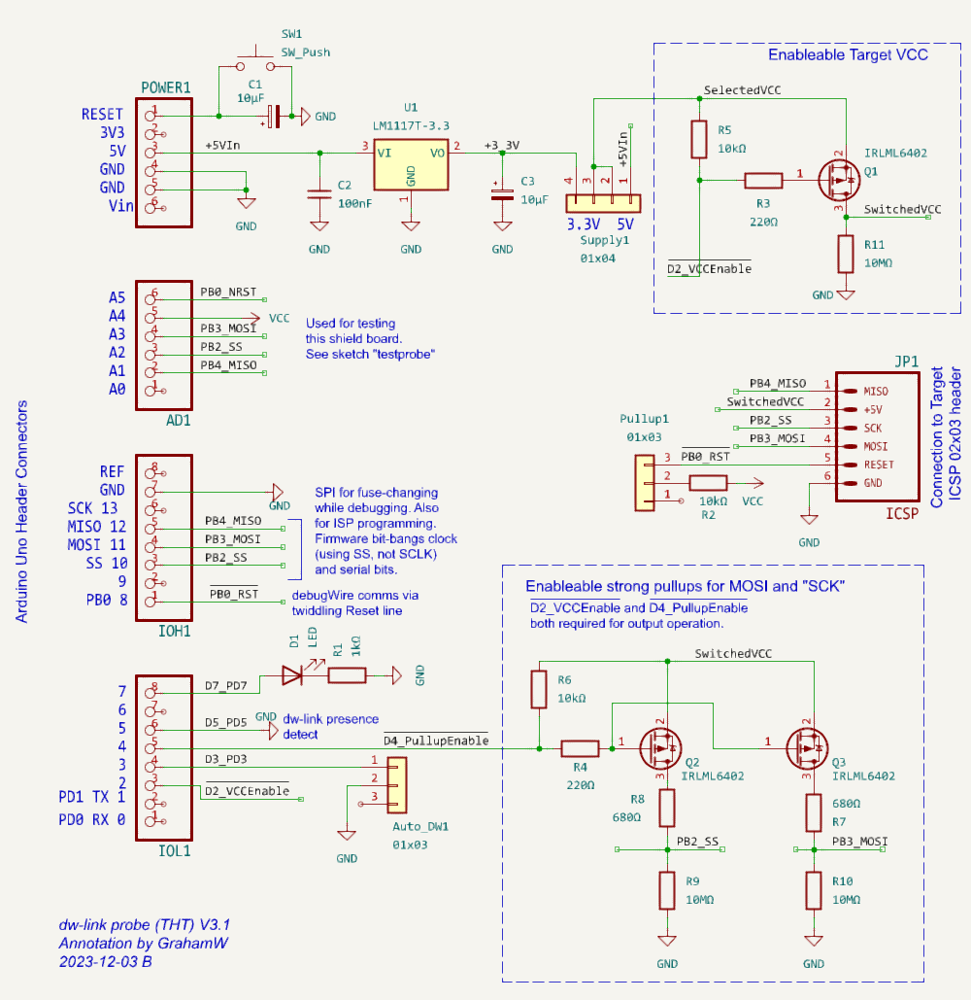

# dw-link

# An Arduino-based debugWIRE debugger

**Bernhard Nebel**

**Version 5.0 - March 2025**

<a rel="license" href="http://creativecommons.org/licenses/by/4.0/"></a><br />This work is licensed under a <a rel="license" href="http://creativecommons.org/licenses/by/4.0/">Creative Commons Attribution 4.0 International License</a>.


<div style="page-break-after: always"></div>

  * [1. Introduction](#1-introduction)
    + [1.1 Enter the wonderful world of debugging in a few easy steps](#11-enter-the-wonderful-world-of-debugging-in-a-few-easy-steps)
    + [1.2 Other debugging approaches for classic ATtinys and ATmegaX8s](#12-other-debugging-approaches-for-classic-attinys-and-atmegax8s)
    + [Warning](#warning)
  * [2. The debugWIRE interface](#2-the-debugwire-interface)
  * [3. Hardware requirements](#3-hardware-requirements)
    + [3.1 The hardware debugger](#31-the-hardware-debugger)
    + [3.2 MCUs with debugWIRE interface](#32-mcus-with-debugwire-interface)
    + [3.3 Requirements concerning the target system](#33-requirements-concerning-the-target-system)
    + [3.4 Worst-case scenario](#34-worst-case-scenario)
  * [4. Installation of firmware and hardware setup](#4-installation-of-firmware-and-hardware-setup)
    + [4.1 Firmware installation](#41-firmware-installation)
    + [4.2 Setting up the hardware](#42-setting-up-the-hardware)
      - [4.2.1 Debugging an ATtiny85](#421-debugging-an-attiny85)
      - [4.2.2 Debugging an UNO](#422-debugging-an-uno)
    + [4.3 States of the hardware debugger](#43-states-of-the-hardware-debugger)
  * [5. Software setup](#5-software-setup)
    + [5.1 Installing Arduino board manager packages](#51-installing-arduino-board-manager-packages)
    + [5.2. Compiling the sketch in the Arduino IDE 2](#52-compiling-the-sketch-in-the-arduino-ide-2)
    + [5.3. Debugging](#53-debugging)
    + [5.4 Some Pro Tips](#54-some-pro-tips)
    + [5.5 Monitor commands](#55-monitor-commands)
    + [5.6 Restoring an UNO to its native state](#56-restoring-an-uno-to-its-native-state)
  * [6. Better hardware for the hardware debugger](#6-better-hardware-for-the-hardware-debugger)
    + [6.1 The basic solution](#61-the-basic-solution)
    + [6.2 A simple prototype shield](#62-a-simple-prototype-shield)
    + [6.3 Adapter with level-shifters and switchable power supply](#63-adapter-with-level-shifters-and-switchable-power-supply)
  * [7. Problems and shortcomings](#7-problems-and-shortcomings)
    + [7.1 Flash memory wear](#71-flash-memory-wear)
    + [7.2 Slow responses when loading or single-stepping](#72-slow-responses-when-loading-or-single-stepping)
    + [7.3 Program execution is very slow when conditional breakpoints are present](#73-program-execution-is-very-slow-when-conditional-breakpoints-are-present)
    + [7.4 Single-stepping and interrupt handling clash](#74-single-stepping-and-interrupt-handling-clash)
    + [7.5 Limited number of breakpoints](#75-limited-number-of-breakpoints)
    + [7.6 Power saving is not operational](#76-power-saving-is-not-operational)
    + [7.7 MCU operations interfering with debugWIRE](#77-mcu-operations-interfering-with-debugwire)
    + [7.8 BREAK instructions in your program](#78-break-instructions-in-your-program)
    + [7.9 Some MCUs have stuck-at-one bits in the program counter](#79-some-mcus-have-stuck-at-one-bits-in-the-program-counter)
    + [7.10 The start of the debugger takes two seconds](#710-the-start-of-the-debugger-takes-two-seconds)
    + [7.11 Code optimization reorganizes code and makes it impossible to stop at a particular source line or to inspect or change values of local variables](#711-code-optimization-reorganizes-code-and-makes-it-impossible-to-stop-at-a-particular-source-line-or-to-inspect-or-change-values-of-local-variables)
  * [8. Troubleshooting](#8-troubleshooting)
    + [8.1 Problems while preparing the setup](#81-problems-while-preparing-the-setup)
    + [8.2 Startup problems](#82-startup-problems)
    + [8.3 Problems while debugging](#83-problems-while-debugging)
    + [8.4 Strange behavior of the debugger](#84-strange-behavior-of-the-debugger)
    + [8.5 Problems with with GUI/IDE](#85-problems-with-with-gui-ide)
    + [8.6 Problems after debugging](#86-problems-after-debugging)
    + [8.7 Internal and fatal debugger errors‚](#87-internal-and-fatal-debugger-errors-)
  * [Acknowledgements](#acknowledgements)
  * [Revision history](#revision-history)

<small><i><a href='http://ecotrust-canada.github.io/markdown-toc/'>Table of contents generated with markdown-toc</a></i></small>

<div style="page-break-after: always"></div>

## 1. Introduction 

The Arduino IDE is very simple and makes it easy to get started. After a while, however, one notices that a lot of important features are missing. In particular, neither the old nor the new IDE supports any kind of debugging for the classic AVR chips. So what can you do when you want to debug your Arduino project on small ATmegas (such as the popular ATmega328) or ATtinys? The usual way is to insert print statements and see whether the program does the things it is supposed to do. 

However, supposedly, one should be able to do better than that because the MCUs mentioned above support [on-chip debugging](https://en.wikipedia.org/wiki/In-circuit_emulation#On-chip_debugging) via [debugWIRE](https://debugwire.de/), which can be accessed via so-called hardware debuggers. If you do not want to buy a hardware debugger, such as MPLAB SNAP, PICkit4, Atmel-ICE, Atmel's JTAGICE3, or Atmel's Powerdebugger, then *dw-link* is the right thing for you. It turns an Arduino UNO into a hardware debugger that acts as a [gdbserver](https://en.wikipedia.org/wiki/Gdbserver). It can be used stand-alone (using the symbolic debugger [AVR-GDB](https://sourceware.org/gdb/) in a console window), or you can integrate it into an IDE such as Arduino IDE 2, PlatformIO, or CLion. Here, we will only cover the case of the Arduino IDE 2.

### 1.1 Enter the wonderful world of debugging in a few easy steps 

Before we start the excursion into the world of debugging, I will give you some background in Section 2, sketching the physical properties of the debugWIRE protocol. After that, we have a look at what we need on the hardware side.  You need an Arduino UNO (or something equivalent) as the hardware debugger (see [Section 3.1](#section31)) and a chip or board that understands debugWIRE (see [Section 3.2](#section32)), i.e., a classic ATtiny or an ATmegaX8. Then, you only have to install the debugger firmware on the UNO ([Section 4.1](#section41)) and set up the hardware for a debugging session ([Section 4.2](#section42)). Finally, you need to install a debugging environment. Here, we will cover only how this can be done as part of the Arduino IDE 2 ([Section 5](#section5)).  

If you have performed all the above steps, then the setup should look like as in the following picture.


Your development machine, the *host*, is connected to the UNO acting as a *hardware debugger* over the usual USB connection. The  two devices use the *GDB remote serial protocol* to communicate with each other. The hardware debugger in turn is connected to the *target system*, whereby the *debugWIRE protocol* is used for communication. 

The physical connection between the hardware debugger and the target, as described in [Section 4.2](#section42), is something that might need some enhancements. Instead of six jumper wires, you may want to have a more durable connection. This is covered in [Section 6](#section6). Finally, possible problems and troubleshooting are covered in [Section 7](#section7) and [Section 8](#trouble), respectively.

And what do you with your hardware debugger once you have debugged all your programs and they work flawlessly? Since version 2.2.0, you can use dw-link also as an STK500 v1 ISP programmer. If you connect to dw-link with 19200 bps and start avrdude, then dw-link becomes an ISP programmer.

<a name="section12"></a>

### 1.2 Other debugging approaches for classic ATtinys and ATmegaX8s

While dw-link is (unsurprisingly) one of my preferred open source solution for debugging classic tiny AVRs and ATmegaX8s, there are a number of other possible approaches. 

[Bloom](https://bloom.oscillate.io/) is not a hardware debugger, but it is a pretty extensive implementation of a gdbserver for almost all AVR MCUs using the Microchip hardware debuggers. The only drawback is that it runs only under Linux. Similarly, [avarice](https://github.com/avrdudes/avarice) is another such gdbserver. Recently, I added another gdbserver to the mix, which is written in Python: [dw-gdbserver](https://github.com/felias-fogg/dw-gdbserver). 

There exists a software simulator called [SIMAVR](https://github.com/buserror/simavr) and there is a [GDB remote stub](https://sourceware.org/gdb/onlinedocs/gdb/Remote-Stub.html) for some ATmegas, called [avr_debug](https://github.com/jdolinay/avr_debug). Both are integrated into [PlatformIO](https://platformio.org/) as debuggers. However, both tools come with a lot of restrictions and using them is not the same as debugging on the hardware where your firmware should finally run. 

Based on RikusW's work on [reverse engineering the debugWIRE protocol](http://www.ruemohr.org/docs/debugwire.html), you can find a few attempts at building debuggers using debugWIRE. First, there is an implementation called [dwire-debug](https://github.com/dcwbrown/dwire-debug) for host systems that uses only the serial line interface to talk with a target using the debugWIRE interface. This program implements GDB's remote serial protocol.  Unfortunately, the particular way of turning a serial interface into a one-wire interface did not work for me on a Mac. This approach has been further developed, resulting in an interesting solution for [debugging Arduino UNOs using a CH552 board](https://github.com/DeqingSun/unoDebugTestPackage). 

Then there is also an Arduino UNO based hardware debugger called [DebugWireDebuggerProgrammer](https://github.com/wholder/DebugWireDebuggerProgrammer). However, it does not provide an interface for GDB's remote serial protocol. On top of that, all these solutions allow only one breakpoint (the hardware breakpoint of debugWIRE).

There exists an implementation similar to dwire-debug in Pascal called [debugwire-gdb-bridge](https://github.com/ccrause/debugwire-gdb-bridge) that appears to be more complete. In particular, it handles multiple breakpoints. However, I was not able to install it. That is probably based on the fact that my knowledge of Pascal is rusty and I have no experience with the Lazarus IDE. 

I took all of the above ideas (and some of the code) and put it together in order to come up with a cheap debugWIRE hardware debugger supporting GDB's remote serial protocol. Actually, it was a bit more than just throwing things together. I developed a [new library for single wire serial communication](https://github.com/felias-fogg/SingleWireSerial) that is [much more reliable and robust](https://hinterm-ziel.de/index.php/2021/10/30/one-line-only/) than the usually employed SoftwareSerial library. Further, I fixed a few loose ends in the existing implementations, sped up communication and flash programming, supported slow MCU clocks, implemented an [interrupt-safe way of single-stepping](https://hinterm-ziel.de/index.php/2022/01/02/thats-one-small-step-for-a-man-one-giant-leap-for-a-debugger-on-single-stepping-and-interrupts/), and spent a few nights debugging the debugger.  And I tested the debugger on almost all MCUs supported by [ATTinyCore](https://github.com/SpenceKonde/ATTinyCore) and [MiniCore](https://github.com/MCUdude/MiniCore). Along the way, I also made [a number of interesting discoveries](https://hinterm-ziel.de/index.php/2021/12/29/surprise-surprise/).

<font color="red">

### Warning

</font>

Please read  [Sections 3.3 & 3.4](#section33) about the RESET line requirements before connecting the debugger to a target system. You might very well "brick" your MCU by enabling debugWIRE on a system that does not satisfy these requirements. 

<a name="section2"></a>

## 2. The debugWIRE interface

The basic idea of debugWIRE is that the RESET line is used as a communication line between the target system (the system you want to debug) and the hardware debugger, which in turn can then communicate with the development machine or host, which runs a debug program such as GDB. The idea of using only a single line that is not used otherwise is very cool because it does not waste any of the other pins for debugging purposes (as does, e.g., the [JTAG interface](https://en.wikipedia.org/wiki/JTAG)). However, using the RESET line as a communication channel means, of course, that one cannot use the RESET line to reset the MCU anymore. Furthermore, one cannot any longer use [ISP programming](https://en.wikipedia.org/wiki/In-system_programming) to upload new firmware to the MCU or change the fuses of the MCU. 

With respect to the debugWIRE protocol there are basically three states your MCU could be in:

1. The **normal** **state** in which the DWEN (debugWIRE enable) [fuse](https://microchipdeveloper.com/8avr:avrfuses) is disabled. In this state, you can use ISP programming to change fuses and to upload programs. By enabling the DWEN fuse, one reaches the **transitional** **state**.
2. The **transitional** **state** is the state in which the DWEN fuse is enabled. In this state, you could use ISP programming to disable the DWEN fuse again, to reach the **normal state**. By *power-cycling* (switching the target system off and on again), one reaches the **debugWIRE** **state**.
3. The **debugWIRE** **state** is the state in which you can use the debugger to control the target system. If you want to return to the **normal** **state**, a particular debugWIRE command leads to the **transitional state**, from which one can reach the **normal state** using ordinary ISP programming by disabling the DWEN fuse.


The hardware debugger will take care of bringing you from *normal* state to *debugWIRE* state when you type  the command ```monitor debugwire enable``` . In fact, when using the Arduino IDE 2, this will be done in the background for you. After the hardware debugger has enabled the DWEN fuse, the system LED will flash in a particular pattern, which signals that you should power-cycle the target. Further, in the GDB debugger, a message will be shown that asks you to power-cycle the target system. If the hardware debugger powers the target, it will power-cycle automatically. This transition is only necessary once. The next time, when you start a debugging session, the target system is already in the debugWIRE state and nothing needs to be done. 

When you are done with debugging and you want to get the target system back into the normal state, you must type the command ```monitor debugwire disable``` just before exiting the debugger.

<a name="section3"></a>

## 3. Hardware requirements

There are a few constraints on what kind of board you can use as the base for the hardware debugger and some requirements on how to connect the debugger to the target system. Furthermore, there is only a limited set of AVR MCUs that have a debugWIRE interface.

<a name="section31"></a>

### 3.1 The hardware debugger

As a base for the debugger, in principle one can use any ATmega328 based board. The clock speed  must be 16MHz. Currently, the sketch has been tested on the following boards:

* [Arduino UNO](https://store.arduino.cc/products/arduino-uno-rev3),
* [Arduino Nano](https://store.arduino.cc/products/arduino-nano),
* [Arduino Pro Mini](https://docs.arduino.cc/retired/boards/arduino-pro-mini).

If you intend to use dw-link on a board with an MCU different from ATmega328P, you should be aware that dw-link makes heavy use of the particular hardware features of the ATmega328P and operates close to the limit. I tried it out on the Leonardo and on the Mega256, but was not successful. 

The most basic setup is to use the UNO board and connect the cables, as shown in the [Fritzing sketch](#Fritzing) further down. If you want to use the debugger more than once, it may pay off to build a modified ISP cable or to use a prototype shield and put an ISP socket on it. The more luxurious solution is a shield for the UNO, which you can buy at [Tindie](https://www.tindie.com/products/fogg/dw-link-probe-a-debugwire-hardware-debugger/). All these possibilities are described in [Section 6](#section6).

<a name="section32"></a>

### 3.2 MCUs with debugWIRE interface

In general, almost all "classic" ATtiny MCUs and the ATmegaX8 MCU family have the debugWIRE interface. Specifically, the following MCUs that are supported by the Arduino standard core,  by [ATTinyCore](https://github.com/SpenceKonde/ATTinyCore), and/or by [MiniCore](https://github.com/MCUdude/MiniCore) can be debugged using this interface:

* <s>__ATtiny13__</s>
* __ATtiny43U__
* __ATtiny2313(A)__, __ATtiny4313__
* __ATtiny24(A)__, __ATtiny44(A)__, __ATtiny84(A)__
* __ATtiny441__, __ATtiny841__
* __ATtiny25__, __ATtiny45__, __ATtiny85__
* __ATtiny261(A)__, __ATtiny461(A)__, __ATtiny861(A)__
* __ATtiny87__, __ATtiny167__
* __ATtiny828__
* __ATtiny48__, __ATtiny88__
* __ATtiny1634__
* <s>__ATmega48__</s>, __ATmega48A__, __ATmega48PA__, ATmega48PB, 
* <s>__ATmega88__</s>, __ATmega88A__, __ATmega88PA__, Atmega88PB, 
* __ATmega168__, __ATmega168A__, __ATmega168PA__, ATmega168PB, 
* __ATmega328__, __ATmega328P__, __ATmega328PB__

I have tested the debugger on MCUs marked bold. I excluded the ATtiny13 because it behaved very strangely, and I could not figure out why. When I tried out the ATmegas that are stroked out, I noticed that they have program counters with some bits stuck at one (see Section 7.9). For this reason, GDB has problems debugging them. If dw-link discovers stuck-at-one bits, it will report this and refuse to debug such MCUs.

Additionally, there exist a few more exotic MCUs, which also have the debugWIRE interface:

* ATmega8U2, ATmega16U2, ATmega32U2
* ATmega32C1, ATmega64C1, ATmega16M1, ATmega32M1, ATmega64M1
* AT90USB82, AT90USB162
* AT90PWM1, AT90PWM2B, AT90PWM3B
* AT90PWM81, AT90PWM161
* AT90PWM216, AT90PWM316
* ATmega8HVA, ATmega16HVA, ATmega16HVB, ATmega32HVA, ATmega32HVB, ATmega64HVE2

The debugger contains code for supporting all listed MCUs. I expect the debugger to work on the supported MCUs. However, there are always [surprises](https://arduino-craft-corner.de/index.php/2021/12/29/surprise-surprise/). If you can debug such an MCU using dw-link, please drop me a note.

<a name="section33"></a>

### 3.3 Requirements concerning the target system 

A critical point is the target system's RESET line. Since this line is used as an [open-drain](https://en.wikipedia.org/wiki/Open_collector#MOSFET), [asynchronous](https://en.wikipedia.org/wiki/Asynchronous_communication) [half-duplex](https://en.wikipedia.org/wiki/Duplex_(telecommunications)#HALF-DUPLEX) [serial communication](https://en.wikipedia.org/wiki/Serial_communication) line, one has to ensure there is no capacitive load on the line when used in debugWIRE mode. While the debugger tries to recognize such situations before any damage is done, it will certainly not catch all problematic configurations.

Further, there should be a pull-up resistor of around 10 kΩ. According to reports of other people, 4.7 kΩ might also work. And the RESET line should, of course,  not be directly connected to Vcc and there should not be any external reset sources on the RESET line. The debugger does not recognize these problems.

If your target system is an Arduino UNO R3 or a similar board, you must be aware that there is a capacitor between the ATmega328's RESET pin and the serial chip's DTR pin that implements the auto-reset feature, as shown in the following picture.


One can disconnect the capacitor by cutting the solder bridge labeled *RESET EN* on the board (see picture), but then you cannot use the automatic reset feature of the Arduino IDE any longer. 


A recovery method is to put a bit of soldering  on the bridge or to solder pins to it that can be shortened by a jumper.

On UNO  clones, which have a CH340G chip as the serial interface, there is not such a nice cut-off point. On some of them, it is the C8 capacitor that you have to remove.


Modifications for other Arduino AVR boards are covered on this [webpage](https://debugwire.de/board-modifications/).

<a name="worstcase"></a>

### 3.4 Worst-case scenario 

So, what is the worst-case scenario when using debugWIRE? As described in [Section 2](#section2), first, the DWEN fuse is programmed using ISP programming. Then, one has to power-cycle to reach the debugWIRE state, where you can communicate with the target over the RESET line. If this kind of communication fails, you cannot put the target back in a state where ISP programming is possible. And the bootloader will not work either because it had to be erased. Your MCU is *bricked*.   

One way to try to resurrect your MCU is to make the RESET line compliant with the debugWIRE requirements. Then you should be able to connect to the target using the hardware debugger. 

The most reliable way to revive your MCU is HV programming, which requires applying 12 volts to the RESET pin and a lot of other things. So you either remove the chip from the board and do the programming offline, or you remove any connection from the RESET line to the Vcc rail and other components on the board. Then, you can use an existing high-voltage programmer or [build one on a breadboard](https://github.com/felias-fogg/RescueAVR).

<a name="section4"></a>


## 4. Installation of firmware and hardware setup

There are only a few steps necessary for installing the dw-link firmware on the hardware debugger. For the hardware setup, you need a breadboard or a development board with one of the chips that speaks debugWIRE.

<a name="section41"></a>

### 4.1 Firmware installation

Since the firmware of the hardware debugger comes in the form of an Arduino sketch, you need to download, first of all, the [Arduino IDE](https://www.arduino.cc/en/software) or [Arduino CLI](https://docs.arduino.cc/arduino-cli/), if you have not done that already. You can also use [PlatformIO](https://platformio.org) as an alternative. 

Second, you need to download the dw-link firmware. If you use PlatformIO, note that the repository is already prepared to be opened as a PlatformIO project, i.e., it contains a `platformio.ini` file. Either download/clone the dw-link repository or download a release.

Third, you have to connect your future hardware debugger, i.e., the ATmega328 board, to your computer, select the right board in the Arduino IDE, and upload the `dw-link.ino` sketch to the board. Similarly, in PlatformIO, you have to choose the right board and choose the `Upload` menu entry.

<a name="section42"></a>

### 4.2 Setting up the hardware

Before you can start debugging, you have to set up the hardware. I'll use an ATtiny85 on a breadboard as one example target system. However, any MCU listed above would do as a target. One could even use an Arduino UNO, provided the modifications described in [Section 3.3](#section33) are done. 

#### 4.2.1 Debugging an ATtiny85

In order to debug an ATtiny85, we will assume it is completely "naked" and plugged into a breadboard as shown below. 

<a name="Fritzing"></a>


Notice the capacitor of 10 µF or more between RESET and GND on the UNO board. This will disable the auto-reset of the UNO board. Second, note the yellow LED connected to pin D7. This is the system LED which is used to visualise the internal state of the debugger (see below).  You can also build an LED with a series resistor soldered on and then use pins D6 and D7, where D6 is used as GND.

GND and Vcc of the ATtiny are connected to the respective lines on the breadboard, which in turn are connected to GND and 5V of the UNO. Pin D8 of the Arduino UNO is connected to the RESET pin of the ATtiny (pin 1).   Note the presence of the pull-up resistor of 10kΩ on the ATtiny RESET pin. The remaining connections between Arduino UNO and ATtiny are MOSI (Arduino UNO D11), MISO (Arduino UNO D12), and SCK (Arduino UNO D13), which you need for ISP programming. In addition, there is an LED connected to pin 3 of the ATtiny chip (which is PB4 or pin D4 in Arduino terminology). The pinout of the ATtiny85 is given in the following figure (with the usual "counter-clockwise" numbering of Arduino pins).


Here is a table of all the connections so that you can check that you have made all the connections. 

ATtiny pin# | Arduino UNO pin | component
--- | --- | ---
1 (Reset) | D8 | 10k resistor to Vcc 
2 (D3) |  |
3 (D4) |  |220 Ω resistor to (red) target LED (+)
4 (GND) | GND | both LED (-), decoupling cap 100 nF, RESET blocking cap of 10µF (-) 
5 (D0, MOSI) | D11 |
6 (D1, MISO) | D12 |
7 (D2, SCK) | D13 |
8 (Vcc) | 5V | 10k resistor, decoupling cap 100 nF 
&nbsp;|RESET|RESET blocking cap of 10 µF (+)
&nbsp;|D7|220 Ω resistor to (yellow) system LED (+)

<a name="section452"></a>

#### 4.2.2 Debugging an UNO

If you want to debug an UNO board instead of an ATtiny85, everything said above applies. The Fritzing sketch below shows the connections. Here, the series resistor for the system LED is soldered to the LED cathode, so we do not need a breadboard. The hardware debugger needs a USB connection to your host, but the target does not need to be connected to the host! If it is, then remove the red cable between the 5V pins of the hardware debugger and the target. 


Remember to cut the `RESET EN` solder bridge on the target board (see [Section 3.3](#section33))! When you first activate debugWIRE on the UNO target, the target will be completely erased (including the boot loader), because the lock bits have to be cleared. The steps to restore your UNO to its original state are described in [Section 5.6](#section56).

### 4.3 States of the hardware debugger

We are now good to go and 'only' need to install the additional debugging software on the host. Before we do that, let us have a look, in which states the hardware debugger can be and how it signals that using the system LED.

There are five states the debugger can be in and each is signaled by a different blink pattern of the system LED:

* debugWIRE mode disabled (LED is off),
* waiting for power-cycling the target (LED flashes every second for 0.1 sec),
* debugWIRE mode enabled (LED is on) ,
* ISP programming (LED is blinking slowly every 0.5 sec), or
* error, i.e., it is not possible to connect to the target or there is an internal error (LED blinks furiously every 0.1 sec).

If the hardware debugger is in the error state, one should try to find out the reason by typing the command `monitor info`, studying the [error message table](#fatalerror) at the end of the document, finishing the GDB session, resetting the debugger, and restarting everything. I have made the experience that sometimes it is a good idea to disconnect the USB cable and the connection to the target before starting over.

 If the problem persists, please check the section on [troubleshooting](#trouble).

<a name="section5"></a>

## 5. Software setup

If you only want to use avr-gdb, the GDB version for AVR chips, you need to start the avr-gdb debugger, give the name of the binary as an argument, set the baud rate, and then connect to dw-link using the serial line, as shown below. Since the hardware debugger is platform agnostic, this will work with all operating systems.

```
> avr-gdb program.ino.elf
GNU gdb ...
...
(gdb) set serial baud 115200
(gdb) target remote /dev/cu.usbmodem1234
Remote debugging using /dev/cu.usbmodem1234
0x00000000 in __vectors ()
(gdb) monitor debugwire enable
*** Please power-cycle target ***
Ignoring packet error, continuing...
Connected to ATmega328P
debugWIRE is enabled, bps: 125244
(gdb) 
```

If you have come to this point, I trust that you know what you are doing and know how to proceed from there.

If, instead, you want to use dw-link in the Arduino IDE 2, read on. Using dw-link in the Arduino IDE 2 is straightforward. Before starting, you only must install two board manager URLs and the respective board packages. After that, you can begin your first debugging session.

### 5.1 Installing Arduino board manager packages

We need to install two new cores, which are forks of [MiniCore](https://github.com/MCUdude/MiniCore) and [ATTinyCore](https://github.com/SpenceKonde/ATTinyCore). Open the `Preference` dialog of the Arduino IDE and paste the following two URLs into the list of `Additional boards manager URLs`:

```
https://felias-fogg.github.io/ATTinyCore/package_drazzy.com_ATTinyCore_plus_Debug_index.json
```

```
https://felias-fogg.github.io/MiniCore/package_MCUdude_MiniCore_plus_Debug_index.json
```

Then, you need to start the  `Boards Manager`, which you find under `Tools`-->`Board`. Install MiniCore and ATTinyCore, choosing the most recent version with a `+debug` suffix. Note that the packages include tools that might be incompatible with older OS versions. If you encounter problems when starting the debugging software, consult [Section 8.2](#section82).

### 5.2. Compiling the sketch in the Arduino IDE 2

You must load the sketch into the editor and select a board as usual. If you want to debug an Arduino UNO board, choose ATmega328 from the Minicore in the `Tools` menu. 

Before clicking the `Verify` button in the upper left corner, choose `Optimize for Debugging` in the `Sketch` menu. This is necessary so that the compiler optimizes the code in a way that makes debugging straightforward. Otherwise, the compiler may rearrange source code lines, and one will get confused when single-stepping through the code.


### 5.3. Debugging

After having verified the sketch (which also compiled it), it is time to start debugging by clicking on the debug button in the top row. This will start the debug server, which will notice that the MCU is not yet in debugWIRE mode and ask you to power-cycle the target board by displaying a message to that effect. 

Instead of the message shown in the following screen shot, it may happen that a warning "No hardware debugger discovered" is shown. The reason may be that the Arduino IDE 2 reserved the debugger's serial line for the `Serial Monitor`. Simply close the `Serial Monitor` console and try again.

As mentioned in Section 2, power cycling is only necessary once. The next time you start a debugging session, the MCU will already be in d ebugWIRE mode, and the debugger will not stop at this point. 


After power-cycling the target, the debugger starts. Eventually, execution is stopped in line 4 at an initial internal breakpoint, indicated by the yellow triangle left of line 4 in the following screenshot. It might take a while before we reach that point because the debugger must also load the program. 

After stopping, the IDE rearranges the layout, showing the debugging panes on the left and the sketch on the right. It will also switch from showing the `gdb-server` console to the `Debug Console`, which shows the output of the GDB debugger. 

 

Now is a good time to familiarize yourself with the window's layout. The source code is on the right side. Below that is a console window, and to the left are the debug panes. If you want to set a breakpoint, you can do that by clicking to the left of the line numbers. Such breakpoints are displayed as red dots as the ones left of line 8 and 13.

The debugging panes are orgnized as folloes. Pane A contains the debug controls. From left to right:

- *Reset*ting the device
- *Continue* execution or *pause*
- *Step over*: execute one source line
- *Step into*: execute stepping into the function, if in this line one is called
- *Step out*: finish the current function and stop after the line where it had been called
- *Restart*: Same as Reset
- *Stop*: Terminate debugging

Pane B shows the active threads, but there is just one in our case. Pane C displays the call stack starting from the bottom, i.e., the current frame is the topmost. Pane D displays variable values. Unfortunately, global variables are not shown. Pane E can be populated with watch expressions.  Finally, in pane F, the active breakpoints are listed. The panes below are useless in our case. Some more information about debugging can be found in the Arduino [debugging tutorial](hhttps://docs.arduino.cc/software/ide-v2/tutorials/ide-v2-debugger/). 

### 5.4 Some Pro Tips

If you want to switch from the dw-link debugger to a professional hardware debugger, e.g., [MPLAP SNAP](https://www.microchip.com/en-us/development-tool/pg164100) or [Atmel-ICE](https://www.microchip.com/en-us/development-tool/atatmel-ice), these debuggers can be used as a drop-in replacement! So you do not have to change anything in the hardware or software configuration. And the SNAP is really cheap these days!

Global variables are, for some reason, not displayed. However, you can set a watch expression in the Watch pane to display a global variable's value.

If you select the Debug Console, you can type GDB commands in the bottom line. This can be useful for changing the value of global variables using the GDB command `set var <varname>=<value>`. This can also be used to disable the debugWIRE mode using the command `monitor debugwire disable`. The following section describes more monitor commands.

### 5.5 Monitor commands

| Command                                                | Action                                                       |
| :----------------------------------------------------- | ------------------------------------------------------------ |
| `monitor` `help`                                       | Give a help message on monitor commands.                     |
| `monitor` `info`                                       | Give information about target and debugger.                  |
| `monitor` `version`                                    | Print version number of firmware.                            |
| `monitor` `debugwire` [`enable |`disable`]`            | **Enable** or **disable** debugWIRE mode.                    |
| `monitor` `reset`                                      | Reset the MCU.                                               |
| `monitor load` [`readbeforewrite`\|`writeonly`]        | When loading, either **read before write** or **write only**. The first option is faster and reduces flash wear. So, it is the default. |
| `monitor` `verify` [`enable`\|`disable`]               | **Enable** to verify flash loads or **disable** this feature. |
| `monitor` `onlyloaded` [`enable`\|`disable`]           | **Enable** the check that execution is only possible after a load command or **disable** this feature. |
| `monitor` `timers` [`freeze`\|`run`]                   | **Freeze** timers or let them **run** when the program is stopped. |
| `monitor` `breakpoint` [`all`\|`software`\|`hardware`] | Allow for **all** kinds of breakpoints, for **software** breakpoints only, or for **hardware** breakpoints only (of which there exists only one). |
| `monitor` `singlestep` [`safe`\|`interuptible`]        | Sets single stepping to **safe** or **interruptible**.       |
| `monitor` `speed` [`low`\|`high`]                      | Set the communication speed limit to **low** (=150kbps) (default) or to **high** (=300kbps); without an argument, the current communication speed and speed limit is printed. |

The default setting is always the first one listed, except for `debugwire`, which depends on the MCU itself. All commands can, as usual, be abbreviated. For example, `mo d e` is equivalent to `monitor debugwire enable`. 

<a name="section56"></a>

### 5.6 Restoring an UNO to its native state

When you want to restore the target so that it behaves again like an ordinary UNO after a debugging session, you have two options: you can restore it as a MiniCore 328P board or as an original UNO board. The former one is the more attractive alternative in my eyes. Just check out the pages about [MiniCore](https://github.com/MCUdude/MiniCore). Further, the command `Burn Bootloader` does apparently not work so well with some programmers or debuggers when doing it for the Uno setting. However, the dw-link built-in programmer has no problems. 

In order to restore your board, you need to do the following steps:

1. You need the target board to exit the debugWIRE mode. This could be done by typing `monitor debugwire disable` into the debugger just before exiting. Or it will be done automagically using the built-in programmer mentioned in the following step.
2. Now you have to flash the bootloader. As mentioned in Section 1, since version 2.2.0, the hardware debugger can also act as a programmer! This means that you leave the whole hardware setup as it was. However, you can, of course, use any other ISP programmer.
3. Select `Arduino UNO` or the `ATmega328 board` as the target board in the `Tools` menu, select `AVR ISP` as the Programmer, choose the right serial port, and use  `Burn Bootloader` from the `Tools` menu. This will revert the MCU to its normal state (if it still in debugWARE state) and will restore the fuses, the bootloader, and the lock bits to their original state. 
4. Reestablish the `RESET EN` connection by putting a solder blob on the connection or soldering pins to the connections that can be shortened using a jumper as shown in the next picture. It does not look pretty, but it does its job. After that, your UNO is as good as new. Note that in the future, code uploading should be done by choosing the type of board you used when executing the `Burn Bootloader` command.


<a name="section6"></a>

## 6. Better hardware for the hardware debugger

The hardware part of our hardware debugger is very limited so far. You can, of course, use 6 jumper wires to connect dw-link to your target as described in [Section 4.2](#section42). However, if you want to use this tool more than once, then there should be at least something like an ISP cable connection. Otherwise, you might scratch your head which cable goes where every time you start a debugging session.

### 6.1 The basic solution

For most of the wires, we use the same pins on the debugger and the target. Moreover, most of the pins are connected to the ISP connector on board. So, it makes sense to think about something similar to an ISP cable people use when employing an Arduino UNO as an ISP programmer. Such cables can be easily constructed with some Dupont wires and a bit of heat shrink tube as, for example, demonstrated in [this instructable](https://www.instructables.com/Arduino-ICSP-Programming-Cable/). In contrast to such a programmer cable, it makes sense to also break out the Vcc wire. And you do not want to integrate a capacitor between RESET and GND in such a cable in contrast to what is described in the instructable!


As argued in [my blog post on being cheap](https://hinterm-ziel.de/index.php/2022/01/13/a-debugwire-hardware-debugger-for-less-than-10-e/), with such an ISP cable, we have sort of constructed a hardware debugger for less than 10 €, which can be considered semi-durable. Just add the optional system LED with an attached resistor and a capacitor between RESET and GND.


The relevant pins are defined in the following table. 

<a name="simplemap"></a>

| Arduino pin | ISP pin | Function                                                 |
| ----------- | ------- | -------------------------------------------------------- |
| D13         | 3       | SCK                                                      |
| D12         | 1       | MISO                                                     |
| D11         | 4       | MOSI                                                     |
| 5V          | 2       | VTG                                                      |
| D8          | 5       | RESET                                                    |
| GND         | 6       | GND                                                      |
| D7          |         | System LED+                                              |
| D6          |         | System LED- (if using a LED with a resistor soldered on) |

### 6.2 A simple prototype shield

Taking it one step further, one can take a prototype shield for an UNO, put an ISP socket on it, and connect the socket to the respective shield pins. You should also plan to have jumper pins to to be able to power-cycle the target. Finally, you probably also want to place the system LED on the board. So, it could look like the following Fritzing sketch. 


### 6.3 Adapter with level-shifters and switchable power supply

The basic adapter is quite limited. Power-cycling has to be done manually, it cannot interact with 3.3 V systems, and it has a high load on the SCK line (because the UNO LED is driven by this pin) when the ISP mode is disabled. Thus, it would be great to have a board with the following features: 

* switchable target power supply (supporting power-cycling by the hardware debugger) offering 5-volt and 3.3-volt supply up to 300 mA, 
* a bidirectional (conditional) level-shifter on the debugWIRE/RESET line,
* an optional pull-up resistor of 10 kΩ on this line,
* unidirectional (conditional) level-shifters on the ISP lines, and
* high-impedance status for the two output signals MOSI and SCK when ISP is inactive.

Such a board does not need to be very complex. The electronic design is minimalistic. It uses just three MOS-FETs, one LED, one voltage regulator, and some passive components. We need to (conditionally) level-shift the RESET line in a bidirectional manner and the SPI lines unidirectionally.  One needs to shift the MISO line from 3.3-5 V up to 5 V, and the MOSI and SCK lines from 5 V down to 3.3-5 V. For the former case, no level shifting is done at all, relying on the fact that the input pins of the hardware debugger recognize a logical one already at  3.0 V. For the RESET line, which is open drain, we rely on the same fact. This means that this hardware debugger cannot deal with systems that use a supply voltage of less than 3 V, though.

For downshifting, we use the output pins of the hardware debugger in an open drain configuration and have pull-up resistors connected to the target supply voltage. These have to be particularly strong because some possible target boards, e.g., the Arduino UNO, use the SCK  line for driving an LED with a series resistor of 1kΩ. For this reason,  we use 680Ω pull-up resistors that guarantee that the signal level is above 3V on the SCK line, when we supply the board with 5V. These pull-ups will be disabled when no ISP programming is active, giving the target system full control of the two lines. The schematic looks as follows (thanks to **[gwideman](https://github.com/gwideman)** for the reworked schematic).



The pin mapping is a bit different from the basic design described above. The change from the basic mapping is controlled by pin D5, which is tied to GND in order to signal that the more complex pin mapping is used. The additional pins are all in italics. The ones not used on the board are struck out.

| Arduino pin | ISP pin  | Function                                                     |
| ----------- | -------- | ------------------------------------------------------------ |
| <s>D13</s>  | <s>3</s> | <s>SCK</s>                                                   |
| D12         | 1        | MISO                                                         |
| D11         | 4        | MOSI (open drain)                                            |
| *D10*       | *3*      | *SCK (open drain)*                                           |
| <s>5V</s>   | <s>2</s> | <s>VTG</s>                                                   |
| D8          | 5        | RESET                                                        |
| GND         | 6        | GND                                                          |
| D7          |          | System LED+                                                  |
| <s>D6</s>   |          | <s>System LED- (if using an LED with a resistor soldered on)</s> |
| *D5*        |          | *Sense pin: Connected to GND when a board with a level shifter is used* |
| *D4*        |          | *ISP pull-up enable (open drain, active low)*                |
| *D3*        |          | *Input: automatic debugWire switching disable (open drain, active low)* |
| *D2*        |          | *Power enable (open drain, active low)*                      |
|             | *2*      | *VTG:* *Power from Q1 controlled by power jumper*            |


And here is the early breadboard prototype, which worked beautifully. 


I have turned the prototype into an Arduino Shield, which you can buy [at Tindie](https://www.tindie.com/products/31798/) as a kit. With that, the hardware setup is straightforward. Just plug in an ISP cable, and you can start debugging.


<a name="jumper"></a>

Before you start, you have to configure three jumpers. Then you are all set.

Label | Left | Middle | Right 
--- | --- | --- | --- 
**Supply** | **5 V** are supplied to the target | **extern**: target needs its own supply and power cycling has to be done manually | **3.3 V** are supplied to the target 
**Pullup** | There is **no** pull-up resistor connected to RESET | &nbsp; | A **10 kΩ** pull-up resistor is connected to the RESET line of the target 
**Auto_DW** | Automatic transition from normal mode to debugWIRE mode when `monitor debugwire` is executed is **off**. |  | Automatic transitions from normal mode to debugWIRE mode when executing `monitor debugwire` is **on**. This is the default and *recommended* mode. 

<a name="7"></a>

## 7. Problems and shortcomings

dw-link is still in ***beta*** state. The most obvious errors have been fixed, but there are most probably others. If something does not go according to plan, please try to isolate the reason for the erroneous behavior, i.e., identify a sequence of operations to replicate the error. The most serious errors are *fatal errors*, which stop the debugger from working. With the command `monitor info` you can get information on the last fatal error (check the [error table at the end](#fatalerror)).

One perfect way to document a debugger error is to switch on logging and command tracing in the debugger:

```
set trace-commands on
set remote debug 1
set logging on
...
set logging off
```

This can either be done during the interactive debug session or in the `.gdbinit` file in the home directory. The latter is preferable if the problem happens before the session is started using `target remote ...`.

I have prepared an *[issue form](issue_form.md)* for you, where I ask for all the information necessary to replicate the error. 

Apart from bugs, there are, of course, shortcomings that one cannot avoid. I will present some of them in the next subsections.

### 7.1 Flash memory wear

Setting and removing *breakpoints* is one of the main functionality of a debugger. Setting a breakpoint is mainly accomplished by changing an instruction in flash memory to the BREAK instruction. This, however, implies that one has to *reprogram flash memory*. Since flash memory wears out, one should try to minimize the number of flash memory reprogramming operations.

GDB does not pass *breakpoint set* and *breakpoint delete* commands from the user to the hardware debugger, but instead, it sends a list of *breakpoint set* commands before execution starts. After execution stops, it sends *breakpoint delete* commands for all breakpoints. In particular, when thinking about conditional breakpoints, it becomes clear that GDB may send a large number of *breakpoint set* and *breakpoint delete* commands for one breakpoint during one debug session. Although it is guaranteed that flash memory can be reprogrammed at least 10,000 times according to the data sheets, this number can easily be reached even in a few debug sessions, provided there are loops that are often executed and where a conditional breakpoint has been inserted. Fortunately, the situation is not as bad as it looks since there are many ways of getting around the need of reprogramming flash memory.

First, dw-link leaves the breakpoints in memory even when GDB requests to remove them. The breakpoints in flash memory are updated only when GDB requests to continue execution. Assuming that the user does not change breakpoints too often, this will significantly reduce flash reprogramming.  

Second, if there are many breakpoints on the same flash page, the page is reprogrammed only once instead of individually for each breakpoint.

Third, when one restarts from a location where a breakpoint has been set, GDB temporarily removes this breakpoint, single-steps to the next instruction, reinserts the breakpoint, and only then continues execution. This would lead to two reprogramming operations. However, dw-link does not update flash memory before single-stepping. Instead, if the instruction is a single-word instruction, it loads the original instruction into the MCU's instruction register and executes it there. 

For two-word instructions (i.e., LDS, STS, JUMP, and CALL), things are a bit more complicated. The Microchip documents state that one should refrain from inserting breakpoints at double-word instructions, implying that this would create problems. Indeed, RikusW noted in his [reverse engineering notes about debugWIRE](http://www.ruemohr.org/docs/debugwire.html):
>Seems that its not possible to execute a 32 bit instruction this way.
The Dragon reflash the page to remove the SW BP, SS and then reflash again with the SW BP!!! 

I noticed that this is still the case, i.e., MPLAB-X in connection with ATMEL-ICE still reprograms the page twice for hitting a breakpoint at a two-word instruction. The more sensible solution is to simulate the execution of these instructions, which is at least as fast and saves two reprogramming operations. And this is what dw-link does.

Fourth, each MCU contains one *hardware breakpoint register*, which stops the MCU when the value in the register equals the program counter. Dw-link uses this for the breakpoint introduced most recently. With this heuristic, temporary breakpoints (as the ones GDB generates for single-stepping) will always get priority and more permanent breakpoints set by the user will end up in flash. 

Fifth, when reprogramming of a flash page is requested, dw-link first checks whether the identical contents should be loaded, in which case it does nothing. Further, it checks whether it is possible to achieve the result by just turning some 1's into 0's. Only if these two things are not possible, the flash page is erased and reprogrammed. This helps in particular when reloading a file with the GDB `load` command after only a few things in the program have been changed.  

With all of that in mind, you do not have to worry too much about flash memory wear when debugging. As a general rule, you should not make massive changes to the breakpoints each time the MCU stops executing. Finally, Microchip recommends that chips that have been used for debugging using debugWIRE should not be shipped to customers. Well, I never ship chips to customers anyway.

<a name="paranoid"></a>For the really paranoid,  there is the option that permits only one breakpoint, i.e., the hardware breakpoint: `monitor breakpoint hardware`. In this case, one either can set one breakpoint or one can single-step, but not both. So, if you want to continue after a break by single-stepping, you first have to delete the breakpoint. By the way, with `monitor breakpoint all`, one switches back to normal mode, in which 20 (including one temporary) breakpoints are allowed.

In addition, the debugger command `monitor info` shows the number of flash page reprogramming commands executed since the debugger was started. This also includes the flash reprogramming commands needed when loading code.

<a name="section72"></a>

### 7.2 Slow responses when loading or single-stepping

Sometimes, in particular, when using a clock speed below 1 MHz, responses from the MCU can be quite sluggish. This shows, e.g., when loading code or single-stepping. The reason is that a lot of communication over the RESET line is going on in these cases and the communication speed is set to the MCU clock frequency divided by 8, which is roughly 16000 bps in case of a 128 kHz MCU clock. If the CKDIV8 fuse is programmed, i.e., the MCU clock uses a prescaler of 8, then we are down to 16 kHz MCU clock and 2000 bps. The [Atmel AVR JTAGICE mkII manual ](https://onlinedocs.microchip.com/pr/GUID-73C92233-8EC5-497C-92C3-D52ED257761E-en-US-1/index.html) states under [known issues](https://onlinedocs.microchip.com/oxy/GUID-73C92233-8EC5-497C-92C3-D52ED257761E-en-US-2/GUID-A686427B-0B7C-465A-BCFF-F093FD6B7A8F.html):

>Setting the CLKDIV8 fuse can cause connection problems when using debugWIRE. For best results, leave this fuse un-programmed during debugging. 

"Leaving the fuse un-programmed" means that you probably have to change the fuse to be un-programmed using a fuse-programmer, because the fuse is programmed by default.

With an optimal setting, i.e., 250 kbps for the debugWIRE line, loading is done with 1000 bytes/second. It is 5 KiB/second when the identical file is loaded again (in which case only a comparison with the already loaded file is performed). For the default setting (115200bps to host, 125000bps for debugWIRE), it is 600 bytes/second with new contents and 4 KiB/sec, if the the identical file is loaded.

### 7.3 Program execution is very slow when conditional breakpoints are present

If you use *conditional breakpoints*, the program is slowed down significantly.  The reason is that at such a breakpoint, the program has to be stopped, all registers have to be saved, the current values of the variables have to be inspected, and then the program needs to be started again, whereby registers have to be restored first. For all of these operations, debugWIRE communication takes place. This takes roughly 100 ms per stop, even for simple conditions and an MCU running at 8MHz. So, if you have a loop that iterates 1000 times before the condition is met, it may easily take 2 minutes (instead of a fraction of a second) before execution stops.

<a name="74"></a>

### 7.4 Single-stepping and interrupt handling clash

In many debuggers, it is impossible to do single-stepping when timer interrupts are active since, after a step, the program may end up in the interrupt routine. This is not the case with avr-gdb and dw-link. Instead, time is frozen and interrupts cannot be raised while the debugger single-steps. Only when the `continue` command is used, interrupts are serviced and the timers are advanced. One can change this behavior by using the command `monitor singlestep interruptible`. In this case, it can happen that control is transferred to the interrupt vector table while single-stepping.

### 7.5 Limited number of breakpoints

The hardware debugger supports only a limited number of breakpoints. Currently, 20 breakpoints (including one temporary breakpoint for single-stepping) are supported by default. You can reduce this to 1 by issuing the command `monitor breakpoint hardware` ([see above](#paranoid)). If you set more breakpoints than the maximum number, it will not be possible to start execution. Instead one will get the warning `Cannot insert breakpoint ... Command aborted`. You have to delete or disable some breakpoints before program execution can continue. However, you should not use that many breakpoints in any case. One to five breakpoints are usually enough. 

### 7.6 Power saving is not operational 

When you activate *sleep mode*, the power consumed by the MCU is supposed to go down significantly. If debugWIRE is active, then some timer/counters will never be stopped and for this reason the power reduction is not as high as in normal state.

<a name="section77"></a>

### 7.7 MCU operations interfering with debugWIRE

There are a few situations where MCU operations interfere with the debugWIRE system. The above-mentioned list of [known issues](https://onlinedocs.microchip.com/oxy/GUID-73C92233-8EC5-497C-92C3-D52ED257761E-en-US-2/GUID-A686427B-0B7C-465A-BCFF-F093FD6B7A8F.html) contains the following:

* The PRSPI bit in the power-saving register should not be set
* Do not single step over a SLEEP instruction
* Breakpoints should not be set at the last address of flash memory
* Do not insert breakpoints immediately after an LPM instruction and do not single-step LPM code. 

Setting the `PRSPI` bit can disable the clock for the debugWIRE line and should be avoided for this reason. 

If a SLEEP instruction is requested to be single-stepped, in dw-link, a NOP will be executed instead. This is apparently what happens in Microchip's debuggers as well. 

Setting a breakpoint to the last address of flash memory hardly ever happens when source-level debugging. 

Single-stepping over LPM instructions can corrupt the flash memory display in Atmel Studio. However, we can safely ignore this.

The list of known issues mentions also the following five potential problems:

* Be aware that the On-chip Debug system is disabled when any lock bits are set
* BOD and WDT resets lead to loss of connection 
* The OSCCAL and CLKPR registers should not be changed during a debug session
* The voltage should not be changed during a debug session
* The CKDIV8 fuse should not be in the programmed state when running off a 128 kHz clock source

The first issue is mitigated by dw-link erasing the chip when lock bits are set. This is not an industrial-strength solution, but it makes life easier because all UNO boards have their lock bits set initially. So, instead of explaining that the bits have to be cleared, it is just done automatically. 

Concerning resets, I did not experience fundamental problems. The only issue was that the target would not stop at the hardware breakpoint after a reset, since the reset will clear this hardware breakpoint. So, if you want to be sure to stop after a reset, use the command `monitor breakpoint software`, which forces all breakpoints to be software breakpoints. If you use the watchdog timer to issue a software reset, make sure that right after restarting the MCU, the watchdog timer will be disabled, as mentioned in the [AVR-LibC FAQ](https://avrdudes.github.io/avr-libc/avr-libc-user-manual-2.2.0/FAQ.html#faq_softreset). Otherwise, you run into a WDT-restart loop.

Changing the clock frequency is also not a problem since, at each stop, the debugger re-synchronizes with the target. Further, changing the supply voltage can be done if you have level-shifting hardware in place. It is still not something that is recommended. 

Finally, debugging at very low clock frequencies (32 kHz/8 = 4 kHz) is not impossible, but communication is extremely slow. I have implemented that mainly because of curiosity.

### 7.8 BREAK instructions in your program

It is possible to put the BREAK instruction, which is used to implement breakpoints, in ones program by using the inline assembly statement `asm("break")`. This makes no sense since, without the debugger, the MCU will treat this instruction as a NOP. Such a BREAK instruction may also be in the program because a previous debugging session was not terminated in a clean way. 

When running under the debugger, the program will be stopped in the same way as if there is a software breakpoint set by the user. However, one cannot continue execution from this point with the `step`, `next`, or `continue` command. You will always get a SIGILL signal. So, one needs to reload the program code, set the PC to a different value, or restart the debugging session.

<a name="section79"></a>

### 7.9 Some MCUs have stuck-at-one bits in the program counter

Some debugWIRE MCUs appear to have program counters in which some unused bits are stuck at one. ATmega48s and ATmega88s (without the A-suffix), which I have sitting on my bench,  have their PC bits 11 and 12 or only PC bit 12 always stuck at one. In other words, the PC has at least the value 0x1800 or 0x1000, respectively (note that the AVR program counter addresses words, not bytes!). The hardware debugger can deal with it, but GDB gets confused when trying to perform a stack backtrace. It also gets confused when trying to step over a function call or tries to finalize a function call. For these reasons, debugging these MCUs does not make much sense and dw-link rejects these MCUs with an error message when one tries to connect to one of those (see also [this blog entry](https://hinterm-ziel.de/index.php/2021/12/29/surprise-surprise/)). 

The only reasonable way to deal with this problem is to use a different MCU, one with an A, PA, or PB suffix. 

### 7.10 The start of the debugger takes two seconds

The reason is that when the host establishes a connection to the debugger, the debugger is reset and the bootloader waits two seconds. You can avoid that by disabling the auto-reset feature putting a capacitor of 10 µF or more between RESET and GND. The dw-link probe shield also does that for you.

<a name="section711"></a>

### 7.11 Code optimization reorganizes code and makes it impossible to stop at a particular source line or to inspect or change values of local variables

The standard setting of the Arduino IDE and CLI is to optimize for space, which is accomplished using the compiler option **-Os**. In this case, it may be difficult to stop at some source lines, and single-stepping may give strange results. When you choose `Optimize for Debugging` in the Sketch menu, then the compiler optimizes the code in a debugger-friendly way (using the compiler option **-Og**). 

I have encountered situations [when it was impossible to get the right information about C++ objects](https://arduino-craft-corner.de/index.php/2021/12/15/link-time-optimization-and-debugging-of-object-oriented-programs-on-avr-mcus/). This can be avoided by disabling *link-time optimization* (LTO).  Finally, if there are still discrepancies between what you expect and what the debugger delivers, you can try to set **-O0 -fno-lto**, which you only can do when compiling the sketch with arduino-cli. In PlatformIO, you can set the options for generating the debug binary in the `platform.ini` file.

<a name="trouble"></a>

## 8. Troubleshooting

### 8.1 Problems while preparing the setup

**Problem: It is impossible to upload the dw-link firmware to the UNO board**

Maybe, the dw-link probe shield or the auto-reset disabling capacitor is still plugged into the UNO board? Remove, and try gain. 

<a name=section82></a>

### 8.2 Startup problems

Problems during startup can often be diagnosed when one selects the `gdb-server`  console. 

**Problem: In the gdb-server console, the session is terminated right after the message that the gdbserver is waiting for a connection**

This is an indication that the avr-gdb program could not be started. One could try to solve the problem by getting hold of an avr-gdb version tailored for one's own operating system and replacing the version in the tools folder. The path to this folder is shown in the green line in the `gdb-server` console. 

**Problem: In the gdb-server console, right after starting the dw-gdbserver (green line), there are a lot of error messages shown**

This could indicate that the dw-gdbserver binary is incompatible with one's operating system. One may try to solve the problem by building one's own binary. If you have Python Version >= 3.10 and have pipx installed, you can download, generate, and install a version of dw-gdbserver that should work on your OS. Execute `pipx install dwgdbserver`, and copy the generated binary (try `pipx list` to locate it on your computer) into the tools folder as shown in the green line in the `gdb-server` console.

**Problem: It is impossible to connect to the hardware debugger. In the gdb-server console the message "No hardware debugger discovered" is shown**

On common problem is that the IDE uses the serial line to the debugger for the `Serial Monitor`. Simply close this console. If this does not help, try to choose a different serial port in the `Tools` menu.

Sometimes, one can no longer connect to the hardware debugger.  Try to disconnect and reconnect the USB cable. Next, you may also want to disconnect and reconnect the target. 

If this happens when the hardware debugger powers the target, this is a sign that the capacitive load of the target may be too high. So, one cure is here to power the target externally and do the power-cycling manually.  

**Problem: When connecting to the target using the *target remote* command, it takes a long time and then you get the message *Remote replied unexpectedly to 'vMustReplyEmpty': timeout***

This will probably not happen when dw-link is used in the Arduino IDE.

The serial connection to the hardware debugger could not be established. The most likely reason for that is that there is a mismatch of the bit rates. The Arduino uses by default 115200 baud, but you can recompile dw-link with a changed value of `HOSTBPS`, e.g., using 230400. If GDB is told something differently, either as the argument to the `-b` option when starting avr-gdb or as an argument to the GDB command `set serial baud ...`, you should change that. If you did not specify the bitrate at all, GDB uses its default speed of 9600, which will not work!

My experience is that 230400 bps works only with UNO boards. The Arduino Nano cannot communicate at that speed.

A further (unlikely) reason for a failure in connecting to the host might be that a different communication format was chosen (parity, two stop bits, ...). 

**Problem: In response to the `monitor debugwire enable` command you get the error message *Cannot connect: ...***

Depending on the concrete error message, the problem fix varies.

- *Cannot connect: Could not communicate by ISP; check wiring*: The debugger cannot establish an ISP connection. Check wiring. Maybe you forgot to power the target board? I did that more than once. If this is not the reason, disconnect everything and put it together again. This helps sometimes. Finally, this error could be caused by bricking your MCU having too much capacitive load or a pull-up resistor that is too strong on the RESET line.  
- *Cannot connect: Could not activate debugWIRE*: An ISP connection was established, but it was not possible to activate debugWIRE. Most probably the MCU is now in a limbo state and can only be resurrected by a HV programmer. The reason is most probably too much capacitive load on the RESET line or a strong pullup resistor on this line.
- *Cannot connect: Unsupported MCU*: This MCU is not supported by dw-link.
- *Cannot connect: Lock bits could not be cleared:* This should not happen at all because it is always possible to clear the lock bits by erasing the entire chip.
- *Cannot connect: PC with stuck-at-one bits*: dw-link tried to connect to an MCU with stuck-at-one bits in the program counter (see [Section 7.9](#section79)). These MCUs cannot be debugged with GDB. 
- *Cannot connect: Reset line has a capacitive load*: The message says it all.
- *MCU type does not match*: The chip connected to the hardware debugger is different from what you announced when starting the debugger through an IDE or by calling dw-gdbserver. 
- *Cannot connect: Target not powered or RESET shortened to GND*: The RESET line is low. Either you forgot to power the target, or there is another (maybe temporary?) reason for it.
- *Cannot connect for unknown reasons:* This error message should not be shown at all. If it does, please tell me!

### 8.3 Problems while debugging

<a name="lost"></a>

**Problem: You get the message *Connection to target lost*, the program receives a `SIGHUP` signal when you try to start execution, and/or the system LED is off**

The target is not responsive any longer. Possible reasons for such a loss of connectivity could be that the RESET line of the target system does not satisfy the necessary electrical requirements (see [Section 3.3](#section33)). Other reasons might be that the program disturbed the communication by changing, e.g., the MCU clock frequency (see [Section 7.7](#section77)). Try to identify the reason, eliminate it, and then restart the debug session.  Most probably, there are still BREAK instructions in flash memory, so the `load` command should be used to reload the program.

**Problem: When stopping the program with Ctrl-C (or with the stop button), you get the message *Cannot remove breakpoints because program is no longer writable.***

The reason is most probably that the communication connection to the target system has been lost ([see above](#lost)).

**Problem: When trying to start execution with the `run` command, GDB stops with an internal error**

This happens with older avr-gdb versions. You can instead use `monitor reset` and `continue`. 

**Problem: The debugger does not start execution when you request *single-stepping* or *execution* and you get the warning *Cannot insert breakpoint ... Command aborted*** 

You use more than the allowed number of breakpoints, i.e., usually 20 (including one for a temporary breakpoint for single-stepping). If you have executed the `monitor breakpoint h` command, this number is reduced to 1. In this case, you can either set a breakpoint or you can single-step, but not both! In any case, you need to reduce the number of breakpoints before you can continue.

**Problem: When single stepping with `next` or `step` , you receive the message *Warning: Cannot insert breakpoint 0* and the program is stopped at a strange location**

The problem is similar to the one above: You used too many breakpoints and there is no temporary breakpoint left for GDB. The program is probably stopped somewhere you have not anticipated. You may be able to recover by deleting one or more breakpoints, setting a breakpoint close to where you wanted to step, and then using the `continue` command. If this is not possible, restart and use fewer breakpoints.

**Problem: The debugger does not start execution when you request *single-stepping* or *execution*, you get the message *illegal instruction*, and the program receives a `SIGILL` signal**

It could be that you did not issue a load command. In this case, one should do that.

A second reason for such a signal could be that at the position we want to continue from, there is a BREAK instruction that either was explicitly inserted by the programmer or is a leftover from a previous debugging session that was not cleaned up. In the former case, you may want to change the sketch and restart debugging. In the latter case, a simple `load` command will do.

### 8.4 Strange behavior of the debugger

**Problem: After changing optimization options, the binary is still too large/very small**

You switched the optimization option from **-Og -fno-lto** back to normal and you recompiled, but your program still looks very big. The reason for that can be that the Arduino IDE/CLI does not always recompile the core, but reuses the compiled and linked archive. In the Arduino IDE 1, you can force a recompile of the core by exiting the IDE. In IDE 2, this is no longer an option. You need to look at where the compiled files are stored and delete them manually.

**Problem: The debugger responses are very sluggish**   

One reason for that could be that the target is run with a clock less than 1 MHz, e.g. at 128 kHz. Since the debugWIRE communication speed is MCU usually clock/8, the debugWIRE communication speed could be 16kbps. If the CKDIV8 fuse is programmed, it could even be only 2kbps. Unprogram CKDIV8 and if possible choose a higher clock frequency  (see [Section 7.2](#section72)). 

**Problem: While single-stepping, time seems to be frozen, i.e., the timers do not advance and no timer interrupt is raised**

This is a feature, not a bug.  It allows you to single-step through the code without being distracted by interrupts that transfer the control to the interrupt service routine. Time passes and interrupts are raised only when you use the `continue` command (or when the `next` command skips over a function call). You can change this behavior by using the command `monitor singlestep i`, which enables the timers and interrupts while single-stepping. In this case, however, it may happen that during single-stepping control is transferred into an interrupt routine.

**Problem: PWM (analogWrite) does not seem to work when the program is stopped**

The reason is that all timers are usually stopped when the program is in a stopped state. However, you can change this behavior using the GDB command `monitor timers r`. In this case, the timers are run even when the program is stopped, which means that PWM (aka `analogWrite`) is also still active.

**Problem: When single stepping with `next` or `step` , the program ends up at the start of flash memory, e.g., 0x0030**

This should only happen when you have used the command `monitor singlestep interruptible` before, which enables interrupts while single-stepping. In this case, an interrupt might have been raised which has transferred control to the interrupt vector table at the beginning of flash memory. If you want to continue debugging, set a breakpoint at the line you planned to stop with the single-step command and use the `continue` command. If you want to avoid this behavior in the future, issue the debugger command `monitor singlestep safe`. 

**Problem: After requesting to stop at a function, the debugger displays a completely different file, where the execution will stop**

This is a GDB problem. It can happen when a function call is inlined at the beginning of the function one intends to stop at. While the place where execution will stop looks crazy (e.g., HardwareSerial.h at line 121), the execution stops indeed at the beginning of the specified function (in this case at the beginning of setup).

**Problem: The debugger does not stop at the line a breakpoint was set**

Not all source lines generate machine code so that it is sometimes impossible to stop at a given line. The debugger will then try to stop at the next possible line. This effect can get worse with different compiler optimization levels. For debugging, **-Og3** is the recommended optimization option, which applies optimizations in a debug-friendly way. This is also the default for PlatformIO. In the Arduino IDE, you have to activate the `Optimize for Debugging` switch in the  `Sketch` menu.

**Problem: The debugger does things that appear to be strange**

The debugger starts execution, but it never stops at a breakpoint it should stop, single-stepping does not lead to the expected results, etc. I have seen three possible reasons for that (apart from a programming error that you are hunting).

Often, I had forgotten to load the binary code into flash. Remember to use the `load` command ***every time*** after you have started a debugging session. Otherwise it may be the case that the MCU flash memory contains old code! Note that after the `load` command the program counter is set to zero. However, the MCU and its registers have not been reset. You should probably force a hardware reset by using the command `monitor reset`. Alternatively, when you initiated your session with `target extended-remote ...`, you can use the `run` command that resets the MCU and starts at address zero. In the Arduino IDE 2, all that cannot happen.

Second, you may have specified a board/MCU different from your actual target. This happens quite easily with PlatformIO when you work with different targets. In this case, some things appear to work, but others do not work at all. Again, in the Arduino IDE 2, this cannot happen.

Another possible reason for strange behavior is the chosen compiler optimization level. If you have not chosen **-Og3**, then single-stepping may not work as expected and/or you may not be able to assign values to local variables. If objects are not printed the right way, then you may consider disabling LTO (by using the compiler option **-fno-lto**). 

So, before blaming the debugger, check for the three possible causes.


### 8.5 Problems with with GUI/IDE

**Problem: When starting the debug session in PlatformIO, you get the message *pioinit:XX: Error in sourced command file***

Something in the `platformio.ini` file is not quite right. Sometimes an additional line of information is given that identifies the problem. If you see also see the message `"monitor" command not supported by this target` then the dw-link adapter could not be found.

One other common problem is that the debug environment is not the first environment or the default environment. In this case, the wrong environment is used to configure the debug session and probably some environment variables are not set at all or set to the wrong values. So, you need to edit the `platformio.ini` file accordingly.


### 8.6 Problems after debugging

**Problem: After debugging, the chip is unresponsive, i.e., does not respond anymore to ISP programming or bootloader upload**

There are many possible causes:

* The DWEN fuse is still programmed, i.e., the MCU is still in debugWIRE mode. In this case, it may help to enter and leave the debugger again, provided that there are not any [problems with the RESET line](#worstcase). It may also be helpful to issue the command `monitor debugwire disable`. 
* Another fuse has been programmed by accident. In particular, there are the `monitor` commands that change the clock source. If an external clock or an XTAL has been chosen, then you can recover the chip only by providing such an external clock or XTAL and then use either ISP programming or connect again to dw-link. 
* Apparently it happens that the MCU is stuck halfway when transitioning to debugWIRE state. 

If nothing helps, then [high-voltage programming](#worstcase) might still be a last resort.


### 8.7 Internal and fatal debugger errors

<a name="fatalerror"></a>

**Problem: The system LED blinks furiously and/or the program receives an `ABORT` signal when trying to start execution**

In this case some serious internal error had happened. You have to stop the current debug session and restart. 

The reason for such an error could be that the connection to the target could not be established or that there was an internal debugger error. It may be that the corresponding error message has already been displayed. You can find out what kind of error happened by typing the following command:

```
monitor info
```

If the error number is less than 100, then it is a connection error. Errors above 100 are serious internal debugger errors (see below).

If you have encountered an internal debugger error, then please try to reproduce the problem and tell me how it happened. Please try to distill a minimal example leading to the problem and fill out the [*issue form*](issue_form.md).  

After a reset or a power cycle of the hardware debugger, everything usually works again. If not, you need to take everything apart and put it together again.


Error #  | Meaning
--:|---
1 | Connection error: Could not communicate by ISP; check wiring 
2 | Connection error: Could not activate debugWIRE 
3 | Connection error: MCU type is not supported
4 | Connection error: Lock bits or BOOTRST could not be cleared 
5 | Connection error: MCU has PC with stuck-at-one bits 
6 | Connection error: RESET line has a capacitive load 
7 | Connection error: Target not powered or RESET shortened to GND
8 | MCU type does not match 
9 | Unknown connection error 
101 | No free slot in breakpoint table
102 | Packet length too large
103 | Wrong memory type
104 | Packet length is negative
105 | Reset operation failed
106 | Memory address in flash read operation does not point to page start
107 | Could not complete flash read operation
108 | Could not complete RAM read operation
109 | Memory address in flash write operation does not point to page start
110 | Could not complete flash page erase operation
111 | Could not load data into the flash buffer for writing
112 | Error when programming flash page from buffer
113 | Error verifying flashed page while loading program 
114 | Assignment of hardware breakpoint is inconsistent
115 | BREAK inserted by debugger at a point where a step or execute operation is required
116 | Trying to read flash word at an uneven address
117 | Error when single-stepping
118 | A relevant breakpoint has disappeared
119 | Input buffer overflow
120 | Wrong fuse 
121 | Breakpoint update while flash programming is active 
122 | Timeout while reading from debugWIRE line 
123 | Timeout while reading general register 
124 | Timeout while reading IO register 
125 | Could not reenable RWW 
126 | Failure while reading from EEPROM 
127 | Bad interrupt 


## Acknowledgements

First, I would like to thank everyone who made the work described here possible by making their work public. Most I mentioned already in [Section 1.2](). In addition, I would like to thank everybody who contributed to dw-link.

The cover picture was designed based on vector graphics by [captainvector at 123RF](https://de.123rf.com/profile_captainvector).


## Revision history

**V 1.1** 

Initial version

**V 1.2**

- Changed pin mapping. The default is now to use ISP pins on the debugger so that a simple ISP cable with broken out RESET line is sufficient. System LED is pin D7, GND for the system LED is provided at pin D6. In order to use the pin mapping for shields/adapters, one has to tie SNSGND to ground, whereby the pin number of SNSGND depends on the Arduino board dw-link is compiled for (see mapping described in [Section 8.3.3](#section833)).
- Added wording to recommend optimization level -O0 instead of -Og, because otherwise assignments to local variables will not work. Single-stepping works now with -Og after dw-link hides all inserted BREAK instructions. 

**V 1.3**

- Removed Arduino Mega boards from the set of boards that can be used as hardware debuggers

**V 1.4**

- New error messages
- System LED with fewer modes
- Some screen shots added to PlatformIO description

**V 1.5**

- New error message (126)
- default DW speed is now 250 kbps

**V 1.6**

- New example: Debugging Uno board as target

**V 1.7**

- Changes in 8.7 
- Section 9, Problem 'vMustReplyEmpty': timeout - explanation of what problems I encountered
- Section 5.1-5.3 have been reworked, in particular concerning ATTinyCore 2.0.0 and the new Python script for extending the boards.txt files.

**V 1.8**

- New help command for monitor commands in 5.7

**V 1.9**

- Additional trouble shooting help when lockouts are set

**V 1.10**

- Pointed out in Section 4.2 that when debugging an Uno the first time you try to debug it, you need to erase the chip in order to clear the lock bits.
- Added similar wording under trouble shooting

**V 1.11**

* fixed some small inconsistencies

**V 2.0**

- Removed „lock bit“ error
- Added explanation that lock bits are automatically removed by erasing the entire chip
- Added extra part how to restore UNO functionality 
- Restructured Introduction
- Removed instructions how to modify board and platform files. Now the board definition files are downloaded from my fork.
- Added section 8.11
- More explanation how to start a debugging session using the Arduino IDE
- Reorganized and simplified as much as possible
- Corrected wrong placement in the table about the connections between UNO and ATtiny85
- new monitor command: lasterror
- deleted monitor commands: eraseflash, serial
- added comment about dark system LED
- changed Section 7 in order to describe the V2.0 design
- have thrown out ATtiny13 since it behaves strangely
- added that disabling debugWIRE is now done automatically 
- added dw-server.py
- added description of Gede
- added description of new hardware version
- added that dw-link is now also an ISP programmer
- simplified recovery for UNO

**V 3.0**

* Redesign of monitor commands; most of them now take an argument
* Disabling automatic mode switching (Section 2)
* Lowest frequency is now 4kHz (Section 8.7)
* Number of breakpoints reduced from 33 to 25 because of stability problems (when debugging was on)
* New dw-link probe
* Debugging UNO with an active serial connection to the host
* Added problem that stopping at a function might display the location of the inlined function

**V 4.0**

* Integration of Arduino IDE 2
* New fatal error: Wrong MCU type (caused by monitor mcu command)
* Renamed fatal error 3
* The *boards manager URLs* have changed: a suffix `_plus_Debug` has been added to the core name.
* Simplified platformio.ini
* Corrected statement about the meaning of BREAK when the debugger is not active
* `monitor mcu` command listed
* Description of how to use the AutoDW jumper added 
* Added a section on how to restore an UNO
* Added a problem section on when the hardware debugger becomes unresponsive
* Added notes that you cannot debug the UNO, but need to select ATmega328
* Added notes about the target board and potentially using external powering
* Edited the problem description for locked up hardware debugger/serial line
* New fatal error: capacitive load on the reset line
* Introduced subsections in the problem section
* Added *monitor runtimers*  command in table
* Added paragraph in problem section how to use *monitor runtimers*
* New section 3.1 about choosing between external powering and powering using the hardware debugger. 
* Changed some section titles in order to make compatible with the TOC generator
* Removed `monitor oscillator` . This is actually something quite dangerous, because it can brick the chip.
* Added new 'S' switch for monitor breakpoint
* Added note that the debugger might recognize capacitive load on the RESET line.

**V 5.0**

- No more powering through a data pin, i.e., VSUP on pin D9! The only way automatic power-cycling happens now is when the *dw-link probe shield* is installed and the command `monitor debugwire e` is used.
- The only way to enter dW mode is now the command `monitor debugwire enable`. The only way to leave is the command `monitor debugwire disable` (or using the appropiate debugger and issue a `Burn Bootloader` command).
- Changed and extended monitor commands in order to make it compatible with dw-gdbserver
- Thrown out Sections 5 & 7. Will be handeled in dw-gdbserver setup instructions
- New fatal error 113: *Error verifying flashed page while loading program*

