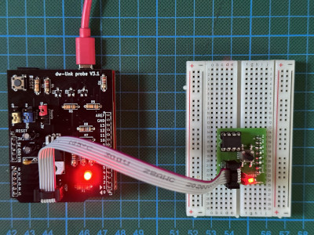

# Quick-start Guide for AVR-GDB Debugging

Turn your Arduino UNO into a hardware debugger that can be used for embedded debugging of classic AVR chips in 7 easy steps (+ 1 optional step). Takes less than one hour. 

This tutorial explains how to use the [GNU Debugger GDB](https://www.sourceware.org/gdb/). If you want to use [Arduino IDE 2](https://docs.arduino.cc/software/ide-v2/tutorials/getting-started-ide-v2/), consult the alternative quickstart guide for [Arduino IDE 2 debugging](quickstart-Arduino-IDE2).

## What you need

* Computer running Windows, macOS, or Linux (the *host*)
* Arduino UNO (will become the *hardware debugger*)
* USB cable 
* ATtiny85 (or any other classic ATtiny or ATmegaX8) as the *target*
* In order to connect the hardware debugger to the target, you need either:
  * the [dw-link probe shield](https://www.tindie.com/products/31798/) and an ISP cable, or
  * a breadboard together with
    * 11 Jumper wires (male-to-male)
    * 2 LEDs
    * 3 Resistors (10 kΩ, 220Ω, 220Ω)
    * 2 Capacitors (100 nF, 10 µF)


## Step 1: Install Arduino IDE

You probably already have installed the Arduino IDE. If not, download and install it from https://arduino.cc. It does not matter whether it is the IDE 1 or 2. However, it should be an IDE with version >= 1.8.13. 

**Check:** Start IDE and check the `About Arduino`  entry under the `Arduino` or `Help` menu for the version number.

## Step 2: Install new board definition files

Open the `Preference` dialog of the Arduino IDE and paste the following two URLs into the list of  `Additional boards manager URLs`:

	https://felias-fogg.github.io/ATTinyCore/package_drazzy.com_ATTinyCore_plus_Debug_index.json
```
https://felias-fogg.github.io/MiniCore/package_MCUdude_MiniCore_plus_Debug_index.json
```

Close the `Preference` dialog with `OK`. Now we want to install the two cores `ATTinyCore` and `MiniCore`. 

* Select `Tools` -> `Board` -> `Board Managers` ... . This will open the Boards Manager dialog. 
* In the search field, type MiniCore first. Then, install the most recent version (or upgrade to the most recent one) with a `+debug-2.X` suffix in its version number.
* Afterwards, do the same with `ATTinyCore`.

**Check:** Select `Tools` -> `Board` -> `ATtinyCore` -> `Attiny25/45/85 (no bootloader)` . Then check whether there is an entry `Debug Compile Flags: "No Debug"` when you click on `Tools` again. Check that also for `Tools` -> `Board` -> `MiniCore` -> `Atmega328`. 

## Step 3: Install *dw-link* firmware

Download the dw-link firmware into a place inside the *Arduino sketchbook*. This means, you should 

* open the webpage https://github.com/felias-fogg/dw-link, 
* click on `Latest` in the field **Releases**,
* choose either `zip` or `tar.gz`,
* copy the archive to a place in the Arduino sketchbook, 
* extract the firmware using `unzip` or `tar -xvzf`. 

In order to install the firmware, 

* first, make sure that the auto-reset feature of the UNO is not disabled, e.g., by a shield or a capacitor plugged into the UNO board,
* then connect the Arduino UNO to your computer with a USB cable,
* open the Arduino IDE and select `Arduino UNO` under `Tools` as the destination `board`, 
* select the correct `Port` in the `Tools` menu, 
* and load the dw-link sketch into the IDE, which is located at `dw-link-x.y.z/dw-link/dw-link.ino`. 
* Finally, compile and download the sketch to the UNO by either pressing the right arrow button or by typing CTRL-U or ⌘U. The UNO now acts as a hardware debugger (but needs a bit of additional hardware).

**Check:** Open the `Serial Monitor` (under the `Tools` menu), choose `115200 baud`,  type  `-`  (minus sign) into the upper line, and send it. The hardware debugger should respond with `$#00`. 

## Step 4: Install *avr-gdb* on the host computer

The installation of the board definition files will (most likely) lead to the download of the GDB debugger in the tools section of the respective package. You should be able to copy it to a place in your `PATH`, e.g., `/usr/local/bin`.

- **On a Mac:** `~/Library/Arduino15/packages/MiniCore/tools/dw-link-tools/XXX/avr-gdb`
- **Under Linux**: `~/.arduino15/packages/MiniCore/tools/dw-link-tools/XXX/avr-gdb`
- **Under Windows:**  `C:\Users\\{username}\AppData\Local\Arduino15\packages\MiniCore\tools\dw-link-tools\XXX\avr-gdb.exe`

If the file is not there, you can install it from other sources, as described below. 

##### On a Mac: 

If you have not done so, you must install the package manager Homebrew first. Go to https://brew.sh/ and follow the instructions. Installing Homebrew can take some considerable time. After that, you can install avr-gdb, the host debugger, by typing the following line into a shell:

```
brew tap osx-cross/avr && brew install avr-gdb
```

##### Under Linux:

You can install avr-gdb using the appropriate packet manager. For Debian/Ubuntu, that looks as follows (note that the package is indeed named gdb-avr):

```
sudo apt-get install gdb-avr 
```

##### Under Windows:

The easiest way to get hold of avr-gdb is probably to download the avr-gcc toolchain from Zak's blog: https://blog.zakkemble.net/avr-gcc-builds/. Then unzip and copy `/bin/avr-gdb` to some place, e.g., `C:\Progam Files\bin\` . Afterward, you should put this path into the Windows `PATH` variable. This means you type `System` into the search field on the control panel, click on `Advanced Settings`, click on `Environment Variables`, and then add `C:\Progam Files\bin` to the `PATH` environment variable.

**Check:** Open a terminal window and type `avr-gdb`. This should start the debugger, which you can quit by typing `quit`.

## Step 5: Hardware setup

This description is for debugging an ATtiny85. However, almost any other classic ATtiny or ATmegaX8 would do. Just be aware that when trying to debug an Arduino UNO board, you need to alter the board physically (cut a solder bridge). How to set up a UNO as a target board is described in Section 4.5.2 of the [dw-link manual](https://github.com/felias-fogg/dw-link/blob/master/docs/manual.pdf).

When you are the proud owner of a [dw-link probe](https://www.tindie.com/products/31798/), and you have a development board for the ATtiny that has an ISP connector, the setup is as easy as plugging in an ISP cable, as shown below.



If this is not the case, you need to set up the hardware on a breadboard and use six wires to connect the ATtiny to your UNO, turned into a hardware debugger. 

Note that the notch or dot on the ATtiny is oriented towards the left. 

Here is a table of all the connections so that you can check that you have made all the connections. 

| ATtiny pin#  | Arduino UNO pin | component                                                    |
| ------------ | --------------- | ------------------------------------------------------------ |
| 1 (Reset)    | D8              | 10k resistor to Vcc                                          |
| 2 (D3)       |                 |                                                              |
| 3 (D4)       |                 | 220 Ω resistor to target (red) LED (+)                       |
| 4 (GND)      | GND             | red and yellow LED (-), decoupling cap 100 nF, RESET blocking cap of 10µF (-) |
| 5 (D0, MOSI) | D11             |                                                              |
| 6 (D1, MISO) | D12             |                                                              |
| 7 (D2, SCK)  | D13             |                                                              |
| 8 (Vcc)      | D9              | 10k resistor, decoupling cap 100 nF                          |
| &nbsp;       | RESET           | RESET blocking cap of 10 µF (+)                              |
| &nbsp;       | D7              | 220 Ω to system (yellow) LED (+)                             |

The yellow LED is the *system LED*, and the red one is the *ATtiny-LED*. The system LED gives you information about the internal state of the debugger: 

1. not connected (LED is off),
2. waiting for power-cycling the target (LED flashes every second for 0.1 sec),3.
3. target is connected (LED is on),
4. ISP programming (LED is blinking slowly),
5. error state, i.e., not possible to connect to target or internal error (LED blinks furiously every 0.1 sec).

Note that state 2 (power-cycling) will be skipped in our configuration, where the debugger provides the power supply to the target via a GPIO line and does the power-cycling for you.

**Check:** Go through the table above and check every connection. Wrong wiring can often cause hours of useless software debugging!

## Step 6: Compiling the Arduino sketch for the target

* Load the sketch, you want to debug  (e.g., `dw-link-x.y.z/examples/varblink/varblink.ino`) into the IDE and select `ATtiny25/45/85 (no bootloader)` as the board. 
* As `Clock Source` choose `1 MHz (internal)` (assuming that the ATtiny is as it comes from the factory and no fuse has been changed). For the `Debug Compile Flags` option choose `Debug`. 
* When you now select `Sketch` -> `Export compiled Binary`, then the sketch will be compiled and an ELF file (a binary that contains debugging information) is placed into the folder, where the sketch is located. If you use the IDE 2, then the ELF file can be found in the folder `build/<board-type>/` inside the sketch folder. 

**Check:** Open terminal window and change into the sketch folder. The ELF file `<sketchname>.ino.elf` should either be there (Arduino IDE 1.X) or in a subdirectory of the `build` folder (Arduino IDE 2.X). 

## Step 7: Debugging

Now, we are ready to debug the sketch on the target chip. Check that the *host*, the computer you are sitting at, is connected to the *hardware debugger*, the UNO, with a USB cable. The hardware debugger should in turn be connected to the *target* chip, the ATtiny85, by 6 flying wires as we have prepared it in step 5.

Open a terminal window and change into the folder where the ELF file resides. Then type

```
avr-gdb -b 115200 <sketchname>.ino.elf
```

where *\<sketchname\>* is the name of the Arduino sketch. This should fire up the avr-gdb debugger. When you now type

```
target remote <serial-port>
```

where *\<serial-port\>* is the serial port of the UNO, then, after a few seconds, one should get a message similar to the following one

```
Remote debugging using <serial-port> 
0x00000000 in __vectors ()  
```

and the system LED lights up. If this is the case, we are in business! 

What else could happen?

* If the LED stays dark and you receive the message `/dev/XXXXXXXX: Resource busy`, then some other program is currently accessing the serial port. Perhaps there is still a monitor window open? Close that and try again.
* If the LED stays dark and you got the message `Ignoring packet error, continuing...` when trying to connect, then the hardware debugger could not be reached over the serial connection. Perhaps, wrong baud rate?

* If the LED is instead blinking quickly, then the hardware debugger could not connect to the target. Type `monitor dwire +`, which should give you the reason. Probably: Wrong wiring. So check the wiring or maybe try a different MCU.

Assuming that everything went according to plan, the only thing missing now is that the sketch is loaded into flash memory. But the next command will exactly do this:

```
load
```

After a while, the debugger will then tell you

```
Loading section .text, size 0x714 lma 0x0
Loading section .data, size 0x4 lma 0x714
Start address 0x00000000, load size 1816
Transfer rate: 618 bytes/sec, 113 bytes/write.
```

or something similar. Now, you really can get into it! Here is a short list of commands that are useful:

- **l** - list program text around current point and advances point
- **l *fn*** - list function *fn* 
- **b *fn*** - puts a breakpoint at the beginning of function *fn*
- **b *num*** - puts a breakpoint at line *num* in current file
- **i b** - list breakpoints
- **d *num*** - deletes breakpoint number *num*
- **c** - continues running the program until the next breakpoint or stop by `CTRL-C`
- **s** - runs the next line of the program
- **s *num*** - run the next *num* lines of the program
- **n** - like s, but it does not step into functions
- **monitor reset** - resets MCUs and sets program counter to 0
- **bt** - print the call stack
- **p *var*** - prints the current value of the variable *var*
- **set variable** ***var*=*expr*** - sets *var* to new value *expr*
- **q** - quits gdb
- `CTRL-C` while the programming is running stops the execution asynchronously

There are tons of GDB commands, too many to show here! On the [documentation page of GDB](https://sourceware.org/gdb/current/onlinedocs/), you find an extensive manual and a useful [PDF reference sheet](https://sourceware.org/gdb/current/onlinedocs/refcard.pdf). A list of `monitor` commands, which are specific to the dw-link debugger, can be found in Section 5.6 of the [dw-link manual](https://github.com/felias-fogg/dw-link/blob/master/docs/manual.pdf).

You should always end your debugging session with the `quit` command, which will turn off debugging mode on the target chip so that the RESET line could be used again.

## Step 8 (optional): Install a graphical user interface

If you would like to work with a GUI, then *[Gede](https://gede.dexar.se/)* is a possible choice. It is a simple and easy to install GUI for GDB, provided your host operating system is macOS or Linux. An alternative to Gede is the [PlatformIO](https://platformio.org/) IDE, as described in detail in the [dw-link manual](https://github.com/felias-fogg/dw-link/blob/master/docs/manual.pdf) in Section 6, which also works for Windows.

A prerequisite for using Gede is that we make sure that *PySerial* is installed. So type into a terminal:

```
pip3 install pyserial
```

Now you need to build Gede from [the Gede repository](https://github.com/jhn98032/gede). Just download the latest release and follow the **build instructions** in the README. After Gede has been installed under `/usr/local/bin`, you need to copy the Python script `dw-server.py` from the folder `dw-link-x.y.z/dw-server` to `/user/local/bin` (of course, using `sudo`).

**Check**: Open a terminal window and type `gede`. This should bring up a window, which you can kill. Typing `dw-server.py` should give you the output `--- No dw-link adapter discovered ---`, when no adapter is present, or `Waiting for connection on 2000`. Stop the script with `CTRL-C`.

In order to start a debugging session, you have to open a terminal window and change into the sketch directory. Now type the following command:

```
dw-server.py -g
```

The `dw-server.py` script will discover the serial port of the hardware debugger, if there is any, and start Gede, which will present the following window.


`Project dir` and `Program` are specific to your debugging session. The former is the directory Gede was started in, and the latter is the location of the ELF file. The rest should be copied as it is shown. With clicking on `OK`, you start a debugging session. Johan Henriksson, the author of Gede, has written [two short tutorials](https://gede.dexar.se/pmwiki.php?n=Site.Tutorials) on using the GUI. I won't add anything here.


## What can go wrong?

If something does not work as advertised, it is often a simple wiring problem. Other possible sources of errors are installation errors, i.e., that a program is not installed at the right place, does not have the proper permissions, the PATH variable is incorrect, or one has installed the wrong board manager files. When some strange error messages show up, it may also indicate that some components have not been installed. Google for the error message! Often, there are hints on how to mitigate the problem. Finally, there is also a troubleshooting section in the [dw-link manual](https://github.com/felias-fogg/dw-link/blob/master/docs/manual.pdf), which may be helpful. 

The most annoying problem can be that an MCU might not be responsive anymore after a debugging session. The reason is that the RESET line, which is used as a communication line during debugging, has not been reenabled. While a regular exit of the debugger restores the RESET line, the debugger may be terminated without restoring it. An easy cure is to enter the debugger again and leave it regularly (after connecting to the target chip) with the command `quit`.  If this does not help, you may have to use a High-Voltage programmer, such as [RescueAVR](https://www.tindie.com/products/fogg/rescueavr-hv-fuse-programmer-for-avrs/).

If you think you have found a bug, please post it on [issues](https://github.com/felias-fogg/dw-link/issues) and fill out the [issue form](issue_form.md) before.

## After debugging has finished

If you want to have a more durable debugging solution, then the [dw-link manual](https://github.com/felias-fogg/dw-link/blob/master/docs/manual.pdf) has some suggestions in Section 7, or you can buy the [dw-link probe](https://www.tindie.com/products/31798/) at Tindie.

So, after everything has been debugged, what do you do with your newly built hardware debugger? You don't have to throw it away. You can also use it as an ISP programmer (STK500 v1). In the Arduino IDE, such a programmer is called `AVR ISP` or `Arduino as ISP`.

