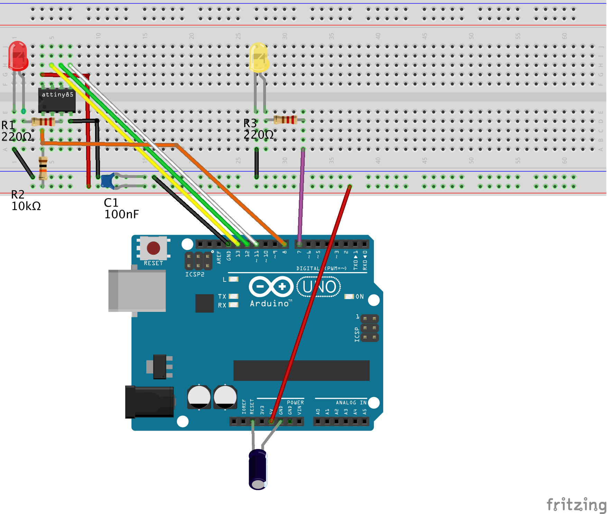

# Quick-start guide: AVR-GDB debugging

Turn your Arduino Uno into a hardware debugger that can be used for embedded debugging of classic AVR chips in 7 easy steps. This quickstart guide explains how to use the [GNU Debugger GDB](https://www.sourceware.org/gdb/). If you want to use the [Arduino IDE 2](https://docs.arduino.cc/software/ide-v2/tutorials/getting-started-ide-v2/), consult the alternative quickstart guide for [Arduino IDE 2 debugging](https://felias-fogg.github.io/dw-link/quickstart-Arduino-IDE2/).

If you already own a Microchip debugger, such as SNAP, PICkit4, Atmel-ICE, JTAGICE3, or one of the embedded debuggers EDBG, mEDBG, or nEDBG, you can use it directly to debug classic AVR chips in the Arduino IDE 2 employing [PyAvrOCD](https://github.com/felias-fogg/PyAvrOCD).

## What you need

* Computer running Windows, macOS, or Linux (the *host*)
* Arduino Uno (will become the *hardware debugger*)
* USB cable 
* ATtiny85 (or any other classic ATtiny or ATmegaX8) as the *target*
* In order to connect the hardware debugger to the target, you need:
    * a breadboard together with
    * 11 Jumper wires (male-to-male)
    * 2 LEDs
    * 3 Resistors (10 kΩ, 220Ω, 220Ω)
    * 2 Capacitors (100 nF, 10 µF)


## Step 1: Install Arduino IDE 2 or arduino-cli

You probably already have installed the Arduino IDE 2. If not, download and install it from https://arduino.cc. Alternatively, you can install arduino-cli.

**Check:** Start IDE and check the `About Arduino`  entry under the `Arduino` or `Help` menu for the version number.

## Step 2: Install new board manager files

Open the `Preferences` dialog of the Arduino IDE and paste the following `Board Manager URLs` into the list:

	https://felias-fogg.github.io/package_debugging_index.json
	https://mcudude.github.io/MiniCore/package_MCUdude_MiniCore_index.json
	https://mcudude.github.io/MicroCore/package_MCUdude_MicroCore_index.json

Close the `Preference` dialog with `OK`. Now, you can install the cores, `ATTinyCore (Debug enabled)` , `Arduino AVR boards (Debug enabled)`,  `MiniCore`, and `MicroCore`.

* Select `Tools` -> `Board` -> `Board Managers` ... . This will open the Boards Manager dialog. 
* In the search field, type `ATTinyCore(Debug enabled)` and install the most recent version.
* Afterward, do the same with `MiniCore` and `MicroCore`.

**Check:** Select `Tools` -> `Board` -> `ATtinyCore (Debug enabled)` -> `Attiny25/45/85 (no bootloader)` . The debug button in the upper row (3rd from the left) is no longer greyed out. 

## Step 3: Install *dw-link* firmware

Download the dw-link firmware into a place inside the *Arduino sketchbook*. This means, you should 

* open the webpage https://github.com/felias-fogg/dw-link, 
* click on `Latest` in the field **Releases**,
* choose either `zip` or `tar.gz`,
* copy the archive to a place in the Arduino sketchbook, 
* extract the firmware using `unzip` or `tar -xvzf`. 

In order to install the firmware, 

* first, make sure that the auto-reset feature of the Uno is not disabled, e.g., by a shield or a capacitor plugged into the Uno board,
* then connect the Arduino Uno to your computer with a USB cable,
* open the Arduino IDE and select `Arduino Uno` under `Tools` as the destination `board`, 
* select the correct `Port` in the `Tools` menu, 
* and load the dw-link sketch into the IDE, which is located at `dw-link-x.y.z/dw-link/dw-link.ino`. 
* Finally, compile and download the sketch to the Uno by either pressing the right arrow button or by typing CTRL-U or ⌘U. The Uno now acts as a hardware debugger (but needs a bit of additional hardware).

**Check:** Open the `Serial Monitor` (under the `Tools` menu), choose `115200 baud`,  type  `-`  (minus sign) into the upper line, and send it. The hardware debugger should respond with `$#00`. 

## Step 4: Install *avr-gdb* on the host computer

The installation of the board definition files will lead to the download of a recent version of the GDB debug client in the tools section of the respective package. You should be able to copy it to a place in your `PATH`, e.g., `/usr/local/bin`.

- **On a Mac:** `~/Library/Arduino15/packages/MiniCore/tools/avrocd-tools/XXX/avr-gdb`
- **Under Linux**: `~/.arduino15/packages/MiniCore/tools/avrocd-tools/XXX/avr-gdb`
- **Under Windows:**  `C:\Users\\{username}\AppData\Local\Arduino15\packages\MiniCore\tools\avrocd-tools\XXX\avr-gdb.exe`

If the file is not there, you can install it from other sources, as described below. 

##### On a Mac: 

If you have not done so, you must install the package manager Homebrew first. Go to https://brew.sh/ and follow the instructions. Installing Homebrew can take some considerable time. After that, you can install avr-gdb, the host debug client, by typing the following line into a shell:

```
brew tap osx-cross/avr && brew install avr-gdb
```

##### Under Linux:

You can install avr-gdb using the appropriate packet manager. For Debian/Ubuntu, that looks as follows (note that the package is indeed named gdb-avr):

```
sudo apt-get install gdb-avr 
```

##### Under Windows:

The easiest way to get hold of avr-gdb is probably to download the avr-gcc toolchain from Zak's blog: https://blog.zakkemble.net/avr-gcc-builds/. Then unzip and copy `/bin/avr-gdb` to some place, e.g., `C:\Progam Files\bin\` . Afterward, you should put this path into the Windows `PATH` variable. This means you type `System` into the search field on the control panel, click on `Advanced Settings`, click on `Environment Variables`, and then add `C:\Progam Files\bin` to the `PATH` environment variable.

**Check:** Open a terminal window and type `avr-gdb`. This should start the debugger, which you can quit by typing `quit`.

## Step 5: Hardware setup

This description is for debugging an ATtiny85. However, almost any other classic ATtiny or ATmegaX8 would do. Just be aware that when trying to debug an Arduino Uno board, you need to alter the board physically (cut a solder bridge). How to set up an Uno as a target board is described in the [dw-link manual](https://felias-fogg.github.io/dw-link/installation/#debugging-an-uno).

You need to set up the hardware on a breadboard and use six wires to connect the ATtiny to your Uno, turned into a hardware debugger. Note that the notch or dot on the ATtiny is oriented towards the left. 



Note that the notch or dot on the ATtiny is oriented towards the left. 

Here is a table of all the connections so that you can check that you have made all the connections. 

| ATtiny pin#  | Arduino Uno pin | component                                                    |
| ------------ | --------------- | ------------------------------------------------------------ |
| 1 (Reset)    | D8              | 10k resistor to Vcc                                          |
| 2 (D3)       |                 |                                                              |
| 3 (D4)       |                 | 220 Ω resistor to target (red) LED (+)                       |
| 4 (GND)      | GND             | red and yellow LED (-), decoupling cap 100 nF, RESET blocking cap of 10µF (-) |
| 5 (D0, MOSI) | D11             |                                                              |
| 6 (D1, MISO) | D12             |                                                              |
| 7 (D2, SCK)  | D13             |                                                              |
| 8 (Vcc)      | 5V              | 10k resistor, decoupling cap 100 nF                          |
| &nbsp;       | RESET           | RESET blocking cap of 10 µF (+)                              |
| &nbsp;       | D7              | 220 Ω to system (yellow) LED (+)                             |

The yellow LED is the *system LED*, and the red one is the *ATtiny-LED*. The system LED gives you information about the internal state of the debugger: 

1. debugWIRE mode disabled (LED is off),
2. waiting for power-cycling the target (LED flashes every second for 0.1 sec),3.
3. debugWIRE mode enabled (LED is on),
4. ISP programming (LED is blinking slowly),
5. error state, i.e., not possible to connect to target or internal error (LED blinks furiously every 0.1 sec).

**Check:** Go through the table above and check every connection. Wrong wiring can often cause hours of useless software debugging!

## Step 6: Compiling the Arduino sketch for the target

Either you use the arduino-cli to compile your sketch (and then I assume you know what you are doing), or you use the IDE:

* Load the sketch, you want to debug  (e.g., `dw-link-x.y.z/examples/varblink/varblink.ino`) into the IDE and select `ATtiny25/45/85 (no bootloader)` as the board. 
* As `Clock Source` choose `1 MHz (internal)` (assuming that the ATtiny is as it comes from the factory and no fuse has been changed). In the `Sketch` menu, you should now activate `Optimize for Debugging.
* When you now select `Sketch` -> `Export compiled Binary`, then the sketch will be compiled and an ELF file (a binary that contains debugging information) is placed into the folder `build/<board-type>/` inside the sketch folder.

You can also use arduino-cli to compile the sketch. Make sure to set the compiler option `-Og`, which makes sure that the compiler optimized for debugging (instead of for space).

**Check:** Open terminal window and change into the sketch folder. The ELF file `<sketchname>.ino.elf` should either be in the the sketch folder or in a subdirectory of the `build` folder.

## Step 7: Debugging

Now, we are ready to debug the sketch on the target chip. Check that the *host*, the computer you are sitting at, is connected to the *hardware debugger*, the Uno, with a USB cable. The hardware debugger should in turn be connected to the *target* chip, the ATtiny85, by 6 flying wires as we have prepared it in step 5.

Open a terminal window and change into the folder where the ELF file resides. Then type

```
avr-gdb -b 115200 <sketchname>.ino.elf
```

where *\<sketchname\>* is the name of the Arduino sketch. This should fire up the avr-gdb debugger, which will prompt you with `(gdb)`. When you now type 

```
(gdb) target remote <serial-port>
```

where *\<serial-port\>* is the serial port of the Uno, then, after a few seconds, one should get a message similar to the following one

```
Remote debugging using <serial-port> 
0x00000000 in __vectors ()  
```

You are connected to the hardware debugger. Now you need to enable the [debugWIRE](https://debugwire.de) mode:

```
(gdb) monitor debugWIRE enable
```

This will bring up the message

```
*** Please power-cycle target ***
```

asking you to switch power to the target off and the on again in order to acxtivate debugWIRE mode. If in repsonse to it, the following message appears

```
Connected to ATmega328P
debugWIRE is enabled, bps: 125244
```

and the system LED lights up, then you are in business!

What else could happen?

* If the LED stays dark and you receive the message `/dev/XXXXXXXX: Resource busy`, then some other program is currently accessing the serial port. Perhaps there is still a monitor window open? Close that and try again.
* If the LED stays dark and you got the message `Ignoring packet error, continuing...` when trying to connect, then the hardware debugger could not be reached over the serial connection. Perhaps, wrong baud rate?

* If the LED is instead blinking quickly, then the hardware debugger could not connect to the target. Type `monitor info`, which should give you the reason. Probably: Wrong wiring. So check the wiring or maybe try a different MCU.

Assuming that everything went according to plan, the only thing missing now is that the sketch is loaded into flash memory. But the next command will exactly do this:

```
load
```

After a while, the debugger will then tell you

```
Loading section .text, size 0x714 lma 0x0
Loading section .data, size 0x4 lma 0x714
Start address 0x00000000, load size 1816
Transfer rate: 618 bytes/sec, 113 bytes/write.
```

or something similar. Now, you really can get into it! Here is a short list of commands that are useful:

- **l** - list program text around current point and advances point
- **l *fn*** - list function *fn* 
- **b *fn*** - puts a breakpoint at the beginning of function *fn*
- **b *num*** - puts a breakpoint at line *num* in current file
- **i b** - list breakpoints
- **d *num*** - deletes breakpoint number *num*
- **c** - continues running the program until the next breakpoint or stop by `CTRL-C`
- **s** - runs the next line of the program
- **s *num*** - run the next *num* lines of the program
- **n** - like s, but it does not step into functions
- **monitor reset** - resets MCUs and sets program counter to 0
- **bt** - print the call stack
- **p *var*** - prints the current value of the variable *var*
- **set variable** ***var*=*expr*** - sets *var* to new value *expr*
- **q** - quits gdb
- `CTRL-C` while the programming is running stops the execution asynchronously

There are tons of GDB commands, too many to show here! On the [documentation page of GDB](https://sourceware.org/gdb/current/onlinedocs/), you find an extensive manual and a useful [PDF reference sheet](https://sourceware.org/gdb/current/onlinedocs/refcard.pdf). A list of [`monitor` commands](https://felias-fogg.github.io/dw-link/debugging/#monitor-commands), which are specific to the dw-link debugger, can be found in the dw-link manual.

## After debugging

When you are done with debugging, you probably want to disable the debugWIRE mode again, because in debugWIRE mode you cannot use the RESET line or ISP programming. This can be accomplised by using the command `monitor debugwire disable` before you leave the debugger. 

After debugging, you can still can use dw-link as a programmer (of type `Arduino as ISP`). It is not the fastest one, but if you do not have anything better, it will do its job.

If you want a more durable hardware debugging solution, there are some [suggestions](better.md) in the dw-link manual. These days, however, the Microchip debugger MPLAP SNAP might be a better deal. You can use it as a drop-in replacement for dw-link, it costs less than US-$ 15 and it is able to do much more! 


## What can go wrong?

If something does not work as advertised, it is often a simple wiring problem. Other possible sources of errors are installation errors, i.e., that a program is not installed at the right place, does not have the proper permissions, the PATH variable is incorrect, or one has installed the wrong board manager files. When some strange error messages show up, it may also indicate that some components have not been installed. Google for the error message! Often, there are hints on how to mitigate the problem. Finally, there is also a [troubleshooting section](https://felias-fogg.github.io/dw-link/troubleshooting/) in the dw-link manual, which may be helpful.

The most annoying problem can be that an MCU might not be responsive anymore after a debugging session. The reason is that the RESET line, which is used as a communication line during debugging, has not been re-enabled. While a regular exit of the debugger restores the RESET line, the debugger may be terminated without restoring it. An easy cure is to enter the debugger again and leave it regularly (after connecting to the target chip) with the command `quit`.  If this does not help, you may have to use a High-Voltage programmer, such as [RescueAVR](https://www.tindie.com/products/fogg/rescueavr-hv-fuse-programmer-for-avrs/).

If you think you have found a bug, please post it on [issues](https://github.com/felias-fogg/dw-link/issues).

