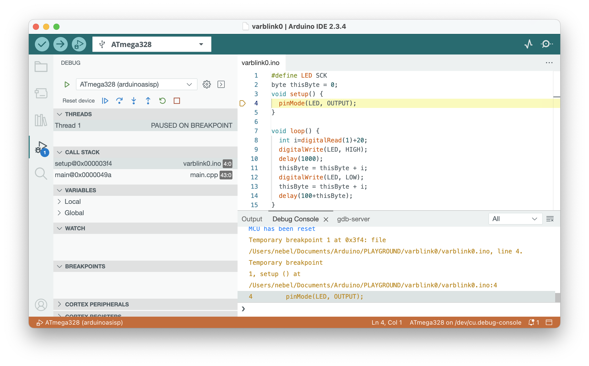

# Quick-start guide: Debugging with the Arduino IDE 2

You can turn your Arduino Uno into a hardware debugger that can be used for embedded debugging of classic AVR chips under [Arduino IDE 2](https://docs.arduino.cc/software/ide-v2/tutorials/getting-started-ide-v2/). If you want to debug your classic AVR chips without using Arduino IDE 2, consult the alternative quickstart guide for [AVR-GDB debugging](https://felias-fogg.github.io/dw-link/quickstart-AVR-GDB/).

If you already own a Microchip debugger, such as SNAP, PICkit4, Atmel-ICE, JTAGICE3, or one of the embedded debuggers EDBG, mEDBG, or nEDBG, you can use it directly to debug classic AVR chips in the Arduino IDE 2 employing [PyAvrOCD](https://github.com/felias-fogg/PyAvrOCD).

## What you need

* Computer running Windows, macOS, or Linux (the *host*)
* Arduino Uno (will become the *hardware debugger*)
* USB cable 
* ATtiny85 (or any other classic ATtiny or ATmegaX8) as the *target*
* In order to connect the hardware debugger to the target, you need:
    * a breadboard together with
    * 11 Jumper wires (male-to-male)
    * 2 LEDs
    * 3 Resistors (10 kΩ, 220Ω, 220Ω)
    * 2 Capacitors (100 nF, 10 µF)

## Step 1: Install Arduino IDE 2

You probably already have the Arduino IDE 2 installed. If not, download and install it from https://arduino.cc. 

**Check:** Start IDE and check the `About Arduino` entry under the `Arduino` or `Help` menu for the version number. It should be >= 2.3.0.

## Step 2: Install new board manager files

Open the `Preferences` dialog of the Arduino IDE and paste the following `Board Manager URLs` into the list:

	https://felias-fogg.github.io/package_debugging_index.json
	https://mcudude.github.io/MiniCore/package_MCUdude_MiniCore_index.json
	https://mcudude.github.io/MicroCore/package_MCUdude_MicroCore_index.json
Close the `Preference` dialog with `OK`. Now, you can install the cores, `ATTinyCore (Debug enabled)` , `Arduino AVR boards (Debug enabled)`, `MiniCore`, and `MicroCore`. 

* Select `Tools` -> `Board` -> `Board Managers` ... . This will open the Boards Manager dialog. 
* In the search field, type `ATTinyCore (Debug enabled)` and install the most recent version.

**Check:** Select `Tools` -> `Board` -> `ATtinyCore Debug enabled)` -> `Attiny25/45/85 (no bootloader)` . The debug button in the upper row (3rd from the left) is no longer greyed out. 

## Step 3: Install *dw-link* firmware on an Uno

Download the dw-link firmware. This means you should 

* open the webpage https://github.com/felias-fogg/dw-link, 
* click on `Latest` in the field **Releases** (on the left),
* choose either `zip` or `tar.gz`,
* download it to  your hard disk, 
* extract the firmware from the downloaded archive using `unzip` or `tar -xvzf`. 

In order to install the firmware, 

* first make sure that the auto-reset feature of the Uno is not disabled, e.g., by a shield or a capacitor plugged into the Uno board,
* then connect the Arduino Uno to your computer with a USB cable,
* open the Arduino IDE and select `Arduino Uno` under `Tools` as the destination `board`, 
* select the right `Port` in the `Tools` menu, 
* and load the dw-link sketch into the IDE, which is located at `dw-link-x.y.z/dw-link/dw-link.ino`. 
* Finally, compile and download the sketch to the Uno by either pressing the right arrow button, or by typing `CTRL-U` or `⌘U`. The Uno acts now as a hardware debugger (but needs a bit of additional hardware).

**Check:** Open the `Serial Monitor` (under `Tools` menu), choose `115200 baud`,  type  `-`  (minus sign) into the upper line, and send it. The hardware debugger should respond with `$#00`. 

## Step 4: Hardware setup

This description is for debugging an ATtiny85. However, almost any other classic ATtiny or ATmegaX8 would do. Just be aware that when trying to debug an Arduino Uno board, you need to alter the board physically (cut a solder bridge). How to set up an Uno as a target board is described in the [Hardware setup section](setup.md#debugging-an-uno).

You need to set up the hardware on a breadboard and use six wires to connect the ATtiny to your Uno, turned into a hardware debugger. Note that the notch or dot on the ATtiny is oriented towards the left. 

Here is a table of all connections to check that you have made all the connections. 

| ATtiny pin#  | Arduino Uno pin | component                                                    |
| ------------ | --------------- | ------------------------------------------------------------ |
| 1 (Reset)    | D8              | 10k resistor to Vcc                                          |
| 2 (D3)       |                 |                                                              |
| 3 (D4)       |                 | 220 Ω resistor to target (red) LED (+)                       |
| 4 (GND)      | GND             | red and yellow LED (-), decoupling cap 100 nF, RESET blocking cap of 10µF (-) |
| 5 (D0, MOSI) | D11             |                                                              |
| 6 (D1, MISO) | D12             |                                                              |
| 7 (D2, SCK)  | D13             |                                                              |
| 8 (Vcc)      | 5V              | 10k resistor, decoupling cap 100 nF                          |
| &nbsp;       | RESET           | RESET blocking cap of 10 µF (+)                              |
| &nbsp;       | D7              | 220 Ω to system (yellow) LED (+)                             |

The yellow LED is the *system LED*, and the red one is the *ATtiny-LED*. The system LED gives you information about the internal state of the debugger: 

1. debugWIRE mode disabled (LED is off),
2. waiting for power-cycling the target (LED flashes every second for 0.1 sec)
3. debugWIRE mode enabled (LED is on),
4. ISP programming (LED is blinking slowly),
5. error state, i.e., not possible to connect to target or internal error (LED blinks furiously every 0.1 sec).

**Check:** Go through the table above and check every connection. Wrong wiring can often cause hours of useless software debugging!

## Step 5: Start Debugging

- Load the sketch you want to debug  (e.g., `dw-link-x.y.z/examples/varblink/varblink.ino`) into the IDE by choosing `Open...` in the `File` menu. 
- Select `ATtiny25/45/85 (no bootloader)` as the board under `Tools` -> `Board` -> `ATTinyCore`.
- In the `Tools` menu,  choose `1 MHz (internal)` as the `Clock Source`  (assuming that the ATtiny is as it comes from the factory and no fuse has been changed).
- In the `Sketch` menu, select `Optimize for Debugging`.
- Compile the code by clicking the `Verify` button in the upper left corner.  
- Open the debug panes by clicking the debug symbol (bug with triangle) in the left sidebar. 
- Click the debug symbol in the top row to start debugging. This will start the debugger and the debug server. The activities are logged in the `Debug Console` and the `gdb-server` console in the bottom right part of the window. 
- You will probably be asked to "power-cycle the target." This means that you need to remove power from the target and then reconnect it, activating the debugWIRE mode.
- After the debugger and gdb-server have been started, the debugger will start executing the program on the target. Execution will stop at the first line of the `setup` function.
- Now, you are in business and can set breakpoints (clicking left of the line number), continue executing, stop the program asynchronously, inspect and change values, and examine different stack frames. To terminate your debugging session, click the red box in the debug row before terminating the debugging session.

Be aware that after finishing the debug session, the MCU is still in debugWIRE mode! You can change that by typing `monitor debugwire disable` in the last line of the `Debug Console`. More information can be found in the [dw-link manual](https://felias-fogg.github.io/dw-link/debugging/).

## After debugging has finished

When you are done with debugging, you probably want to disable the debugWIRE mode again, because in debugWIRE mode you cannot use the RESET line or ISP programming. This can be accomplised by using the command `monitor debugwire disable` before you leave the debugger. 

So, after everything has been debugged, what do you do with your newly built hardware debugger? You don't have to throw it away. You can also use it as an ISP programmer (STK500 v1). In the Arduino IDE, such a programmer is called `Arduino as ISP` or `Arduino as ISP fast`. In the latter case, the upload speed is 115200 instead of 19200.

If you want a more durable hardware debugging solution, there are some [suggestions](https://felias-fogg.github.io/dw-link/better/) in the dw-link manual. These days, however, the Microchip debugger MPLAP SNAP might be a better deal. You can use it as a drop-in replacement for dw-link, it costs less than US-$ 15 and it is able to do much more! 

## What can go wrong?

First, you might be unable to start debugging because the debug button is greyed out. This happens for all MCUs that the IDE cannot debug. If you think that this is an error, you might need to install the correct board definition files or choose the `Reload Board Data` entry in the `Tools` menu.

Second, the debug-server might terminate early. In this case, you should see an error message in the `gdb-server` console. 

If something does not work as advertised, it is often a simple wiring problem. Other possible sources of errors are installation errors, i.e., that a program is not installed at the right place, does not have the proper permissions, the PATH variable is incorrect, or one has installed the wrong board manager files. When strange error messages appear, it may also indicate that some components have not been installed. Google for the error message! Often, there are hints on how to mitigate the problem. Finally, there is also a [troubleshooting section](https://felias-fogg.github.io/dw-link/troubleshooting/) in the dw-link manual, which may be helpful. 

The most annoying problem is that an MCU might not be responsive after a debugging session. The reason is that the RESET line, which is used as a communication line during debugging, has not been re-enabled. The command `monitor debugwire disable` typed into the lasr line of the `Debug Console` just before terminating the debugger should restore the RESET line functionality. If this does not help, you may have to use a High-Voltage programmer, such as [RescueAVR](https://www.tindie.com/products/fogg/rescueavr-hv-fuse-programmer-for-avrs/).

If you have found a bug, please post it on [issues](https://github.com/felias-fogg/dw-link/issues).

