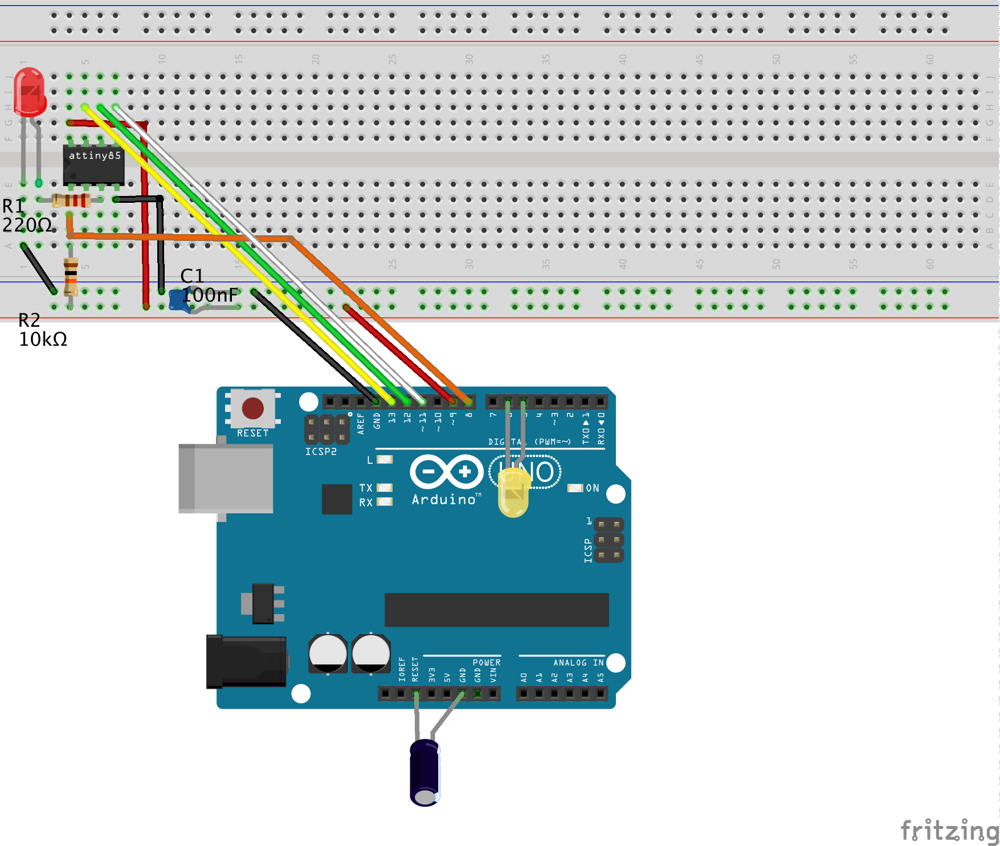

# Quick-start guide

Setting up an embedded debugging environment for classic AVR chips in 7 easy (+ 1 optional) steps. 

## What you need

* Computer running Windows, macOS, or Linux (the *host*)
* Arduino UNO (will become the *hardware debugger*)
* ATTiny85 (or any other classic ATTiny or ATmega8X as the *target*)
* Breadboard
* 9 Jumper wires (male-to-male)
* 2 LEDs (3 or 5 mm)
* 2 Resistors (10 kΩ, 330Ω)
* 2 Capacitors (100 nF, 10 µF)
* USB cable


## Step 1: Install Arduino IDE or CLI

You probably already have installed the Arduino IDE. If not, download and install it from https://arduino.cc. It does not matter whether it is the IDE 1 or 2. Even the CLI will work. However, it should be an IDE with  version >= 1.8.13. 

## Step 2: Install new board definition files

Open the `Preference` dialog of the Arduino IDE and paste the following two `Board Manager URLs` into the list:

	https://felias-fogg.github.io/ATTinyCore/package_drazzy.com_ATTinyCore_index.json
```
https://felias-fogg.github.io/MiniCore/package_MCUdude_MiniCore_index.json
```

Close the `Preference` dialog with `OK`. Now we want to install the two cores `ATTinyCore` and `MiniCore`. Select `Tools` -> `Board` -> `Board Mangers` ... . This will open the Boards Manager dialog. In the search field, type first `MiniCore` and install the most recent version. Afterwards, do the same with `ATTinyCore`.

## Step 3: Install *dw-link* firmware

Download the dw-link repository into a place inside the *Arduino sketchbook* (shown in `Preference` dialog). This means, you should should open the webpage https://github.com/felias-fogg/dw-link, click on the green`Code` button,  and select `Download ZIP`. Select then either a folder in the sketchbook as the destination or copy the ZIP file after the download to the place. Finally unzip the ZIP-archive in place.

In order to install the firmware, first connect the Arduino UNO to your computer with a USB cable. Now open the Arduino IDE and select `Arduino UNO` under `Tools` as the destination `board`. Perhaps, you have to select the right `Port` in the `Tools` menu as well. Now load the *dw-link* sketch into the IDE, which is located at `dw-link-master/dw-link/dw.link.ino`. Finally, compile and download the sketch by either pressing the right arrow button, or by typing `CTRL-U` or `⌘U`. The UNO acts now a hardware debugger (but needs a bit of additional hardware).

## Step 4: Install *avr-gdb* debugger on host computer

##### On a Mac: 

You need to install the package system *Homebrew* first, if you have not done that yet. Go to https://brew.sh/ and follow the instructions. Then you can install avr-gdb, the host debugger, as follows:

```
brew install avr-gdb
```

##### Under Linux:

You can install avr-gdb with the appropriate packet manager. For Debian/Ubuntu that looks as follows:

```
sudo apt-get install gdb-avr 
```

##### Under Windows:

The easiest way to get hold of avr-gdb is probably to download the avr-gcc toolchain from Zak's blog: https://blog.zakkemble.net/avr-gcc-builds/. Then unzip and copy `/bin/avr-gcc` to some place, e.g. `C:\Progam Files\bin\` . Afterwards, you should put this path into the Windows `PATH` variable. This means you type `System` into the search field on the control panel, click on `Advanced Settings`, click on `Environment Variables`, and then change the value of the `PATH` environment.

##### All OS:

Finally check, whether the installation was successful. Open a terminal window and type in `avr-gdb`. This should start up the debugger.

## Step 5: Hardware setup

The description is for debugging an ATtiny85. However, almost any other classic ATtiny or ATmegaX8 would do. Just be aware that when trying to debug an Arduino UNO board, you need to physically alter the board (cut a solder bridge). 

Note that the notch or dot on the ATtiny is oriented towards the left. 

Here is a table of all the connections so that you can check that you have made all the connections. 

| ATtiny pin#  | Arduino UNO pin | component                                                    |
| ------------ | --------------- | ------------------------------------------------------------ |
| 1 (Reset)    | D8              | 10k resistor to Vcc                                          |
| 2 (D3)       |                 |                                                              |
| 3 (D4)       |                 | 220 Ω resistor to LED (+)                                    |
| 4 (GND)      | GND             | LED (-), decoupling cap 100 nF, RESET blocking cap of 10µF (-), |
| 5 (D0, MOSI) | D11             |                                                              |
| 6 (D1, MISO) | D12             |                                                              |
| 7 (D2, SCK)  | D13             |                                                              |
| 8 (Vcc)      | D9              | 10k resistor, decoupling cap 100 nF                          |
| &nbsp;       | RESET           | RESET blocking cap of 10 µF (+)                              |
| &nbsp;       | D7              | (alternative bright system LED (+))                          |
| &nbsp;       | D6              | dim system LED (alternative 200 Ω to bright system LED (-))  |
| &nbsp;       | D5              | dim system LED (+)                                           |

The yellow system LED is directly connected to the Arduino pins. The internal pull-up resistor is used as a limiting resistor, which leads to a LED that is very dim. If you have a soldering iron, you can solder a series resistor to the system LED and then use pins 6 and 7.

The system LED gives you information about the internal state of the debugger: 

* not connected (LED is off)
* waiting for power-cycling the target (LED flashes every second for 0.1 sec)
* target is connected (LED is on) 
* error state, i.e., not possible to connect to target or internal error (LED blinks furiously every 0.1 sec)

## Step 6: Compiling the Arduino sketch

Load the sketch, you want to debug  (e.g., `dw-link-master/examples/varblink/varblink.ino`) into the IDE and the select `ATtiny85 (no bootloader)` as the board. As `Clock Source` choose `1 MHz (internal)` (assuming that no fuse has been changed). For the `Debug Compile Flags` option choose `Debug`. When you now select `Sketch` -> `Export compiled Binary`, then the sketch will be compiled and an ELF file (a binary that contains debugging information) is placed into the folder, where the sketch is located. If you use the IDE 2 or CLI, then the ELF file can be found in the folder `build/board-type/` inside the sketch folder. 

## Step 7: Start Debugging

Now, we are ready to debug the sketch that is executing on the target chip. Check that the `host`, the computer you are setting at, is connected to the hardware debugger, the UNO, with a USB cable. The hardware debugger is in turn connected to the target chip, the ATtiny85.

Open a terminal window and change into the sketch folder. Then type

```
avr-gdb -b 115200 <sketchname>.ino.elf
```

where *\<sketchname\>* is the name of the Arduino sketch. This should fire up the avr-gdb debugger. When you now type

```
target remote <serial-port>
```

where *\<serial-port\>* is the serial port of the UNO, then the system LED should light up and one should get a message similar to the following one:

```
Remote debugging using <serial-port> 
0x00000000 in __vectors ()  
```

If this is the case, we are in business! The only thing missing is now that the sketch has not been uploaded to the chip. But the next command will exactly do this:

```
load
```

After a while, the debugger will then tell you

```
Loading section .text, size 0x714 lma 0x0
Loading section .data, size 0x4 lma 0x714
Start address 0x00000000, load size 1816
Transfer rate: 618 bytes/sec, 113 bytes/write.
```

or something similar. Now, you really can get into it! Here is a short list of commands that are useful:

- **l** - list program text around current point and advances point
- **l *fn*** - list function *fn* 
- **b *fn*** - puts a breakpoint at the beginning of function *fn*
- **b *num*** - puts a breakpoint at line *num* in current file
- **i b** - list breakpoints
- **d *num*** - deletes breakpoint number *num*
- **c** - continues running the program until the next breakpoint or stop by CTRL-C
- **f** - runs until the current function is finished
- **s** - runs the next line of the program
- **s *num*** - Runs the next *num* lines of the program
- **n** - like s, but it does not step into functions
- **monitor reset** - resets MCUs and sets program counter to 0
- **bt** - print the call stack
- **p *var*** - prints the current value of the variable *var*
- **q** - Quits gdb

There are tons of commands, too many to show here! On the [home page of the GDB system](https://sourceware.org/gdb/current/onlinedocs/), you find an extensive manual an a useful [PDF reference sheet](https://sourceware.org/gdb/current/onlinedocs/gdb.pdf).

## Step 8 (optional): Install a graphical user interface

If you would like to work with a GUI, then you can install *Gede*, a simple and easy to install GUI for GDB, provided your host OS is  macOS or Linux. Alternatively, you can install PlatformIO, as described in detail in the [dw-link manual in Section 6](manual.md#section6), which also works for Windows.

You can either download and build Gede from [my forked Gede repository](https://github.com/felias-fogg/gede), or use the ready-made binaries in `dw-link-master/gui/<OS>/`. You need to copy the binary as well as the Python script `dw-server.py` in the `gui` folder to `/user/local/bin`. 

In order to start a debugging session, you have as above to open a terminal window and to change into the sketch directory. Now type the following command:

```
dw-server.py -s gede
```

The script will discover the serial port of the hardware debugger, if there is any, and start *gede*, which will present the following window.


`Project dir` and `Program` are specific to your debugging session. The rest should be copied as it is shown. And with clicking on `OK`, you start a debugging session. Johan Henriksson, the author of the GUI, has written up two [short tutorials](https://gede.dexar.se/pmwiki.php?n=Site.Tutorials) about using the GUI. I won't add anything here.

There is now an additional command that re-downloads the binary to the target. This means that after a small change to the program, you do not have to fire the thing up again, but you simply reload the modified ELF file. 

## What can go wrong?

If something does not work as advertised, it is very often a simple wiring problem. The next possible sources of errors are installation errors, i.e., that a program is not installed at the right place, does not have the right permissions, the PATH variable is not right, or one has installed the wrong board manager files. There is also a [troubleshooting section](manual.md#trouble) in the regular manual, which may be helpful. 

The most annoying problem is that it can happen that after a debugging session,an MCU is not responsive anymore. The reason can be that the RESET line, which during debugging is used as a communication line, has not been reenabled. While a regular exit of the debugger restores the RESET line, it can happen that the debugger is terminated without restoring the RESET line. An easy cure is to enter the debugger again and leave it regularly (after connecting to the target chip) with the command `quit`. 

If you think that you have found a bug, please consider posting it on [issues](https://github.com/felias-fogg/dw-link/issues) and consider filling out the [issue form](issue_form.md) before.