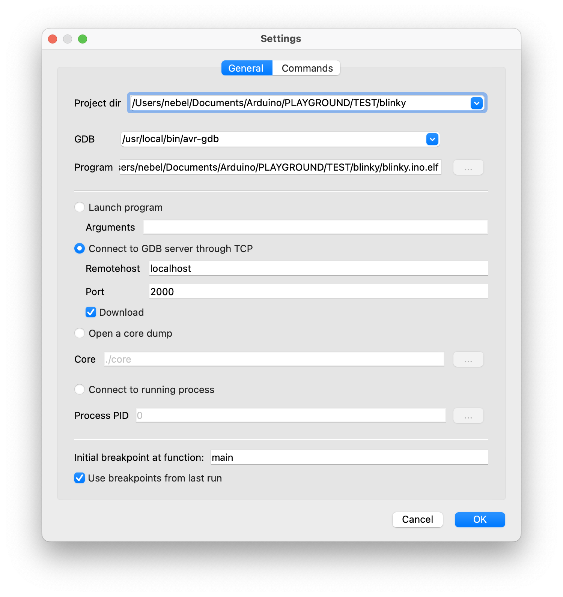

# dw-link

# Quickstart Guide

Setting up an embedded debugging environment for classic AVR chips in 7 easy (+ 1 optional) steps. 

## What you need

* Computer running Windows, macOS, or Linux (the *host*)
* Arduino UNO (will become the *hardware debugger*)
* ATTiny85 (or any other classic ATTiny or ATmega8X as the *target*)
* Breadboard
* 9 Jumper wires (male-to-male)
* 2 LEDs
* 3 Resistors (10 kΩ, 220Ω, 220Ω)
* 2 Capacitors (100 nF, 10 µF)
* USB cable 


## Step 1: Install Arduino IDE or CLI

You probably already have installed the Arduino IDE. If not, download and install it from https://arduino.cc. It does not matter whether it is the IDE 1 or 2. However, it should be an IDE with  version >= 1.8.13. 

**Check:** Start IDE and check the `About Arduino`  entry under the `Arduino` or `Help` menu for the version number.

## Step 2: Install new board definition files

Open the `Preference` dialog of the Arduino IDE and paste the following two `Board Manager URLs` into the list:

	https://felias-fogg.github.io/ATTinyCore/package_drazzy.com_ATTinyCore_index.json
```
https://felias-fogg.github.io/MiniCore/package_MCUdude_MiniCore_index.json
```

Close the `Preference` dialog with `OK`. Now we want to install the two cores `ATTinyCore` and `MiniCore`. 

* Select `Tools` -> `Board` -> `Board Managers` ... . This will open the Boards Manager dialog. 
* In the search field, type first `MiniCore` and install the most recent version (or upgrade to the most recent one). 
* Afterwards, do the same with `ATTinyCore`.

**Check:** Select `Tools` -> `Board` -> `ATtinyCore` -> `Attiny25/45/85 (no bootloader)` . Then check whether there is an entry `Debug Compile Falgs: "No Debug"` when you click on `Tools` again. Check that also for `Tools` -> `Board` -> `MiniCore` -> `Atmega328`. 

## Step 3: Install *dw-link* firmware

Download the dw-link repository into a place inside the *Arduino sketchbook* (shown in `Preference` dialog). This means, you should 

* open the webpage https://github.com/felias-fogg/dw-link, 
* click on the green`Code` button,  and select `Download ZIP`. 
* Select then either a folder in the sketchbook as the destination or copy the ZIP file after the download to the place. 
* Finally unzip the ZIP-archive in place.

In order to install the firmware, 

* first connect the Arduino UNO to your computer with a USB cable. 
* Now open the Arduino IDE and select `Arduino UNO` under `Tools` as the destination `board`. 
* Perhaps, you have to select the right `Port` in the `Tools` menu as well. 
* Now load the *dw-link* sketch into the IDE, which is located at `dw-link-master/dw-link/dw.link.ino`. 
* Finally, compile and download the sketch by either pressing the right arrow button, or by typing `CTRL-U` or `⌘U`. The UNO acts now a hardware debugger (but needs a bit of additional hardware).

**Check:** Open the `Serial Monitor` (under `Tools` menu), choose `115200 baud`,  type  `-`  (minus sign) into the upper line, and send it. The hardware debugger should respond with `$#00`. 

## Step 4: Install *avr-gdb* debugger on host computer

##### On a Mac: 

You need to install the package system *Homebrew* first, if you have not done that yet. Go to https://brew.sh/ and follow the instructions. This can take some considerable time.

Before you can download avr-gdb, you have to inform homebrew about a 'tap' you want to consider, when looking for packages:

```
brew tap osx-cross/avr
```

After that, you can install avr-gdb, the host debugger, as follows:

```
brew install avr-gdb
```

##### Under Linux:

You can install avr-gdb with the appropriate packet manager. For Debian/Ubuntu that looks as follows:

```
sudo apt-get install gdb-avr 
```

##### Under Windows:

The easiest way to get hold of avr-gdb is probably to download the avr-gcc toolchain from Zak's blog: https://blog.zakkemble.net/avr-gcc-builds/. Then unzip and copy `/bin/avr-gcc` to some place, e.g. `C:\Progam Files\bin\` . Afterwards, you should put this path into the Windows `PATH` variable. This means you type `System` into the search field on the control panel, click on `Advanced Settings`, click on `Environment Variables`, and then add `C:\Progam Files\bin` to the `PATH` environment variable.

**Check:** Open a terminal window and type in `avr-gdb`. This should start up the debugger. You can quit the debugger with the command `quit`.

## Step 5: Hardware setup

This description is for debugging an ATtiny85. However, almost any other classic ATtiny or ATmegaX8 would do. Just be aware that when trying to debug an Arduino UNO board, you need to physically alter the board (cut a solder bridge). How to set up an UNO is described in [Section 4.5.2](manual.md#section452) of the manual.

Note that the notch or dot on the ATtiny is oriented towards the left. 

Here is a table of all the connections so that you can check that you have made all the connections. 

| ATtiny pin#  | Arduino UNO pin | component                                                    |
| ------------ | --------------- | ------------------------------------------------------------ |
| 1 (Reset)    | D8              | 10k resistor to Vcc                                          |
| 2 (D3)       |                 |                                                              |
| 3 (D4)       |                 | 220 Ω resistor to target (red) LED (+)                       |
| 4 (GND)      | GND             | red and yellow LED (-), decoupling cap 100 nF, RESET blocking cap of 10µF (-) |
| 5 (D0, MOSI) | D11             |                                                              |
| 6 (D1, MISO) | D12             |                                                              |
| 7 (D2, SCK)  | D13             |                                                              |
| 8 (Vcc)      | D9              | 10k resistor, decoupling cap 100 nF                          |
| &nbsp;       | RESET           | RESET blocking cap of 10 µF (+)                              |
| &nbsp;       | D7              | 220 Ω to system (yellow) LED (+)                             |

The system LED gives you information about the internal state of the debugger: 

* not connected (LED is off)
* waiting for power-cycling the target (LED flashes every second for 0.1 sec)
* target is connected (LED is on) 
* error state, i.e., not possible to connect to target or internal error (LED blinks furiously every 0.1 sec)

**Check:** Go through the table above and check every connection. Wrong wiring can often cause hours of debugging the software!

## Step 6: Compiling the Arduino sketch

* Load the sketch, you want to debug  (e.g., `dw-link-master/examples/varblink/varblink.ino`) into the IDE and the select `ATtiny85 (no bootloader)` as the board. 
* As `Clock Source` choose `1 MHz (internal)` (assuming that the ATtiny is as it comes from the factory and no fuse has been changed). For the `Debug Compile Flags` option choose `Debug`. 
* When you now select `Sketch` -> `Export compiled Binary`, then the sketch will be compiled and an ELF file (a binary that contains debugging information) is placed into the folder, where the sketch is located. If you use the IDE 2, then the ELF file can be found in the folder `build/<board-type>/` inside the sketch folder. 

**Check:** Open terminal window and change into the sketch folder. The ELF file `<sketchname>.ino.elf` should either be there (Arduino IDE 1.X) or in a subdirectory of the `build` folder (Arduino IDE 2.X). 

## Step 7: Start Debugging

Now, we are ready to debug the sketch on the target chip. Check that the *host*, the computer you are sitting at, is connected to the *hardware debugger*, the UNO, with a USB cable. The hardware debugger should in turn be connected to the *target* chip, the ATtiny85, by 6 flying wires.

Open a terminal window and change into the folder where the ELF file resides. Then type

```
avr-gdb -b 115200 <sketchname>.ino.elf
```

where *\<sketchname\>* is the name of the Arduino sketch. This should fire up the avr-gdb debugger. When you now type

```
target remote <serial-port>
```

where *\<serial-port\>* is the serial port of the UNO, then, after a few seconds, one should get a message similar to the following one

```
Remote debugging using <serial-port> 
0x00000000 in __vectors ()  
```

and the system LED should light up. If this is the case, we are in business! 

What else could happen?

* If the LED stays dark and you receive the message `/dev/XXXXXXXX: Resource busy`, the some other program is currently accessing the serial port. Perhaps there is still a monitor window open? Close that and try again.
* If the LED stays dark and you got the message `Ignoring packet error, continuing...` when trying to connect, then the hardware debugger could not be reached over the serial connection. Perhaps, wrong baud rate?

* If the LED is instead blinking, then the hardware debugger could not connect to the target. Type: `monitor dwconnect`, which should give you the reason. Probably: Wrong wiring. 

Assuming that everything went according to plan, the only thing missing now is that the sketch is loaded into flash memory. But the next command will exactly do this:

```
load
```

After a while, the debugger will then tell you

```
Loading section .text, size 0x714 lma 0x0
Loading section .data, size 0x4 lma 0x714
Start address 0x00000000, load size 1816
Transfer rate: 618 bytes/sec, 113 bytes/write.
```

or something similar. Now, you really can get into it! Here is a short list of commands that are useful:

- **l** - list program text around current point and advances point
- **l *fn*** - list function *fn* 
- **b *fn*** - puts a breakpoint at the beginning of function *fn*
- **b *num*** - puts a breakpoint at line *num* in current file
- **i b** - list breakpoints
- **d *num*** - deletes breakpoint number *num*
- **c** - continues running the program until the next breakpoint or stop by CTRL-C
- **f** - runs until the current function is finished
- **s** - runs the next line of the program
- **s *num*** - Runs the next *num* lines of the program
- **n** - like s, but it does not step into functions
- **monitor reset** - resets MCUs and sets program counter to 0
- **bt** - print the call stack
- **p *var*** - prints the current value of the variable *var*
- **q** - Quits gdb

There are tons of GDB commands, too many to show here! On the [home page of GDB](https://sourceware.org/gdb/current/onlinedocs/), you find an extensive manual and a useful [PDF reference sheet](https://sourceware.org/gdb/current/onlinedocs/refcard.pdf).

You should always end your debugging session with the quit command, which will turn off debugging mode on the target chip so that the RESET line could be used again.

## Step 8 (optional): Install a graphical user interface

If you would like to work with a GUI, then *Gede* is a possible choice. It is a simple and easy to install GUI for GDB, provided your host OS is  macOS or Linux. Alternatively, you can install PlatformIO, as described in detail in the [dw-link manual in Section 6](manual.md#section6), which also works for Windows.

As a prerequisite, we need to make sure that *PySerial* is installed. So type into a terminal:

```
pip3 install pyserial
```

Now you need to build *Gede* from [my forked Gede repository](https://github.com/felias-fogg/gede). Just follow the **build instructions** in the README. After Gede has been installed under `/usr/local/bin`, you need to copy the Python script `dw-server.py` from the folder `dw-link-master/dw-server` to `/user/local/bin` (of course, using `sudo`).

**Check**: Open a terminal window and type `gede`. This should bring up a window, which you can kill. Typing `dw-server.py` should give you the output `--- No dw-link adapter discovered ---`, when no adapter is present, or `Waiting for connection on 2000`.

In order to start a debugging session, you have, as above, to open a terminal window and change into the sketch directory. Now type the following command:

```
dw-server.py -g
```

The `dw-server.py` script will discover the serial port of the hardware debugger, if there is any, and start *gede*, which will present the following window.



`Project dir` and `Program` are specific to your debugging session. The former is the directory *gede* was started in, the latter is the location of the ELF file. The rest should be copied as it is shown. And with clicking on `OK`, you start a debugging session. Johan Henriksson, the author of the GUI, has written up two [short tutorials](https://gede.dexar.se/pmwiki.php?n=Site.Tutorials) about using the GUI. I won't add anything here.

*Gede* has now an additional command (arrow pointing down) that re-downloads the binary to the target. This means that after a small change to the program, you do not have to fire the thing up again, but you simply reload the modified ELF file. 

## What can go wrong?

If something does not work as advertised, it is very often a simple wiring problem. The next possible sources of errors are installation errors, i.e., that a program is not installed at the right place, does not have the right permissions, the PATH variable is not right, or one has installed the wrong board manager files. When some strange error messages show up, it may also be an indication that some component has not been installed. Google for the error message! Often there are hints how to mitigate the problem. Finally, there is also a [troubleshooting section](manual.md#trouble) in the regular manual, which may be helpful. 

The most annoying problem is that after a debugging session, an MCU might not be responsive anymore. The reason can be that the RESET line, which during debugging is used as a communication line, has not been reenabled. While a regular exit of the debugger restores the RESET line, it can happen that the debugger is terminated without restoring the RESET line. An easy cure is to enter the debugger again and leave it regularly (after connecting to the target chip) with the command `quit`. 

If you think that you have found a bug, please consider posting it on [issues](https://github.com/felias-fogg/dw-link/issues) and consider filling out the [issue form](issue_form.md) before.