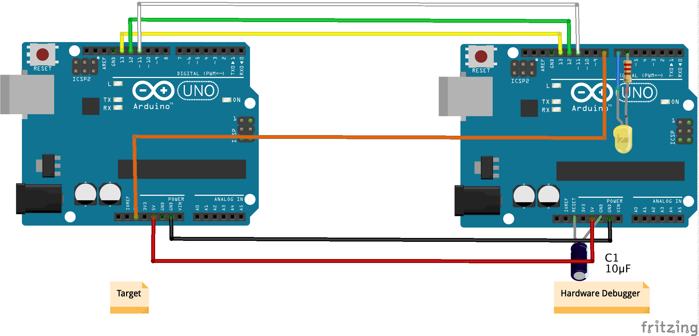

# Setting up the hardware

Before you can start debugging, you have to set up the hardware. I'll use an ATtiny85 on a breadboard as one example target system. However, any MCU listed above would do as a target. One could even use an Arduino UNO, provided the modifications described in the section on [modifying an Uno board](requirements.md#requirements-concerning-the-target-system) have been done.

## Debugging an ATtiny85

In order to debug an ATtiny85, we will assume it is completely "naked" and plugged into a breadboard as shown below. 

Notice the capacitor of 10 µF or more between RESET and GND on the UNO board. This will disable the auto-reset of the UNO board. Second, note the yellow LED connected to pin D7. This is the system LED which is used to visualise the internal state of the debugger (see below).  You can also build an LED with a series resistor soldered on and then use pins D6 and D7, where D6 is used as GND.

GND and Vcc of the ATtiny are connected to the respective lines on the breadboard, which in turn are connected to GND and 5V of the UNO. Pin D8 of the Arduino UNO is connected to the RESET pin of the ATtiny (pin 1).   Note the presence of the pull-up resistor of 10kΩ on the ATtiny RESET pin. The remaining connections between Arduino UNO and ATtiny are MOSI (Arduino UNO D11), MISO (Arduino UNO D12), and SCK (Arduino UNO D13), which you need for ISP programming. In addition, there is an LED connected to pin 3 of the ATtiny chip (which is PB4 or pin D4 in Arduino terminology). The pinout of the ATtiny85 is given in the following figure (with the usual "counter-clockwise" numbering of Arduino pins).

Here is a table of all the connections so that you can check that you have made all the connections. 

ATtiny pin# | Arduino UNO pin | component
--- | --- | ---
1 (Reset) | D8 | 10k resistor to Vcc 
2 (D3) |  |
3 (D4) |  |220 Ω resistor to (red) target LED (+)
4 (GND) | GND | both LED (-), decoupling cap 100 nF, RESET blocking cap of 10µF (-) 
5 (D0, MOSI) | D11 |
6 (D1, MISO) | D12 |
7 (D2, SCK) | D13 |
8 (Vcc) | 5V | 10k resistor, decoupling cap 100 nF 
&nbsp;|RESET|RESET blocking cap of 10 µF (+)
&nbsp;|D7|220 Ω resistor to (yellow) system LED (+)

## Debugging an UNO

If you want to debug an UNO board instead of an ATtiny85, everything said above applies. The Fritzing sketch below shows the connections. Here, the series resistor for the system LED is soldered to the LED cathode, so we do not need a breadboard. The hardware debugger needs a USB connection to your host, but the target does not need to be connected to the host! If it is, then remove the red cable between the 5V pins of the hardware debugger and the target. 

Remember to cut the `RESET EN` solder bridge on the target board (see [section on Requirements concerning the target system](requirements.md#requirements-concerning-the-target-system))! When you first activate debugWIRE on the UNO target, the target will be completely erased (including the boot loader), because the lock bits have to be cleared. The steps to restore your UNO to its original state are described [in the end of the debugging section](debugging.md#restoring-an-uno-to-its-native-state).

## States of the hardware debugger

We are now good to go and 'only' need to install the additional debugging software on the host. Before we do that, let us have a look, in which states the hardware debugger can be and how it signals that using the system LED.

There are five states the debugger can be in and each is signaled by a different blink pattern of the system LED:

* debugWIRE mode disabled (LED is off),
* waiting for power-cycling the target (LED flashes every second for 0.1 sec),
* debugWIRE mode enabled (LED is on) ,
* ISP programming (LED is blinking slowly every 0.5 sec), or
* error, i.e., it is not possible to connect to the target or there is an internal error (LED blinks furiously every 0.1 sec).

If the hardware debugger is in the error state, one should try to find out the reason by typing the command `monitor info` and studying the [error message table](troubleshooting.md#internal-and-fatal-debugger-errors) at the end of the document. Then finish the GDB session, reset the debugger, and restart everything. I have made the experience that sometimes it is a good idea to disconnect the USB cable and the connection to the target before starting over.

If the problem persists, please check the section on [troubleshooting](troubleshooting.md).

