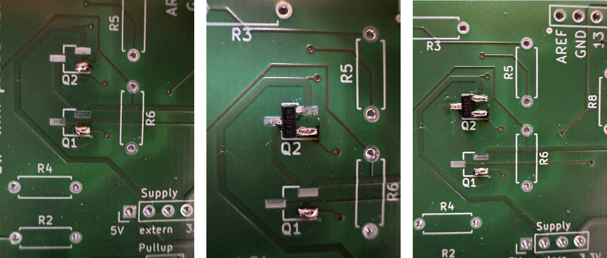

# Assembly Instructions 

 This work is licensed under a <a rel="license" href="http://creativecommons.org/licenses/by/4.0/">Creative Commons Attribution 4.0 International License</a>.

The kit contains the following parts. They are all THT, except for Q1 and Q2.

| ID                           | Value                              | Number |
| ---------------------------- | ---------------------------------- | ------ |
| PCB                          | dw-link probe V3.0                 | 1      |
| Q1, Q2                       | IRLML6402                          | 2      |
| R1                           | 1 kΩ (brown, black, red)           | 1      |
| R2, R5, R6                   | 10 kΩ (brown, black, orange)       | 3      |
| R3, R4                       | 220 Ω (red, red, brown)            | 2      |
| R7, R8                       | 680 Ω (blue, grey, brown)          | 2      |
| R9, R10                      | 10 MΩ (brown, black, blue)         | 2      |
| C1, C3                       | 10 µF (polarity must be matched)   | 2      |
| C2                           | 100 nF                             | 1      |
| D1                           | LED 3mm (polarity must be matched) | 1      |
| U1                           | LD1117V33                          | 1      |
| SW1                          | Tactile push button                | 1      |
| JP1                          | ISP pin header (2x3)               | 1      |
| PULLUP1, AUTO_DW1            | Pin header (1x3)                   | 2      |
| Supply1                      | Pin header (1x4)                   | 1      |
| Jumper for the above headers | Jumper                             | 3      |
| IOH1, IOL1                   | Pin Header (1x8)                   | 2      |
| POWER1, AD1                  | Pin Header (1x6)                   | 2      |

When assembling the kit, just follow what is specified in the table. Start from the top and go down. In case, you do not know  the color codes for resistors by heart, try this [online calculator](https://www.allaboutcircuits.com/tools/resistor-color-code-calculator/). 

For the capacitors C1 and C3 and the LED, watch out for the polarity, which should be matched with the symbols on the PCB. Bipolar capacitors have the negative connection marked and the negative connection has usually a shorter lead. The other lead should go into the hole marked with '+'.  Similarly, also LEDs have a long and a short lead, where the short one marks the cathode. This one should go into the hole marked with a square.

Q1, Q2, and U1 should all be soldered with the marking pointing upwards.

When soldering the shield connectors to the board, it is a good idea to do that when the plugs are inserted into the sockets of the Arduino UNO. 

If you have never soldered SMD parts before: It is not rocket science. You need to put a blob of solder on one pad, take the SMD part with a pair of tweezers, and solder the part to the pad with a solder blob on it. Afterwards solder the remaining legs to the respective pads. Finally, check with a magnifying glass that all connections have been made. There are numerous tutorials about SMD hand-soldering out there. The [HowTo](https://josepheoff.github.io/posts/howtosolder-11soldersmdpassive) by JRE is very detailed and easy to follow. Here are three photos to illustrate how to solder the MOS-FETs step by step.

In order to test the basic functionality of the freshly assembled board, you'll find the sketch `testprobe.ino` in the repository. Set the `Pullup` jumper to `10K` and the `Supply` jumper to either `3V` or `5V` before you start to test the board. 

Note that the board disables the auto-reset capability of the UNO board. That is, when the shield is plugged in, you cannot upload any sketch to the UNO. Unplug the shield and try again! 